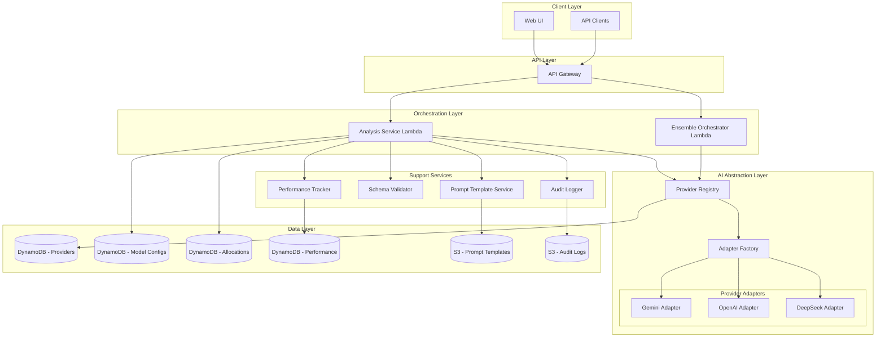

# Design Document: AI-Assisted Intelligence

## Overview

The AI-Assisted Intelligence feature provides a provider-agnostic integration layer for multiple AI services (Gemini, OpenAI, DeepSeek, and future providers). The architecture uses the Adapter pattern to normalize communication across providers, enabling users to select models, allocate funds across AI systems, and compare performance.

Key design principles:
- **Provider Agnostic**: Common interfaces abstract provider-specific implementations
- **Schema-First**: All AI outputs are validated against JSON schemas before use
- **Audit Complete**: Every AI interaction is logged for compliance and debugging
- **Fail Safe**: Invalid AI outputs trigger fallbacks, never crash the system

## Architecture



## Components and Interfaces

### AI Provider Abstraction

The core abstraction that enables multi-provider support.

```typescript
// Provider types
type ProviderType = 'GEMINI' | 'OPENAI' | 'DEEPSEEK' | 'ANTHROPIC' | 'CUSTOM';
type ProviderStatus = 'ACTIVE' | 'INACTIVE' | 'RATE_LIMITED' | 'ERROR';

interface AIProvider {
  providerId: string;
  type: ProviderType;
  name: string;
  apiEndpoint: string;
  authMethod: 'API_KEY' | 'OAUTH' | 'IAM';
  supportedModels: string[];
  status: ProviderStatus;
  rateLimits: RateLimitConfig;
  createdAt: string;
  updatedAt: string;
}

interface RateLimitConfig {
  requestsPerMinute: number;
  tokensPerMinute: number;
  requestsPerDay: number;
}

// Provider Adapter Interface - all providers implement this
interface AIProviderAdapter {
  readonly providerType: ProviderType;
  
  // Core analysis methods
  classifyMarketRegime(request: RegimeClassificationRequest): Promise<RegimeClassificationResponse>;
  generateExplanation(request: ExplanationRequest): Promise<ExplanationResponse>;
  suggestParameters(request: ParameterSuggestionRequest): Promise<ParameterSuggestionResponse>;
  
  // Health and status
  healthCheck(): Promise<HealthCheckResult>;
  getRemainingQuota(): Promise<QuotaStatus>;
}

interface HealthCheckResult {
  healthy: boolean;
  latencyMs: number;
  errorMessage?: string;
}

interface QuotaStatus {
  requestsRemaining: number;
  tokensRemaining: number;
  resetsAt: string;
}
```

### Model Configuration

Per-tenant model settings and preferences.

```typescript
interface ModelConfiguration {
  configId: string;
  tenantId: string;
  providerId: string;
  modelId: string;
  modelName: string;
  enabled: boolean;
  credentials: EncryptedCredentials;
  costLimits: CostLimits;
  rateLimits: RateLimitConfig;
  priority: number;  // 1-10, higher = preferred
  createdAt: string;
  updatedAt: string;
}

interface EncryptedCredentials {
  encryptedApiKey: string;
  keyId: string;  // KMS key reference
}

interface CostLimits {
  maxDailyCostUsd: number;
  maxMonthlyCostUsd: number;
  currentDailyCostUsd: number;
  currentMonthlyCostUsd: number;
  lastResetDate: string;
}

interface ModelConfigurationService {
  configureModel(tenantId: string, config: ModelConfigurationInput): Promise<ModelConfiguration>;
  getConfiguration(tenantId: string, configId: string): Promise<ModelConfiguration>;
  listConfigurations(tenantId: string): Promise<ModelConfiguration[]>;
  enableModel(tenantId: string, configId: string): Promise<ModelConfiguration>;
  disableModel(tenantId: string, configId: string): Promise<ModelConfiguration>;
  validateCredentials(tenantId: string, configId: string): Promise<ValidationResult>;
}
```

### Market Regime Classification

AI-powered market condition analysis.

```typescript
type MarketRegime = 
  | 'TRENDING_UP' 
  | 'TRENDING_DOWN' 
  | 'RANGING' 
  | 'HIGH_VOLATILITY' 
  | 'LOW_VOLATILITY' 
  | 'UNCERTAIN';

interface RegimeClassificationRequest {
  tenantId: string;
  modelConfigId: string;
  marketData: MarketDataSnapshot;
  timeframe: string;
  additionalContext?: string;
}

interface MarketDataSnapshot {
  symbol: string;
  prices: PricePoint[];
  volume: VolumePoint[];
  timestamp: string;
}

interface PricePoint {
  timestamp: string;
  open: number;
  high: number;
  low: number;
  close: number;
}

interface VolumePoint {
  timestamp: string;
  volume: number;
}

interface RegimeClassificationResponse {
  regime: MarketRegime;
  confidence: number;  // 0.0 to 1.0
  reasoning: string;
  supportingFactors: string[];
  modelId: string;
  promptVersion: string;
  processingTimeMs: number;
  timestamp: string;
}

// JSON Schema for validation
const RegimeClassificationSchema = {
  type: 'object',
  required: ['regime', 'confidence', 'reasoning'],
  properties: {
    regime: {
      type: 'string',
      enum: ['TRENDING_UP', 'TRENDING_DOWN', 'RANGING', 'HIGH_VOLATILITY', 'LOW_VOLATILITY', 'UNCERTAIN']
    },
    confidence: {
      type: 'number',
      minimum: 0,
      maximum: 1
    },
    reasoning: {
      type: 'string',
      minLength: 10
    },
    supportingFactors: {
      type: 'array',
      items: { type: 'string' }
    }
  }
};
```

### Strategy Explanation

Natural language explanations of strategy behavior.

```typescript
interface ExplanationRequest {
  tenantId: string;
  modelConfigId: string;
  strategyId: string;
  action: StrategyAction;
  marketContext: MarketDataSnapshot;
  strategyParameters: Record<string, unknown>;
}

interface StrategyAction {
  type: 'ENTRY' | 'EXIT' | 'INCREASE' | 'DECREASE' | 'HOLD';
  symbol: string;
  quantity?: number;
  price?: number;
  reason: string;
}

interface ExplanationResponse {
  explanation: string;
  keyFactors: ExplanationFactor[];
  riskAssessment: string;
  modelId: string;
  promptVersion: string;
  processingTimeMs: number;
  timestamp: string;
}

interface ExplanationFactor {
  factor: string;
  impact: 'POSITIVE' | 'NEGATIVE' | 'NEUTRAL';
  weight: number;
}

// JSON Schema for validation
const ExplanationSchema = {
  type: 'object',
  required: ['explanation', 'keyFactors'],
  properties: {
    explanation: {
      type: 'string',
      minLength: 50
    },
    keyFactors: {
      type: 'array',
      items: {
        type: 'object',
        required: ['factor', 'impact'],
        properties: {
          factor: { type: 'string' },
          impact: { type: 'string', enum: ['POSITIVE', 'NEGATIVE', 'NEUTRAL'] },
          weight: { type: 'number', minimum: 0, maximum: 1 }
        }
      }
    },
    riskAssessment: { type: 'string' }
  }
};
```

### Fund Allocation

Distribution of trading capital across AI models.

```typescript
interface FundAllocation {
  allocationId: string;
  tenantId: string;
  strategyId: string;
  version: number;
  allocations: ModelAllocation[];
  ensembleMode: boolean;
  createdAt: string;
  createdBy: string;
}

interface ModelAllocation {
  modelConfigId: string;
  percentage: number;  // 10-100, must sum to 100
  priority: number;    // Tiebreaker when models disagree
}

interface AllocationService {
  createAllocation(tenantId: string, strategyId: string, allocations: ModelAllocation[]): Promise<FundAllocation>;
  getAllocation(tenantId: string, strategyId: string): Promise<FundAllocation>;
  updateAllocation(tenantId: string, strategyId: string, allocations: ModelAllocation[]): Promise<FundAllocation>;
  getAllocationHistory(tenantId: string, strategyId: string): Promise<FundAllocation[]>;
}

// Validation rules
const AllocationValidation = {
  minModels: 1,
  maxModels: 5,
  minPercentagePerModel: 10,
  totalPercentage: 100
};
```

### Ensemble Analysis

Multi-model parallel analysis with aggregation.

```typescript
interface EnsembleRequest {
  tenantId: string;
  strategyId: string;
  analysisType: 'REGIME' | 'EXPLANATION' | 'PARAMETERS';
  marketData: MarketDataSnapshot;
  timeoutMs: number;
}

interface EnsembleResponse {
  aggregatedResult: RegimeClassificationResponse | ExplanationResponse;
  individualResults: IndividualModelResult[];
  consensus: boolean;
  consensusLevel: number;  // 0.0 to 1.0
  processingTimeMs: number;
  timestamp: string;
}

interface IndividualModelResult {
  modelConfigId: string;
  modelName: string;
  result: RegimeClassificationResponse | ExplanationResponse | null;
  status: 'SUCCESS' | 'TIMEOUT' | 'ERROR';
  errorMessage?: string;
  weight: number;  // From fund allocation
}

interface EnsembleService {
  analyzeWithEnsemble(request: EnsembleRequest): Promise<EnsembleResponse>;
  aggregateRegimeResults(results: IndividualModelResult[]): RegimeClassificationResponse;
  calculateConsensus(results: IndividualModelResult[]): number;
}
```

### Performance Tracking

Model accuracy and cost metrics.

```typescript
interface ModelPerformance {
  performanceId: string;
  tenantId: string;
  modelConfigId: string;
  period: 'DAILY' | 'WEEKLY' | 'MONTHLY';
  periodStart: string;
  metrics: PerformanceMetrics;
  updatedAt: string;
}

interface PerformanceMetrics {
  totalAnalyses: number;
  regimeAccuracy: number;      // 0.0 to 1.0
  averageConfidence: number;   // 0.0 to 1.0
  averageLatencyMs: number;
  totalCostUsd: number;
  costPerAnalysis: number;
  errorRate: number;           // 0.0 to 1.0
  validationFailureRate: number;
}

interface PerformancePrediction {
  predictionId: string;
  tenantId: string;
  modelConfigId: string;
  analysisId: string;
  predictedRegime: MarketRegime;
  confidence: number;
  timestamp: string;
  validated: boolean;
  actualRegime?: MarketRegime;
  correct?: boolean;
}

interface PerformanceService {
  recordPrediction(prediction: PerformancePrediction): Promise<void>;
  validatePrediction(predictionId: string, actualRegime: MarketRegime): Promise<void>;
  getPerformance(tenantId: string, modelConfigId: string, period: string): Promise<ModelPerformance>;
  compareModels(tenantId: string, period: string): Promise<ModelPerformance[]>;
}
```

### Prompt Template Management

Versioned prompt templates with parameter substitution.

```typescript
interface PromptTemplate {
  templateId: string;
  name: string;
  version: number;
  type: 'REGIME_CLASSIFICATION' | 'EXPLANATION' | 'PARAMETER_SUGGESTION';
  content: string;
  parameters: PromptParameter[];
  createdAt: string;
  createdBy: string;
}

interface PromptParameter {
  name: string;
  required: boolean;
  defaultValue?: string;
  description: string;
}

interface PromptService {
  getTemplate(templateId: string, version?: number): Promise<PromptTemplate>;
  renderTemplate(templateId: string, parameters: Record<string, string>): Promise<string>;
  createTemplate(template: PromptTemplateInput): Promise<PromptTemplate>;
  updateTemplate(templateId: string, content: string): Promise<PromptTemplate>;
  listTemplates(type?: string): Promise<PromptTemplate[]>;
}

// Parameter substitution syntax: {{parameter_name}}
function renderPrompt(template: string, params: Record<string, string>): string {
  return template.replace(/\{\{(\w+)\}\}/g, (match, key) => params[key] ?? match);
}
```

### Schema Validation

JSON schema validation for AI outputs.

```typescript
interface SchemaValidationResult {
  valid: boolean;
  errors: SchemaValidationError[];
  rawOutput: string;
  parsedOutput?: unknown;
}

interface SchemaValidationError {
  path: string;
  message: string;
  keyword: string;
  params: Record<string, unknown>;
}

interface SchemaValidator {
  validateRegimeClassification(output: unknown): SchemaValidationResult;
  validateExplanation(output: unknown): SchemaValidationResult;
  validateParameterSuggestion(output: unknown): SchemaValidationResult;
  registerSchema(type: string, schema: object): void;
}

interface ValidationFailureTracker {
  modelConfigId: string;
  consecutiveFailures: number;
  lastFailureAt: string;
  alertThreshold: number;
}
```

### Audit Logging

Complete audit trail for compliance.

```typescript
interface AuditRecord {
  auditId: string;
  tenantId: string;
  modelConfigId: string;
  analysisType: string;
  request: AuditRequest;
  response: AuditResponse;
  timestamp: string;
  retentionExpiresAt: string;
}

interface AuditRequest {
  promptTemplateId: string;
  promptVersion: number;
  renderedPrompt: string;
  marketDataHash: string;
}

interface AuditResponse {
  rawOutput: string;
  validatedOutput: unknown;
  validationPassed: boolean;
  processingTimeMs: number;
  tokenUsage: TokenUsage;
  costUsd: number;
}

interface TokenUsage {
  promptTokens: number;
  completionTokens: number;
  totalTokens: number;
}

interface AuditService {
  logAnalysis(record: AuditRecord): Promise<void>;
  getAuditRecords(tenantId: string, filters: AuditFilters): Promise<AuditRecord[]>;
  exportAuditPackage(tenantId: string, dateRange: DateRange): Promise<string>;  // S3 URL
}

interface AuditFilters {
  modelConfigId?: string;
  analysisType?: string;
  startDate?: string;
  endDate?: string;
  limit?: number;
}
```

## Data Models

### DynamoDB Table Schemas

**Providers Table**
- Partition Key: `providerId`
- Attributes: type, name, apiEndpoint, authMethod, supportedModels, status, rateLimits, timestamps

**ModelConfigurations Table**
- Partition Key: `tenantId`
- Sort Key: `configId`
- GSI: `providerId-index` for listing models by provider
- Attributes: modelId, modelName, enabled, credentials (encrypted), costLimits, rateLimits, priority, timestamps

**Allocations Table**
- Partition Key: `tenantId`
- Sort Key: `strategyId#version`
- Attributes: allocations (JSON), ensembleMode, createdAt, createdBy

**Performance Table**
- Partition Key: `tenantId#modelConfigId`
- Sort Key: `period#periodStart`
- Attributes: metrics (JSON), updatedAt

**Predictions Table**
- Partition Key: `tenantId`
- Sort Key: `predictionId`
- GSI: `modelConfigId-timestamp-index` for querying by model
- TTL: `expiresAt` for automatic cleanup
- Attributes: analysisId, predictedRegime, confidence, validated, actualRegime, correct, timestamp

### S3 Storage

**Prompt Templates Bucket**
- Path: `prompts/{templateId}/v{version}.json`
- Versioning enabled for audit trail

**Audit Logs Bucket**
- Path: `audit/{tenantId}/{year}/{month}/{day}/{auditId}.json`
- Lifecycle policy: Transition to Glacier after 30 days, delete after retention period


## Correctness Properties

*A property is a characteristic or behavior that should hold true across all valid executions of a system—essentially, a formal statement about what the system should do. Properties serve as the bridge between human-readable specifications and machine-verifiable correctness guarantees.*

### Property 1: Provider Adapter Interface Compliance

*For any* registered AI_Provider, the system SHALL have a corresponding Provider_Adapter that implements all methods of the AIProviderAdapter interface (classifyMarketRegime, generateExplanation, suggestParameters, healthCheck, getRemainingQuota).

**Validates: Requirements 1.3**

### Property 2: Provider Status Management

*For any* AI_Provider marked as INACTIVE, all requests to that provider SHALL be rejected with an appropriate error, and no API calls SHALL be made to the provider's endpoint.

**Validates: Requirements 1.4**

### Property 3: Model Configuration Persistence Round-Trip

*For any* valid ModelConfiguration object, serializing to JSON, persisting to storage, retrieving, and deserializing SHALL produce an equivalent ModelConfiguration with all fields preserved (excluding encrypted credentials which should decrypt to original values).

**Validates: Requirements 2.4**

### Property 4: Available Models Filtering

*For any* Tenant requesting available models, the returned list SHALL contain only models where: (a) the model is enabled for the Tenant, AND (b) the model's AI_Provider has status ACTIVE.

**Validates: Requirements 2.3**

### Property 5: Cost Limit Enforcement

*For any* Tenant whose currentDailyCostUsd exceeds maxDailyCostUsd for a ModelConfiguration, subsequent analysis requests using that model SHALL be rejected until the cost resets.

**Validates: Requirements 2.5**

### Property 6: Regime Classification Output Constraints

*For any* RegimeClassificationResponse, the regime field SHALL be one of the valid MarketRegime enum values, AND the confidence field SHALL be a number between 0.0 and 1.0 inclusive.

**Validates: Requirements 3.2, 3.3**

### Property 7: Schema Validation with Fallback

*For any* AI_Model output that fails JSON schema validation, the system SHALL return a fallback response with regime='UNCERTAIN' and confidence=0, AND the validation failure SHALL be logged.

**Validates: Requirements 3.4, 3.5**

### Property 8: Explanation Generation with Template Tracking

*For any* ExplanationResponse, the response SHALL include the promptVersion used, AND an audit record SHALL exist containing the rendered prompt and raw AI output.

**Validates: Requirements 4.3, 4.4, 4.5**

### Property 9: Allocation Validation Rules

*For any* FundAllocation, the sum of all allocation percentages SHALL equal exactly 100, the number of ModelAllocations SHALL be between 1 and 5 inclusive, AND each individual allocation percentage SHALL be at least 10.

**Validates: Requirements 5.1, 5.2, 5.4**

### Property 10: Allocation Versioning

*For any* FundAllocation update, a new version SHALL be created with an incremented version number, AND all previous versions SHALL remain retrievable.

**Validates: Requirements 5.3**

### Property 11: Performance Tracking and Metrics

*For any* AI_Analysis that is generated, a PerformancePrediction record SHALL be created, AND when validated against actual market movement, the ModelPerformance metrics SHALL be updated to reflect the accuracy.

**Validates: Requirements 6.1, 6.2, 6.3**

### Property 12: Ensemble Parallel Execution

*For any* EnsembleRequest with N allocated models, the system SHALL invoke all N models, AND the EnsembleResponse SHALL contain exactly N IndividualModelResults (with status SUCCESS, TIMEOUT, or ERROR for each).

**Validates: Requirements 7.1**

### Property 13: Ensemble Weighted Aggregation

*For any* EnsembleResponse where multiple models return valid results, the aggregatedResult confidence SHALL equal the weighted average of individual confidences using Fund_Allocation percentages as weights.

**Validates: Requirements 7.2**

### Property 14: Ensemble Disagreement Handling

*For any* EnsembleResponse where models return different MarketRegime values, the consensus field SHALL be false, AND all individual model outputs SHALL be included in individualResults.

**Validates: Requirements 7.3**

### Property 15: Ensemble Timeout Handling

*For any* EnsembleRequest where some models timeout, the EnsembleResponse SHALL be returned within the configured timeout, using results from models that responded in time.

**Validates: Requirements 7.4**

### Property 16: Prompt Template Versioning

*For any* PromptTemplate update, a new version SHALL be created while preserving all previous versions, AND requesting a specific version SHALL return that exact version's content.

**Validates: Requirements 8.2**

### Property 17: Prompt Parameter Substitution

*For any* PromptTemplate with parameters, rendering with all required parameters provided SHALL replace all {{parameter_name}} placeholders with their values, AND rendering with missing required parameters SHALL fail with a validation error.

**Validates: Requirements 8.3, 8.4**

### Property 18: Schema Validation Completeness

*For any* AI output type (Market_Regime, Explanation, Parameter_Suggestion), the Schema_Validator SHALL validate against the corresponding schema, AND validation failures SHALL include the specific field path and error message.

**Validates: Requirements 9.1, 9.2, 9.3**

### Property 19: Validation Failure Tracking

*For any* ModelConfiguration with consecutiveFailures exceeding alertThreshold, an alert SHALL be triggered, AND the failure counter SHALL accurately reflect the number of consecutive validation failures.

**Validates: Requirements 9.4**

### Property 20: Audit Record Completeness

*For any* AI_Analysis, the AuditRecord SHALL contain: promptTemplateId, promptVersion, renderedPrompt, rawOutput, validatedOutput, validationPassed, processingTimeMs, tokenUsage, and costUsd.

**Validates: Requirements 10.1, 10.2, 10.3**

### Property 21: Audit Tenant Isolation

*For any* Tenant, querying audit records SHALL return only records where the record's tenantId matches the requesting Tenant's ID.

**Validates: Requirements 10.4**

## Error Handling

### Provider Errors

- **Provider Unavailable**: Return HTTP 503 with provider status, suggest alternative providers
- **Rate Limited**: Return HTTP 429 with retry-after header based on provider's reset time
- **Authentication Failed**: Return HTTP 401, disable model configuration, notify tenant

### Validation Errors

- **Schema Validation Failed**: Log raw output, return fallback response, increment failure counter
- **Allocation Invalid**: Return HTTP 400 with specific validation errors (sum != 100, count out of range, percentage < 10)
- **Missing Parameters**: Return HTTP 400 listing missing required parameters

### Ensemble Errors

- **Partial Timeout**: Return available results with timeout status for failed models
- **Total Failure**: Return fallback response, trigger alert, log all individual errors
- **Disagreement**: Flag in response, include all individual results for user decision

### Cost Limit Errors

- **Daily Limit Exceeded**: Return HTTP 402 with limit details and reset time
- **Monthly Limit Exceeded**: Return HTTP 402, suggest upgrading plan or adjusting limits

### Audit Errors

- **Storage Failed**: Retry with exponential backoff, alert on persistent failure
- **Retrieval Failed**: Return HTTP 500, do not expose internal storage details

## Testing Strategy

### Unit Tests

Unit tests verify specific examples and edge cases:

- Provider adapter method implementations for each provider type
- Schema validation with valid and invalid JSON structures
- Allocation percentage calculations and validation
- Prompt template parameter substitution
- Weighted average calculations for ensemble aggregation
- Cost limit threshold detection
- Audit record serialization/deserialization

### Property-Based Tests

Property-based tests verify universal properties across randomly generated inputs. Each property test will:

- Run minimum 100 iterations with random inputs
- Use fast-check library for TypeScript property-based testing
- Tag each test with the corresponding design property number

**Test Configuration:**
- Framework: Jest with fast-check
- Minimum iterations: 100 per property
- Generators: Custom generators for Provider, ModelConfiguration, FundAllocation, MarketData, RegimeClassification, and AuditRecord objects

**Property Test Coverage:**
- Property 1: Generate providers, verify adapter interface compliance
- Property 3: Generate model configs, verify persistence round-trip
- Property 4: Generate tenant/provider/model combinations, verify filtering
- Property 5: Generate cost scenarios, verify limit enforcement
- Property 6: Generate regime responses, verify output constraints
- Property 7: Generate invalid outputs, verify fallback behavior
- Property 9: Generate allocations, verify validation rules
- Property 10: Generate allocation updates, verify versioning
- Property 11: Generate analyses, verify performance tracking
- Property 12: Generate ensemble requests, verify parallel execution
- Property 13: Generate ensemble results, verify weighted aggregation
- Property 14: Generate disagreeing results, verify flagging
- Property 16: Generate template updates, verify versioning
- Property 17: Generate templates with params, verify substitution
- Property 18: Generate outputs, verify schema validation
- Property 20: Generate analyses, verify audit completeness
- Property 21: Generate multi-tenant scenarios, verify isolation

### Integration Tests

Integration tests verify end-to-end flows:

- Full analysis flow: configure model → request analysis → validate output → log audit
- Ensemble flow: allocate models → request ensemble → aggregate results
- Performance tracking: record prediction → validate against actual → update metrics
- Cost management: track usage → exceed limit → verify rejection → reset → verify restored
