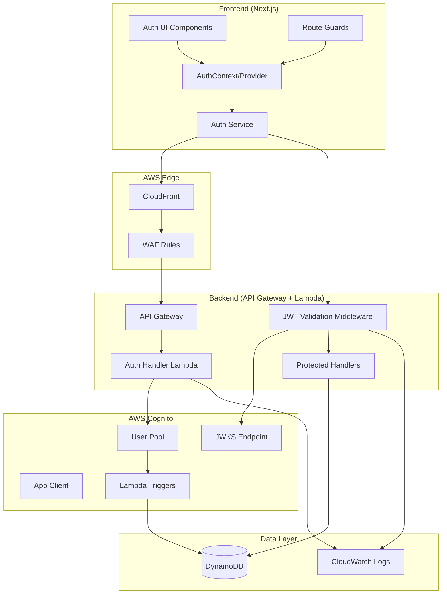
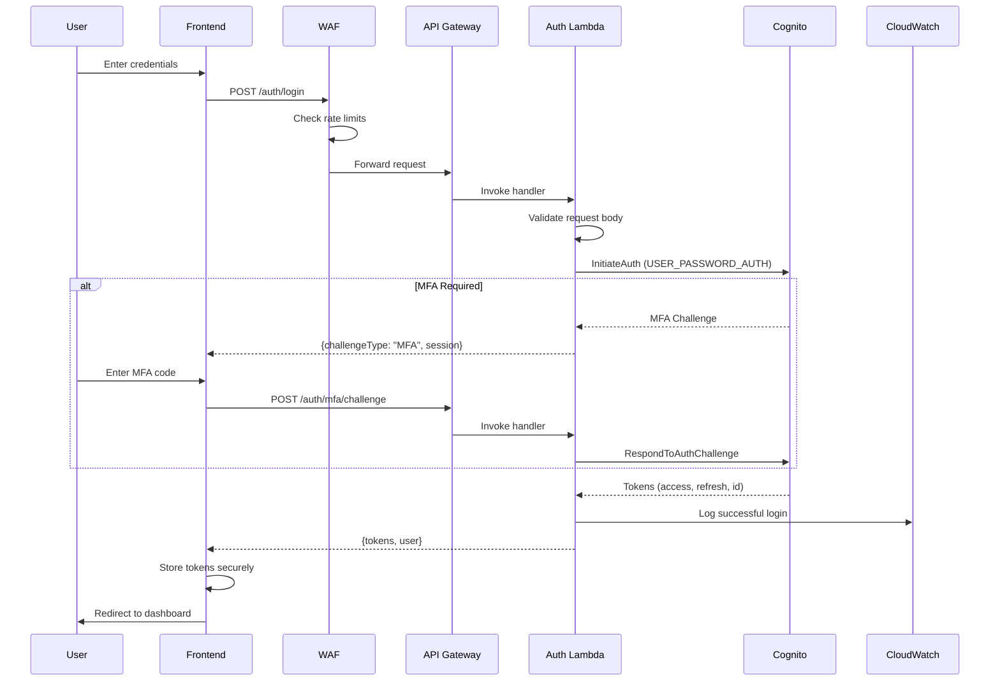
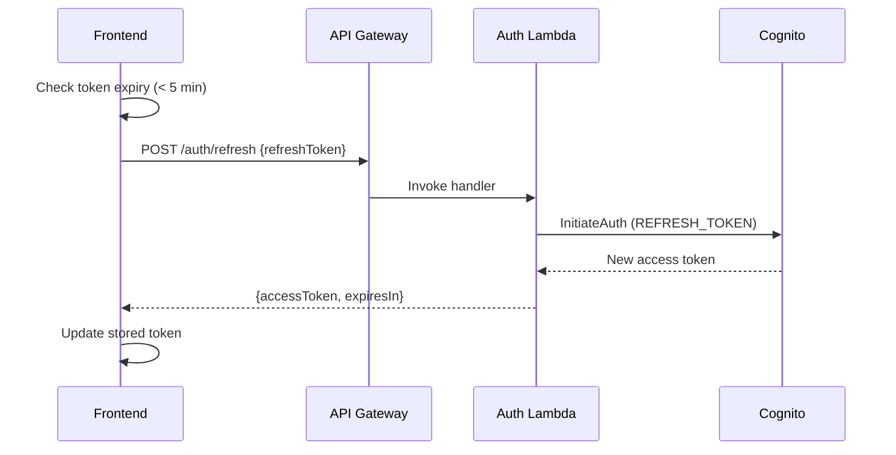

# Design Document: Production Authentication System

## Overview

This design document describes the architecture for a production-ready authentication system using AWS Cognito, with all authentication traffic proxied through the backend API Gateway. This architecture enables WAF protection, centralized rate limiting, and security monitoring for all auth operations.

The key architectural decision is to **not expose Cognito endpoints directly** to the frontend. Instead, all Cognito operations flow through backend Lambda functions behind API Gateway with WAF, providing:
- Unified rate limiting and abuse protection
- Centralized security logging
- Ability to add custom validation logic
- Consistent error handling and response formatting
- Protection against Cognito-specific attacks

## Architecture

### Authentication Flow Diagram



### Login Flow Sequence



### Token Refresh Flow



## Components and Interfaces

### Infrastructure Module: Cognito

```hcl
# infrastructure/modules/cognito/main.tf

resource "aws_cognito_user_pool" "main" {
  name = "${var.project_name}-${var.environment}-users"

  # Password policy
  password_policy {
    minimum_length                   = 12
    require_lowercase                = true
    require_uppercase                = true
    require_numbers                  = true
    require_symbols                  = true
    temporary_password_validity_days = 7
  }

  # MFA configuration
  mfa_configuration = "OPTIONAL"
  software_token_mfa_configuration {
    enabled = true
  }

  # Account recovery
  account_recovery_setting {
    recovery_mechanism {
      name     = "verified_email"
      priority = 1
    }
  }

  # User attributes
  schema {
    name                = "tenant_id"
    attribute_data_type = "String"
    mutable             = true
    required            = false
    string_attribute_constraints {
      min_length = 1
      max_length = 256
    }
  }

  schema {
    name                = "roles"
    attribute_data_type = "String"
    mutable             = true
    required            = false
    string_attribute_constraints {
      min_length = 0
      max_length = 2048
    }
  }

  # Email configuration
  email_configuration {
    email_sending_account = var.environment == "production" ? "DEVELOPER" : "COGNITO_DEFAULT"
    source_arn            = var.environment == "production" ? var.ses_identity_arn : null
    from_email_address    = var.environment == "production" ? "noreply@${var.domain}" : null
  }

  # Advanced security
  user_pool_add_ons {
    advanced_security_mode = "ENFORCED"
  }

  # Lambda triggers
  lambda_config {
    pre_sign_up       = var.pre_signup_lambda_arn
    post_confirmation = var.post_confirmation_lambda_arn
  }

  tags = var.tags
}

resource "aws_cognito_user_pool_client" "main" {
  name         = "${var.project_name}-${var.environment}-client"
  user_pool_id = aws_cognito_user_pool.main.id

  # Auth flows - no hosted UI
  explicit_auth_flows = [
    "ALLOW_USER_PASSWORD_AUTH",
    "ALLOW_REFRESH_TOKEN_AUTH"
  ]

  # Token validity
  access_token_validity  = 1   # hours
  id_token_validity      = 1   # hours
  refresh_token_validity = 30  # days

  token_validity_units {
    access_token  = "hours"
    id_token      = "hours"
    refresh_token = "days"
  }

  # Security settings
  prevent_user_existence_errors = "ENABLED"
  enable_token_revocation       = true

  # No OAuth/hosted UI
  generate_secret                      = false
  allowed_oauth_flows_user_pool_client = false
}
```

### WAF Rules for Auth Endpoints

```hcl
# infrastructure/modules/waf/auth-rules.tf

resource "aws_wafv2_rule_group" "auth_protection" {
  name     = "${var.project_name}-${var.environment}-auth-protection"
  scope    = "REGIONAL"
  capacity = 100

  # Login rate limiting: 100 requests per 5 minutes per IP
  rule {
    name     = "login-rate-limit"
    priority = 1

    action {
      block {
        custom_response {
          response_code = 429
          custom_response_body_key = "rate-limited"
        }
      }
    }

    statement {
      rate_based_statement {
        limit              = 100
        aggregate_key_type = "IP"
        scope_down_statement {
          byte_match_statement {
            search_string         = "/auth/login"
            positional_constraint = "STARTS_WITH"
            field_to_match {
              uri_path {}
            }
            text_transformation {
              priority = 0
              type     = "LOWERCASE"
            }
          }
        }
      }
    }

    visibility_config {
      sampled_requests_enabled   = true
      cloudwatch_metrics_enabled = true
      metric_name                = "LoginRateLimit"
    }
  }

  # Signup rate limiting: 10 requests per 5 minutes per IP
  rule {
    name     = "signup-rate-limit"
    priority = 2

    action {
      block {
        custom_response {
          response_code = 429
        }
      }
    }

    statement {
      rate_based_statement {
        limit              = 10
        aggregate_key_type = "IP"
        scope_down_statement {
          byte_match_statement {
            search_string         = "/auth/signup"
            positional_constraint = "STARTS_WITH"
            field_to_match {
              uri_path {}
            }
            text_transformation {
              priority = 0
              type     = "LOWERCASE"
            }
          }
        }
      }
    }

    visibility_config {
      sampled_requests_enabled   = true
      cloudwatch_metrics_enabled = true
      metric_name                = "SignupRateLimit"
    }
  }

  visibility_config {
    sampled_requests_enabled   = true
    cloudwatch_metrics_enabled = true
    metric_name                = "AuthProtection"
  }
}
```

### Backend Auth Handler

```typescript
// backend/src/handlers/auth.ts

import { APIGatewayProxyEvent, APIGatewayProxyResult } from 'aws-lambda';
import { CognitoIdentityProviderClient, InitiateAuthCommand, SignUpCommand } from '@aws-sdk/client-cognito-identity-provider';
import { AuthService } from '../services/auth';
import { AuditService } from '../services/audit';

const cognito = new CognitoIdentityProviderClient({ region: process.env.AWS_REGION });
const CLIENT_ID = process.env.COGNITO_CLIENT_ID!;

interface LoginRequest {
  email: string;
  password: string;
}

interface LoginResponse {
  accessToken: string;
  refreshToken: string;
  idToken: string;
  expiresIn: number;
  user: {
    id: string;
    email: string;
    name: string;
    tenantId: string;
    roles: string[];
  };
}

export async function login(event: APIGatewayProxyEvent): Promise<APIGatewayProxyResult> {
  const clientIp = event.requestContext.identity?.sourceIp || 'unknown';
  const userAgent = event.headers['User-Agent'] || 'unknown';

  try {
    const body = JSON.parse(event.body || '{}') as LoginRequest;
    
    // Validate request
    if (!body.email || !body.password) {
      return errorResponse(400, 'Email and password are required', 'INVALID_REQUEST');
    }

    // Call Cognito
    const command = new InitiateAuthCommand({
      AuthFlow: 'USER_PASSWORD_AUTH',
      ClientId: CLIENT_ID,
      AuthParameters: {
        USERNAME: body.email,
        PASSWORD: body.password,
      },
    });

    const result = await cognito.send(command);

    // Handle MFA challenge
    if (result.ChallengeName === 'SOFTWARE_TOKEN_MFA') {
      await AuditService.logAuthEvent({
        event: 'LOGIN_MFA_REQUIRED',
        email: body.email,
        ip: clientIp,
        userAgent,
      });

      return successResponse({
        challengeType: 'MFA',
        session: result.Session,
      });
    }

    // Parse tokens and extract user info
    const tokens = result.AuthenticationResult!;
    const user = AuthService.parseIdToken(tokens.IdToken!);

    await AuditService.logAuthEvent({
      event: 'LOGIN_SUCCESS',
      userId: user.id,
      email: body.email,
      ip: clientIp,
      userAgent,
      tenantId: user.tenantId,
    });

    return successResponse<LoginResponse>({
      accessToken: tokens.AccessToken!,
      refreshToken: tokens.RefreshToken!,
      idToken: tokens.IdToken!,
      expiresIn: tokens.ExpiresIn!,
      user,
    });

  } catch (error: any) {
    await AuditService.logAuthEvent({
      event: 'LOGIN_FAILED',
      email: (JSON.parse(event.body || '{}') as LoginRequest).email,
      ip: clientIp,
      userAgent,
      reason: error.name,
    });

    // Sanitize error messages
    if (error.name === 'NotAuthorizedException') {
      return errorResponse(401, 'Invalid email or password', 'INVALID_CREDENTIALS');
    }
    if (error.name === 'UserNotConfirmedException') {
      return errorResponse(403, 'Please verify your email address', 'EMAIL_NOT_VERIFIED');
    }
    if (error.name === 'UserNotFoundException') {
      // Don't reveal user existence
      return errorResponse(401, 'Invalid email or password', 'INVALID_CREDENTIALS');
    }

    console.error('Login error:', error);
    return errorResponse(500, 'Authentication failed', 'AUTH_ERROR');
  }
}
```

### JWT Validation Middleware

```typescript
// backend/src/middleware/jwt-validator.ts

import { APIGatewayProxyEvent } from 'aws-lambda';
import * as jwt from 'jsonwebtoken';
import jwksClient from 'jwks-rsa';

interface UserContext {
  userId: string;
  email: string;
  tenantId: string;
  roles: string[];
}

// JWKS client with caching
const client = jwksClient({
  jwksUri: `https://cognito-idp.${process.env.AWS_REGION}.amazonaws.com/${process.env.COGNITO_USER_POOL_ID}/.well-known/jwks.json`,
  cache: true,
  cacheMaxAge: 3600000, // 1 hour
  rateLimit: true,
});

function getKey(header: jwt.JwtHeader, callback: jwt.SigningKeyCallback) {
  client.getSigningKey(header.kid!, (err, key) => {
    if (err) {
      callback(err);
      return;
    }
    const signingKey = key?.getPublicKey();
    callback(null, signingKey);
  });
}

export async function validateToken(event: APIGatewayProxyEvent): Promise<UserContext | null> {
  const authHeader = event.headers['Authorization'] || event.headers['authorization'];
  
  if (!authHeader || !authHeader.startsWith('Bearer ')) {
    return null;
  }

  const token = authHeader.substring(7);

  return new Promise((resolve) => {
    jwt.verify(
      token,
      getKey,
      {
        issuer: `https://cognito-idp.${process.env.AWS_REGION}.amazonaws.com/${process.env.COGNITO_USER_POOL_ID}`,
        algorithms: ['RS256'],
      },
      (err, decoded) => {
        if (err) {
          console.error('Token validation failed:', err.message);
          resolve(null);
          return;
        }

        const claims = decoded as jwt.JwtPayload;
        resolve({
          userId: claims.sub!,
          email: claims.email,
          tenantId: claims['custom:tenant_id'],
          roles: JSON.parse(claims['custom:roles'] || '[]'),
        });
      }
    );
  });
}

export function requireAuth(handler: Function) {
  return async (event: APIGatewayProxyEvent) => {
    const user = await validateToken(event);
    
    if (!user) {
      return {
        statusCode: 401,
        headers: {
          'Content-Type': 'application/json',
          'WWW-Authenticate': 'Bearer realm="api"',
        },
        body: JSON.stringify({
          error: 'Unauthorized',
          code: 'INVALID_TOKEN',
        }),
      };
    }

    // Attach user to event for handler access
    (event as any).user = user;
    return handler(event);
  };
}

export function requireRole(...roles: string[]) {
  return (handler: Function) => {
    return requireAuth(async (event: APIGatewayProxyEvent) => {
      const user = (event as any).user as UserContext;
      
      const hasRole = roles.some(role => user.roles.includes(role));
      if (!hasRole) {
        return {
          statusCode: 403,
          headers: { 'Content-Type': 'application/json' },
          body: JSON.stringify({
            error: 'Forbidden',
            code: 'INSUFFICIENT_PERMISSIONS',
            message: `Required role: ${roles.join(' or ')}`,
          }),
        };
      }

      return handler(event);
    });
  };
}
```

### Frontend Auth Service

```typescript
// frontend/src/services/auth-api.ts

const API_URL = process.env.NEXT_PUBLIC_API_URL;

export interface LoginCredentials {
  email: string;
  password: string;
}

export interface AuthTokens {
  accessToken: string;
  refreshToken: string;
  idToken: string;
  expiresIn: number;
}

export interface User {
  id: string;
  email: string;
  name: string;
  tenantId: string;
  roles: string[];
}

export interface LoginResponse {
  tokens?: AuthTokens;
  user?: User;
  challengeType?: 'MFA';
  session?: string;
}

class AuthAPI {
  async login(credentials: LoginCredentials): Promise<LoginResponse> {
    const response = await fetch(`${API_URL}/auth/login`, {
      method: 'POST',
      headers: { 'Content-Type': 'application/json' },
      body: JSON.stringify(credentials),
    });

    if (!response.ok) {
      const error = await response.json();
      throw new AuthError(error.code, error.message);
    }

    return response.json();
  }

  async signup(data: SignupData): Promise<{ userId: string }> {
    const response = await fetch(`${API_URL}/auth/signup`, {
      method: 'POST',
      headers: { 'Content-Type': 'application/json' },
      body: JSON.stringify(data),
    });

    if (!response.ok) {
      const error = await response.json();
      throw new AuthError(error.code, error.message);
    }

    return response.json();
  }

  async verifyEmail(email: string, code: string): Promise<void> {
    const response = await fetch(`${API_URL}/auth/verify-email`, {
      method: 'POST',
      headers: { 'Content-Type': 'application/json' },
      body: JSON.stringify({ email, code }),
    });

    if (!response.ok) {
      const error = await response.json();
      throw new AuthError(error.code, error.message);
    }
  }

  async refreshToken(refreshToken: string): Promise<{ accessToken: string; expiresIn: number }> {
    const response = await fetch(`${API_URL}/auth/refresh`, {
      method: 'POST',
      headers: { 'Content-Type': 'application/json' },
      body: JSON.stringify({ refreshToken }),
    });

    if (!response.ok) {
      throw new AuthError('TOKEN_REFRESH_FAILED', 'Failed to refresh token');
    }

    return response.json();
  }

  async logout(accessToken: string): Promise<void> {
    await fetch(`${API_URL}/auth/logout`, {
      method: 'POST',
      headers: {
        'Content-Type': 'application/json',
        'Authorization': `Bearer ${accessToken}`,
      },
    });
  }

  async verifyMFA(session: string, code: string): Promise<LoginResponse> {
    const response = await fetch(`${API_URL}/auth/mfa/challenge`, {
      method: 'POST',
      headers: { 'Content-Type': 'application/json' },
      body: JSON.stringify({ session, code }),
    });

    if (!response.ok) {
      const error = await response.json();
      throw new AuthError(error.code, error.message);
    }

    return response.json();
  }

  async forgotPassword(email: string): Promise<void> {
    const response = await fetch(`${API_URL}/auth/forgot-password`, {
      method: 'POST',
      headers: { 'Content-Type': 'application/json' },
      body: JSON.stringify({ email }),
    });

    if (!response.ok) {
      const error = await response.json();
      throw new AuthError(error.code, error.message);
    }
  }

  async resetPassword(email: string, code: string, newPassword: string): Promise<void> {
    const response = await fetch(`${API_URL}/auth/reset-password`, {
      method: 'POST',
      headers: { 'Content-Type': 'application/json' },
      body: JSON.stringify({ email, code, newPassword }),
    });

    if (!response.ok) {
      const error = await response.json();
      throw new AuthError(error.code, error.message);
    }
  }
}

export class AuthError extends Error {
  constructor(public code: string, message: string) {
    super(message);
    this.name = 'AuthError';
  }
}

export const authAPI = new AuthAPI();
```

### Frontend Auth Provider (Updated)

```typescript
// frontend/src/providers/AuthProvider.tsx (production version)

'use client';

import React, { createContext, useContext, useReducer, useCallback, useEffect, useRef } from 'react';
import { authAPI, AuthTokens, User, AuthError } from '@/services/auth-api';

const TOKEN_STORAGE_KEY = 'crypto-trading-auth';
const TOKEN_REFRESH_THRESHOLD_MS = 5 * 60 * 1000; // 5 minutes before expiry

interface AuthState {
  status: 'idle' | 'loading' | 'authenticated' | 'unauthenticated' | 'mfa_required';
  user: User | null;
  tokens: AuthTokens | null;
  mfaSession: string | null;
  error: string | null;
}

interface AuthContextValue extends AuthState {
  login: (email: string, password: string) => Promise<void>;
  logout: () => Promise<void>;
  signup: (data: SignupData) => Promise<void>;
  verifyEmail: (email: string, code: string) => Promise<void>;
  verifyMFA: (code: string) => Promise<void>;
  forgotPassword: (email: string) => Promise<void>;
  resetPassword: (email: string, code: string, newPassword: string) => Promise<void>;
  clearError: () => void;
  getAccessToken: () => Promise<string | null>;
}

const AuthContext = createContext<AuthContextValue | undefined>(undefined);

export function AuthProvider({ children }: { children: React.ReactNode }) {
  const [state, dispatch] = useReducer(authReducer, initialState);
  const refreshTimerRef = useRef<NodeJS.Timeout | null>(null);

  // Token storage helpers
  const saveTokens = useCallback((tokens: AuthTokens, user: User) => {
    const expiresAt = Date.now() + tokens.expiresIn * 1000;
    localStorage.setItem(TOKEN_STORAGE_KEY, JSON.stringify({ tokens, user, expiresAt }));
  }, []);

  const clearTokens = useCallback(() => {
    localStorage.removeItem(TOKEN_STORAGE_KEY);
  }, []);

  // Setup token refresh timer
  const setupRefreshTimer = useCallback((expiresAt: number) => {
    if (refreshTimerRef.current) {
      clearTimeout(refreshTimerRef.current);
    }

    const refreshAt = expiresAt - TOKEN_REFRESH_THRESHOLD_MS;
    const delay = refreshAt - Date.now();

    if (delay > 0) {
      refreshTimerRef.current = setTimeout(async () => {
        try {
          const stored = JSON.parse(localStorage.getItem(TOKEN_STORAGE_KEY) || '{}');
          if (stored.tokens?.refreshToken) {
            const result = await authAPI.refreshToken(stored.tokens.refreshToken);
            const newTokens = { ...stored.tokens, accessToken: result.accessToken };
            const newExpiresAt = Date.now() + result.expiresIn * 1000;
            localStorage.setItem(TOKEN_STORAGE_KEY, JSON.stringify({ 
              tokens: newTokens, 
              user: stored.user, 
              expiresAt: newExpiresAt 
            }));
            dispatch({ type: 'TOKEN_REFRESHED', payload: { tokens: newTokens } });
            setupRefreshTimer(newExpiresAt);
          }
        } catch (error) {
          console.error('Token refresh failed:', error);
          dispatch({ type: 'SESSION_EXPIRED' });
          clearTokens();
        }
      }, delay);
    }
  }, [clearTokens]);

  // Initialize from storage
  useEffect(() => {
    const stored = localStorage.getItem(TOKEN_STORAGE_KEY);
    if (stored) {
      try {
        const { tokens, user, expiresAt } = JSON.parse(stored);
        if (expiresAt > Date.now()) {
          dispatch({ type: 'RESTORE_SESSION', payload: { tokens, user } });
          setupRefreshTimer(expiresAt);
        } else {
          clearTokens();
          dispatch({ type: 'SET_UNAUTHENTICATED' });
        }
      } catch {
        clearTokens();
        dispatch({ type: 'SET_UNAUTHENTICATED' });
      }
    } else {
      dispatch({ type: 'SET_UNAUTHENTICATED' });
    }

    return () => {
      if (refreshTimerRef.current) {
        clearTimeout(refreshTimerRef.current);
      }
    };
  }, [clearTokens, setupRefreshTimer]);

  const login = useCallback(async (email: string, password: string) => {
    dispatch({ type: 'SET_LOADING' });
    try {
      const result = await authAPI.login({ email, password });
      
      if (result.challengeType === 'MFA') {
        dispatch({ type: 'MFA_REQUIRED', payload: { session: result.session! } });
      } else if (result.tokens && result.user) {
        saveTokens(result.tokens, result.user);
        const expiresAt = Date.now() + result.tokens.expiresIn * 1000;
        setupRefreshTimer(expiresAt);
        dispatch({ type: 'LOGIN_SUCCESS', payload: { tokens: result.tokens, user: result.user } });
      }
    } catch (error) {
      const message = error instanceof AuthError ? error.message : 'Login failed';
      dispatch({ type: 'SET_ERROR', payload: message });
    }
  }, [saveTokens, setupRefreshTimer]);

  const logout = useCallback(async () => {
    try {
      if (state.tokens?.accessToken) {
        await authAPI.logout(state.tokens.accessToken);
      }
    } finally {
      clearTokens();
      if (refreshTimerRef.current) {
        clearTimeout(refreshTimerRef.current);
      }
      dispatch({ type: 'LOGOUT' });
    }
  }, [state.tokens, clearTokens]);

  const getAccessToken = useCallback(async (): Promise<string | null> => {
    const stored = localStorage.getItem(TOKEN_STORAGE_KEY);
    if (!stored) return null;
    
    const { tokens, expiresAt } = JSON.parse(stored);
    if (expiresAt <= Date.now()) {
      // Token expired, try refresh
      try {
        const result = await authAPI.refreshToken(tokens.refreshToken);
        return result.accessToken;
      } catch {
        return null;
      }
    }
    return tokens.accessToken;
  }, []);

  // ... rest of the methods (signup, verifyEmail, verifyMFA, etc.)

  return (
    <AuthContext.Provider value={{ ...state, login, logout, getAccessToken, /* ... */ }}>
      {children}
    </AuthContext.Provider>
  );
}

export function useAuth() {
  const context = useContext(AuthContext);
  if (!context) {
    throw new Error('useAuth must be used within AuthProvider');
  }
  return context;
}
```

## Data Models

### Cognito User Attributes

```typescript
interface CognitoUserAttributes {
  sub: string;              // Cognito user ID (UUID)
  email: string;            // User email (verified)
  email_verified: boolean;
  name: string;             // Display name
  'custom:tenant_id': string;  // Organization/tenant ID
  'custom:roles': string;      // JSON array of role names
}
```

### Auth Audit Log Entry

```typescript
interface AuthAuditEntry {
  entryId: string;
  timestamp: string;
  event: AuthEventType;
  userId?: string;
  email?: string;
  tenantId?: string;
  ip: string;
  userAgent: string;
  success: boolean;
  reason?: string;
  metadata?: Record<string, unknown>;
}

type AuthEventType =
  | 'LOGIN_SUCCESS'
  | 'LOGIN_FAILED'
  | 'LOGIN_MFA_REQUIRED'
  | 'LOGOUT'
  | 'SIGNUP'
  | 'EMAIL_VERIFIED'
  | 'PASSWORD_CHANGED'
  | 'PASSWORD_RESET_REQUESTED'
  | 'PASSWORD_RESET_COMPLETED'
  | 'MFA_ENABLED'
  | 'MFA_DISABLED'
  | 'MFA_VERIFIED'
  | 'TOKEN_REFRESHED'
  | 'SESSION_EXPIRED'
  | 'ACCOUNT_LOCKED'
  | 'SSO_LOGIN';
```

### Role Definitions

```typescript
const ROLES = {
  VIEWER: {
    name: 'VIEWER',
    permissions: ['read:strategies', 'read:positions', 'read:reports'],
  },
  TRADER: {
    name: 'TRADER',
    permissions: [
      ...ROLES.VIEWER.permissions,
      'write:strategies',
      'execute:orders',
      'read:market-data',
    ],
  },
  ANALYST: {
    name: 'ANALYST',
    permissions: [
      ...ROLES.VIEWER.permissions,
      'read:ai-analysis',
      'read:audit-logs',
      'export:reports',
    ],
  },
  ADMIN: {
    name: 'ADMIN',
    permissions: [
      ...ROLES.TRADER.permissions,
      ...ROLES.ANALYST.permissions,
      'manage:users',
      'manage:roles',
      'manage:settings',
    ],
  },
  SUPER_ADMIN: {
    name: 'SUPER_ADMIN',
    permissions: ['*'], // All permissions, cross-tenant access
  },
};
```

## API Endpoints

### Auth Endpoints (Public)

| Method | Path | Description |
|--------|------|-------------|
| POST | /auth/signup | Register new user |
| POST | /auth/login | Authenticate user |
| POST | /auth/verify-email | Verify email with code |
| POST | /auth/resend-verification | Resend verification code |
| POST | /auth/forgot-password | Request password reset |
| POST | /auth/reset-password | Complete password reset |
| POST | /auth/refresh | Refresh access token |
| GET | /auth/sso/providers | List SSO providers |
| GET | /auth/sso/initiate/:id | Start SSO flow |
| POST | /auth/sso/callback | Handle SSO callback |

### Auth Endpoints (Authenticated)

| Method | Path | Description |
|--------|------|-------------|
| POST | /auth/logout | Sign out user |
| GET | /auth/me | Get current user profile |
| POST | /auth/mfa/setup | Start MFA setup |
| POST | /auth/mfa/verify | Verify MFA setup |
| POST | /auth/mfa/challenge | Respond to MFA challenge |
| POST | /auth/change-password | Change password |

## Error Handling

### Auth Error Codes

| Code | HTTP Status | Description |
|------|-------------|-------------|
| INVALID_REQUEST | 400 | Missing or invalid request body |
| INVALID_CREDENTIALS | 401 | Wrong email or password |
| INVALID_TOKEN | 401 | JWT validation failed |
| EMAIL_NOT_VERIFIED | 403 | Email verification required |
| MFA_REQUIRED | 403 | MFA challenge pending |
| INVALID_MFA_CODE | 401 | Wrong MFA code |
| ACCOUNT_LOCKED | 403 | Too many failed attempts |
| INSUFFICIENT_PERMISSIONS | 403 | Role doesn't have permission |
| USER_EXISTS | 409 | Email already registered |
| WEAK_PASSWORD | 400 | Password doesn't meet policy |
| TOKEN_EXPIRED | 401 | Access token expired |
| TOKEN_REFRESH_FAILED | 401 | Refresh token invalid |

## Testing Strategy

### Unit Tests

- JWT validation logic with valid/invalid/expired tokens
- Permission checking for all role combinations
- Request body validation for all auth endpoints
- Error message sanitization

### Integration Tests

- Full signup → verify → login flow
- Login with MFA flow
- Token refresh flow
- Password reset flow
- SSO flow (with mock IdP)

### Security Tests

- Rate limiting verification
- SQL injection attempts blocked
- XSS attempts blocked
- Token tampering detected
- Tenant isolation enforced

### Load Tests

- 1000 concurrent login requests
- Token refresh under load
- Rate limit behavior verification
