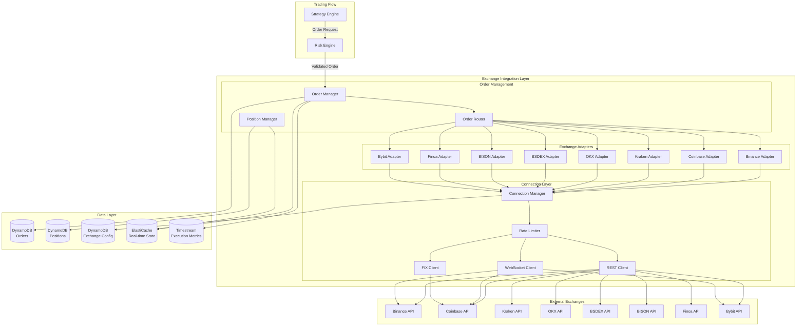

# Design Document: Exchange Integration

## Overview

The Exchange Integration feature provides the execution layer for the AI-Assisted Crypto Trading System, enabling connectivity to external crypto exchanges via REST, WebSocket, and FIX protocols. It receives validated orders from the Risk Engine and manages their complete lifecycle through to settlement.

Key design principles:
- **Protocol Agnostic**: Unified interface abstracts REST, WebSocket, and FIX implementations
- **Resilient**: Automatic reconnection, failover, and error recovery
- **Rate-Aware**: Intelligent rate limiting with capacity reservation for critical operations
- **Auditable**: Complete logging of all exchange interactions for compliance

## Architecture




## Components and Interfaces

### Exchange Adapter Abstraction

```typescript
type ExchangeId = 'BINANCE' | 'COINBASE' | 'KRAKEN' | 'OKX' | 'BSDEX' | 'BISON' | 'FINOA' | 'BYBIT';
type ExchangeStatus = 'ACTIVE' | 'INACTIVE' | 'MAINTENANCE' | 'ERROR';
type ExchangeMode = 'PRODUCTION' | 'SANDBOX';
type AuthMethod = 'API_KEY' | 'HMAC' | 'OAUTH' | 'FIX_CREDENTIALS';

interface ExchangeConfig {
  exchangeId: ExchangeId;
  tenantId: string;
  name: string;
  mode: ExchangeMode;
  restEndpoint: string;
  wsEndpoint?: string;
  fixEndpoint?: string;
  authMethod: AuthMethod;
  credentials: EncryptedCredentials;
  supportedFeatures: ExchangeFeatures;
  rateLimits: ExchangeRateLimits;
  status: ExchangeStatus;
  priority: number;  // For failover ordering
  createdAt: string;
  updatedAt: string;
}

interface ExchangeFeatures {
  supportedOrderTypes: OrderType[];
  supportedAssets: string[];
  supportedTimeInForce: TimeInForce[];
  supportsOrderModification: boolean;
  supportsWebSocket: boolean;
  supportsFIX: boolean;
  maxOrderSize: number;
  minOrderSize: number;
  tickSize: number;
  lotSize: number;
}

interface ExchangeRateLimits {
  ordersPerSecond: number;
  ordersPerMinute: number;
  queriesPerSecond: number;
  queriesPerMinute: number;
  wsMessagesPerSecond: number;
  weightPerMinute?: number;  // For weight-based limits like Binance
}

interface EncryptedCredentials {
  apiKey: string;
  apiSecret: string;
  passphrase?: string;  // For exchanges like Coinbase
  fixSenderCompId?: string;
  fixTargetCompId?: string;
}


// Exchange Adapter Interface - all exchange adapters implement this
interface ExchangeAdapter {
  readonly exchangeId: ExchangeId;
  readonly mode: ExchangeMode;
  
  // Connection management
  connect(): Promise<void>;
  disconnect(): Promise<void>;
  isConnected(): boolean;
  
  // Order operations (unified across REST/WS/FIX)
  submitOrder(order: OrderRequest): Promise<OrderResponse>;
  cancelOrder(orderId: string, exchangeOrderId: string): Promise<CancelResponse>;
  modifyOrder(orderId: string, modifications: OrderModification): Promise<OrderResponse>;
  getOrderStatus(orderId: string, exchangeOrderId: string): Promise<OrderStatus>;
  
  // Account operations
  getBalance(asset?: string): Promise<BalanceResponse>;
  getPositions(): Promise<PositionResponse[]>;
  
  // Real-time subscriptions
  subscribeToOrderUpdates(callback: (update: OrderUpdate) => void): Promise<SubscriptionHandle>;
  subscribeToExecutions(callback: (execution: ExecutionUpdate) => void): Promise<SubscriptionHandle>;
  unsubscribe(handle: SubscriptionHandle): Promise<void>;
  
  // Health and status
  healthCheck(): Promise<ExchangeHealthResult>;
  getRateLimitStatus(): Promise<RateLimitStatus>;
}

interface ExchangeService {
  registerExchange(tenantId: string, config: ExchangeConfigInput): Promise<ExchangeConfig>;
  getExchange(tenantId: string, exchangeId: ExchangeId): Promise<ExchangeConfig>;
  updateExchange(tenantId: string, exchangeId: ExchangeId, updates: Partial<ExchangeConfigInput>): Promise<ExchangeConfig>;
  listExchanges(tenantId: string): Promise<ExchangeConfig[]>;
  setExchangeStatus(tenantId: string, exchangeId: ExchangeId, status: ExchangeStatus): Promise<void>;
  getAdapter(tenantId: string, exchangeId: ExchangeId): Promise<ExchangeAdapter>;
  validateCredentials(tenantId: string, exchangeId: ExchangeId): Promise<CredentialValidationResult>;
}
```


### Order Types and Management

```typescript
type OrderType = 'MARKET' | 'LIMIT' | 'STOP_LIMIT' | 'STOP_MARKET' | 'TRAILING_STOP';
type OrderSide = 'BUY' | 'SELL';
type OrderStatus = 'PENDING' | 'OPEN' | 'PARTIALLY_FILLED' | 'FILLED' | 'CANCELLED' | 'REJECTED' | 'EXPIRED';
type TimeInForce = 'GTC' | 'IOC' | 'FOK' | 'GTD';

interface OrderRequest {
  orderId: string;           // Internal unique ID
  tenantId: string;
  strategyId: string;
  assetId: string;
  side: OrderSide;
  orderType: OrderType;
  quantity: number;
  price?: number;            // Required for LIMIT orders
  stopPrice?: number;        // Required for STOP orders
  trailingDelta?: number;    // For TRAILING_STOP
  timeInForce: TimeInForce;
  expiresAt?: string;        // For GTD orders
  exchangeId?: ExchangeId;   // Optional - router selects if not specified
  idempotencyKey: string;    // For duplicate prevention
  metadata?: Record<string, unknown>;
  timestamp: string;
}

interface OrderResponse {
  orderId: string;
  exchangeOrderId: string;
  exchangeId: ExchangeId;
  status: OrderStatus;
  filledQuantity: number;
  remainingQuantity: number;
  averagePrice?: number;
  commission?: number;
  commissionAsset?: string;
  createdAt: string;
  updatedAt: string;
}

interface OrderModification {
  newPrice?: number;
  newQuantity?: number;
  newStopPrice?: number;
}

interface CancelResponse {
  orderId: string;
  exchangeOrderId: string;
  status: 'CANCELLED' | 'PENDING_CANCEL' | 'FAILED';
  reason?: string;
  cancelledAt?: string;
}

interface OrderUpdate {
  orderId: string;
  exchangeOrderId: string;
  exchangeId: ExchangeId;
  status: OrderStatus;
  filledQuantity: number;
  remainingQuantity: number;
  lastFilledPrice?: number;
  lastFilledQuantity?: number;
  timestamp: string;
}

interface ExecutionUpdate {
  executionId: string;
  orderId: string;
  exchangeOrderId: string;
  exchangeId: ExchangeId;
  side: OrderSide;
  quantity: number;
  price: number;
  commission: number;
  commissionAsset: string;
  timestamp: string;
}


interface Order {
  orderId: string;
  tenantId: string;
  strategyId: string;
  exchangeId: ExchangeId;
  exchangeOrderId?: string;
  assetId: string;
  side: OrderSide;
  orderType: OrderType;
  quantity: number;
  filledQuantity: number;
  remainingQuantity: number;
  price?: number;
  stopPrice?: number;
  averageFilledPrice?: number;
  timeInForce: TimeInForce;
  status: OrderStatus;
  idempotencyKey: string;
  fills: Fill[];
  createdAt: string;
  updatedAt: string;
  submittedAt?: string;
  completedAt?: string;
}

interface Fill {
  fillId: string;
  executionId: string;
  quantity: number;
  price: number;
  commission: number;
  commissionAsset: string;
  timestamp: string;
}

interface OrderManager {
  submitOrder(order: OrderRequest): Promise<OrderResponse>;
  cancelOrder(tenantId: string, orderId: string): Promise<CancelResponse>;
  modifyOrder(tenantId: string, orderId: string, modifications: OrderModification): Promise<OrderResponse>;
  getOrder(tenantId: string, orderId: string): Promise<Order>;
  listOrders(tenantId: string, filters?: OrderFilters): Promise<Order[]>;
  getOpenOrders(tenantId: string, strategyId?: string): Promise<Order[]>;
  processFill(fill: ExecutionUpdate): Promise<void>;
  reconcileOrders(tenantId: string, exchangeId: ExchangeId): Promise<ReconciliationResult>;
}

interface OrderFilters {
  strategyId?: string;
  exchangeId?: ExchangeId;
  assetId?: string;
  status?: OrderStatus[];
  side?: OrderSide;
  startTime?: string;
  endTime?: string;
  limit?: number;
}

interface ReconciliationResult {
  ordersChecked: number;
  discrepancies: OrderDiscrepancy[];
  reconciled: boolean;
  timestamp: string;
}

interface OrderDiscrepancy {
  orderId: string;
  field: string;
  internalValue: unknown;
  exchangeValue: unknown;
  resolved: boolean;
}
```


### Order Routing

```typescript
type RoutingCriteria = 'BEST_PRICE' | 'LOWEST_FEES' | 'HIGHEST_LIQUIDITY' | 'USER_PREFERENCE';

interface RoutingConfig {
  configId: string;
  tenantId: string;
  defaultCriteria: RoutingCriteria;
  exchangePriorities: ExchangePriority[];
  enableOrderSplitting: boolean;
  maxSplitExchanges: number;
  minSplitSize: number;
}

interface ExchangePriority {
  exchangeId: ExchangeId;
  priority: number;
  enabled: boolean;
}

interface RoutingDecision {
  decisionId: string;
  orderId: string;
  criteria: RoutingCriteria;
  selectedExchange: ExchangeId;
  alternativeExchanges: ExchangeId[];
  reasoning: RoutingReasoning;
  splitOrders?: SplitOrder[];
  timestamp: string;
}

interface RoutingReasoning {
  priceComparison?: PriceComparison[];
  liquidityAnalysis?: LiquidityAnalysis[];
  feeComparison?: FeeComparison[];
  availabilityCheck: ExchangeAvailability[];
}

interface PriceComparison {
  exchangeId: ExchangeId;
  bidPrice: number;
  askPrice: number;
  spread: number;
}

interface LiquidityAnalysis {
  exchangeId: ExchangeId;
  bidDepth: number;
  askDepth: number;
  estimatedSlippage: number;
}

interface FeeComparison {
  exchangeId: ExchangeId;
  makerFee: number;
  takerFee: number;
  estimatedCost: number;
}

interface ExchangeAvailability {
  exchangeId: ExchangeId;
  available: boolean;
  reason?: string;
}

interface SplitOrder {
  exchangeId: ExchangeId;
  quantity: number;
  estimatedPrice: number;
}

interface OrderRouter {
  routeOrder(order: OrderRequest): Promise<RoutingDecision>;
  getRoutingConfig(tenantId: string): Promise<RoutingConfig>;
  updateRoutingConfig(tenantId: string, config: Partial<RoutingConfig>): Promise<RoutingConfig>;
  getOrderBookSummary(assetId: string): Promise<OrderBookSummary[]>;
  trackRoutingOutcome(decisionId: string, outcome: RoutingOutcome): Promise<void>;
}

interface OrderBookSummary {
  exchangeId: ExchangeId;
  assetId: string;
  bestBid: number;
  bestAsk: number;
  bidDepth: number;
  askDepth: number;
  spread: number;
  spreadPercent: number;
  timestamp: string;
}

interface RoutingOutcome {
  decisionId: string;
  success: boolean;
  actualExchange: ExchangeId;
  actualPrice: number;
  slippage: number;
  executionTimeMs: number;
}
```


### Position Management

```typescript
interface Position {
  positionId: string;
  tenantId: string;
  assetId: string;
  exchangeId: ExchangeId;
  quantity: number;
  averageEntryPrice: number;
  currentPrice: number;
  unrealizedPnL: number;
  unrealizedPnLPercent: number;
  realizedPnL: number;
  totalCommissions: number;
  openedAt: string;
  updatedAt: string;
}

interface AggregatedPosition {
  tenantId: string;
  assetId: string;
  totalQuantity: number;
  weightedAveragePrice: number;
  unrealizedPnL: number;
  realizedPnL: number;
  positionsByExchange: ExchangePosition[];
  updatedAt: string;
}

interface ExchangePosition {
  exchangeId: ExchangeId;
  quantity: number;
  averageEntryPrice: number;
  unrealizedPnL: number;
}

interface PositionHistory {
  historyId: string;
  positionId: string;
  tenantId: string;
  assetId: string;
  exchangeId: ExchangeId;
  eventType: 'OPEN' | 'INCREASE' | 'DECREASE' | 'CLOSE' | 'RECONCILE';
  previousQuantity: number;
  newQuantity: number;
  previousAvgPrice: number;
  newAvgPrice: number;
  fillId?: string;
  timestamp: string;
}

interface PositionManager {
  getPosition(tenantId: string, assetId: string, exchangeId: ExchangeId): Promise<Position | null>;
  getAggregatedPosition(tenantId: string, assetId: string): Promise<AggregatedPosition>;
  listPositions(tenantId: string, exchangeId?: ExchangeId): Promise<Position[]>;
  updatePositionFromFill(fill: ExecutionUpdate): Promise<Position>;
  reconcilePositions(tenantId: string, exchangeId: ExchangeId): Promise<PositionReconciliationResult>;
  calculateUnrealizedPnL(tenantId: string, assetId: string, currentPrice: number): Promise<number>;
  getPositionHistory(tenantId: string, assetId: string, startTime: string, endTime: string): Promise<PositionHistory[]>;
}

interface PositionReconciliationResult {
  exchangeId: ExchangeId;
  positionsChecked: number;
  discrepancies: PositionDiscrepancy[];
  adjustmentsMade: PositionAdjustment[];
  timestamp: string;
}

interface PositionDiscrepancy {
  assetId: string;
  internalQuantity: number;
  exchangeQuantity: number;
  difference: number;
}

interface PositionAdjustment {
  assetId: string;
  previousQuantity: number;
  adjustedQuantity: number;
  reason: string;
}
```


### Connection Management

```typescript
type ConnectionType = 'REST' | 'WEBSOCKET' | 'FIX';
type ConnectionStatus = 'CONNECTED' | 'CONNECTING' | 'DISCONNECTED' | 'RECONNECTING' | 'ERROR';

interface Connection {
  connectionId: string;
  exchangeId: ExchangeId;
  tenantId: string;
  type: ConnectionType;
  status: ConnectionStatus;
  endpoint: string;
  connectedAt?: string;
  lastActivityAt: string;
  reconnectAttempts: number;
  metrics: ConnectionMetrics;
}

interface ConnectionMetrics {
  uptimeMs: number;
  latencyMs: number;
  latencyP95Ms: number;
  errorRate: number;
  messagesReceived: number;
  messagesSent: number;
  reconnectionCount: number;
  lastErrorAt?: string;
  lastError?: string;
}

interface ConnectionPool {
  exchangeId: ExchangeId;
  tenantId: string;
  connections: Connection[];
  maxConnections: number;
  activeConnections: number;
  healthyConnections: number;
}

interface ReconnectionStrategy {
  initialDelayMs: number;
  maxDelayMs: number;
  multiplier: number;
  maxAttempts: number;
  jitterPercent: number;
}

interface ConnectionManager {
  getConnection(tenantId: string, exchangeId: ExchangeId, type: ConnectionType): Promise<Connection>;
  createConnection(tenantId: string, exchangeId: ExchangeId, type: ConnectionType): Promise<Connection>;
  closeConnection(connectionId: string): Promise<void>;
  getConnectionPool(tenantId: string, exchangeId: ExchangeId): Promise<ConnectionPool>;
  getConnectionMetrics(connectionId: string): Promise<ConnectionMetrics>;
  monitorHealth(tenantId: string, exchangeId: ExchangeId): Promise<ConnectionHealthReport>;
  gracefulShutdown(tenantId: string, exchangeId?: ExchangeId): Promise<ShutdownResult>;
  setReconnectionStrategy(exchangeId: ExchangeId, strategy: ReconnectionStrategy): Promise<void>;
}

interface ConnectionHealthReport {
  exchangeId: ExchangeId;
  overallHealth: 'HEALTHY' | 'DEGRADED' | 'UNHEALTHY';
  connections: ConnectionHealthDetail[];
  recommendations: string[];
  timestamp: string;
}

interface ConnectionHealthDetail {
  connectionId: string;
  type: ConnectionType;
  status: ConnectionStatus;
  latencyMs: number;
  errorRate: number;
  healthy: boolean;
}

interface ShutdownResult {
  connectionsClosedCount: number;
  pendingRequestsCompleted: number;
  pendingRequestsCancelled: number;
  shutdownTimeMs: number;
}
```


### Rate Limiting

```typescript
type RateLimitCategory = 'ORDERS' | 'QUERIES' | 'WEBSOCKET' | 'WEIGHT';

interface RateLimitState {
  exchangeId: ExchangeId;
  tenantId: string;
  category: RateLimitCategory;
  limit: number;
  used: number;
  remaining: number;
  resetsAt: string;
  reservedForCritical: number;
}

interface RateLimitConfig {
  exchangeId: ExchangeId;
  limits: CategoryLimit[];
  criticalReservationPercent: number;  // Reserve for cancellations
  warningThresholdPercent: number;
  burstAllowed: boolean;
}

interface CategoryLimit {
  category: RateLimitCategory;
  requestsPerSecond: number;
  requestsPerMinute: number;
  weight?: number;  // For weight-based limits
}

interface QueuedRequest {
  requestId: string;
  category: RateLimitCategory;
  priority: 'CRITICAL' | 'HIGH' | 'NORMAL' | 'LOW';
  request: () => Promise<unknown>;
  queuedAt: string;
  estimatedExecutionAt?: string;
}

interface RateLimiter {
  checkLimit(exchangeId: ExchangeId, category: RateLimitCategory): Promise<RateLimitCheckResult>;
  consumeLimit(exchangeId: ExchangeId, category: RateLimitCategory, weight?: number): Promise<void>;
  queueRequest(exchangeId: ExchangeId, request: QueuedRequest): Promise<string>;
  getQueueStatus(exchangeId: ExchangeId): Promise<QueueStatus>;
  getRateLimitStatus(exchangeId: ExchangeId): Promise<RateLimitState[]>;
  handleRateLimitResponse(exchangeId: ExchangeId, retryAfterMs: number): Promise<void>;
  reserveCapacity(exchangeId: ExchangeId, category: RateLimitCategory, amount: number): Promise<boolean>;
}

interface RateLimitCheckResult {
  allowed: boolean;
  remaining: number;
  waitMs?: number;
  category: RateLimitCategory;
}

interface QueueStatus {
  exchangeId: ExchangeId;
  queuedRequests: number;
  criticalRequests: number;
  estimatedClearTimeMs: number;
  oldestRequestAge: number;
}
```


### Protocol-Specific Interfaces

```typescript
// REST Client Interface
interface RESTClient {
  request<T>(config: RESTRequestConfig): Promise<RESTResponse<T>>;
  signRequest(config: RESTRequestConfig, credentials: EncryptedCredentials): RESTRequestConfig;
}

interface RESTRequestConfig {
  method: 'GET' | 'POST' | 'PUT' | 'DELETE';
  endpoint: string;
  params?: Record<string, string>;
  body?: unknown;
  headers?: Record<string, string>;
  timeout?: number;
}

interface RESTResponse<T> {
  data: T;
  status: number;
  headers: Record<string, string>;
  latencyMs: number;
}

// WebSocket Client Interface
interface WebSocketClient {
  connect(endpoint: string, options?: WSOptions): Promise<void>;
  disconnect(): Promise<void>;
  send(message: unknown): Promise<void>;
  subscribe(channel: string, callback: (message: unknown) => void): Promise<SubscriptionHandle>;
  unsubscribe(handle: SubscriptionHandle): Promise<void>;
  onMessage(callback: (message: unknown) => void): void;
  onError(callback: (error: Error) => void): void;
  onClose(callback: (code: number, reason: string) => void): void;
  sendHeartbeat(): Promise<void>;
}

interface WSOptions {
  reconnect: boolean;
  reconnectStrategy: ReconnectionStrategy;
  heartbeatIntervalMs: number;
  pingTimeoutMs: number;
}

// FIX Client Interface
interface FIXClient {
  connect(config: FIXConfig): Promise<void>;
  disconnect(): Promise<void>;
  sendMessage(message: FIXMessage): Promise<void>;
  onMessage(callback: (message: FIXMessage) => void): void;
  logon(): Promise<void>;
  logout(): Promise<void>;
  sendHeartbeat(): Promise<void>;
  requestResend(beginSeqNo: number, endSeqNo: number): Promise<void>;
}

interface FIXConfig {
  senderCompId: string;
  targetCompId: string;
  host: string;
  port: number;
  heartbeatIntervalSec: number;
  resetOnLogon: boolean;
  persistMessages: boolean;
}

interface FIXMessage {
  msgType: string;
  fields: Record<number, string | number>;
  rawMessage?: string;
}

interface FIXOrderTranslator {
  toFIXNewOrderSingle(order: OrderRequest): FIXMessage;
  toFIXOrderCancelRequest(orderId: string, exchangeOrderId: string): FIXMessage;
  toFIXOrderCancelReplaceRequest(orderId: string, modifications: OrderModification): FIXMessage;
  fromFIXExecutionReport(message: FIXMessage): ExecutionUpdate;
  fromFIXOrderCancelReject(message: FIXMessage): CancelResponse;
}
```


### Error Handling Types

```typescript
type ErrorCategory = 'RETRYABLE' | 'RATE_LIMITED' | 'INVALID_REQUEST' | 'EXCHANGE_ERROR' | 'FATAL';

interface ExchangeError {
  errorId: string;
  exchangeId: ExchangeId;
  category: ErrorCategory;
  code: string;
  message: string;
  originalError?: unknown;
  retryable: boolean;
  retryAfterMs?: number;
  timestamp: string;
}

interface RetryConfig {
  maxRetries: number;
  initialDelayMs: number;
  maxDelayMs: number;
  multiplier: number;
  retryableCategories: ErrorCategory[];
}

interface ErrorHandler {
  categorizeError(error: unknown, exchangeId: ExchangeId): ExchangeError;
  shouldRetry(error: ExchangeError, attemptNumber: number): boolean;
  getRetryDelay(attemptNumber: number, config: RetryConfig): number;
  logError(error: ExchangeError): Promise<void>;
  alertOnError(error: ExchangeError): Promise<void>;
}

interface StuckOrder {
  orderId: string;
  exchangeOrderId?: string;
  exchangeId: ExchangeId;
  status: OrderStatus;
  lastKnownStatus: OrderStatus;
  stuckSince: string;
  resolutionAttempts: number;
  requiresManualIntervention: boolean;
}

interface ManualInterventionService {
  getStuckOrders(tenantId: string): Promise<StuckOrder[]>;
  resolveStuckOrder(tenantId: string, orderId: string, resolution: OrderResolution): Promise<void>;
  forceCancel(tenantId: string, orderId: string): Promise<CancelResponse>;
  forceReconcile(tenantId: string, orderId: string): Promise<Order>;
}

interface OrderResolution {
  action: 'CANCEL' | 'MARK_FILLED' | 'MARK_REJECTED' | 'RECONCILE';
  reason: string;
  resolvedBy: string;
}
```


### Audit and Logging

```typescript
interface ExchangeAuditLog {
  logId: string;
  tenantId: string;
  exchangeId: ExchangeId;
  operationType: 'ORDER_SUBMIT' | 'ORDER_CANCEL' | 'ORDER_MODIFY' | 'BALANCE_QUERY' | 'POSITION_QUERY';
  requestPayload: unknown;
  responsePayload: unknown;
  latencyMs: number;
  success: boolean;
  errorDetails?: string;
  timestamp: string;
}

interface AuditService {
  logOperation(log: ExchangeAuditLog): Promise<void>;
  getAuditLogs(tenantId: string, filters: AuditFilters): Promise<ExchangeAuditLog[]>;
  getOperationStats(tenantId: string, exchangeId: ExchangeId, period: string): Promise<OperationStats>;
}

interface AuditFilters {
  exchangeId?: ExchangeId;
  operationType?: string;
  success?: boolean;
  startTime?: string;
  endTime?: string;
  limit?: number;
}

interface OperationStats {
  totalOperations: number;
  successRate: number;
  averageLatencyMs: number;
  p95LatencyMs: number;
  errorsByCategory: Record<ErrorCategory, number>;
}
```

## Data Models

### DynamoDB Table Schemas

**ExchangeConfigs Table**
- Partition Key: `tenantId`
- Sort Key: `exchangeId`
- Attributes: name, mode, endpoints, authMethod, credentials (encrypted), supportedFeatures, rateLimits, status, priority, timestamps

**Orders Table**
- Partition Key: `tenantId`
- Sort Key: `orderId`
- GSI: `exchangeOrderId-index` for exchange lookups
- GSI: `strategyId-timestamp-index` for strategy queries
- GSI: `status-timestamp-index` for status filtering
- Attributes: all Order fields, fills array, lifecycle events

**Positions Table**
- Partition Key: `tenantId`
- Sort Key: `assetId#exchangeId`
- GSI: `exchangeId-index` for exchange-specific queries
- Attributes: quantity, averageEntryPrice, currentPrice, unrealizedPnL, realizedPnL, timestamps

**PositionHistory Table**
- Partition Key: `tenantId#assetId`
- Sort Key: `timestamp#historyId`
- Attributes: exchangeId, eventType, quantities, prices, fillId

**RoutingDecisions Table**
- Partition Key: `tenantId`
- Sort Key: `decisionId`
- GSI: `orderId-index` for order lookups
- TTL: `expiresAt` (30 days retention)
- Attributes: criteria, selectedExchange, reasoning, outcome

**ExchangeAuditLogs Table**
- Partition Key: `tenantId`
- Sort Key: `timestamp#logId`
- GSI: `exchangeId-timestamp-index`
- TTL: `expiresAt` (90 days retention)
- Attributes: operationType, request/response payloads, latency, success


### ElastiCache Schema

**Real-time Order State**
- Key: `order:{tenantId}:{orderId}`
- Value: JSON with current order status, fills, timestamps
- TTL: 24 hours after completion

**Position Cache**
- Key: `position:{tenantId}:{assetId}:{exchangeId}`
- Value: JSON with current position data
- TTL: 60 seconds (refreshed on updates)

**Rate Limit State**
- Key: `ratelimit:{tenantId}:{exchangeId}:{category}`
- Value: JSON with used/remaining counts, reset time
- TTL: Matches rate limit window

**Connection State**
- Key: `connection:{tenantId}:{exchangeId}:{type}`
- Value: JSON with connection status, metrics
- TTL: None (managed explicitly)

### Amazon Timestream Schema

**ExecutionMetrics Table**
- Dimensions: tenantId, exchangeId, assetId, orderType
- Measures: latencyMs, slippage, commission, fillRate
- Time: timestamp

**ConnectionMetrics Table**
- Dimensions: tenantId, exchangeId, connectionType
- Measures: latencyMs, errorRate, messagesPerSecond
- Time: timestamp

## Correctness Properties

*A property is a characteristic or behavior that should hold true across all valid executions of a system—essentially, a formal statement about what the system should do. Properties serve as the bridge between human-readable specifications and machine-verifiable correctness guarantees.*

### Property 1: Exchange Adapter Interface Consistency

*For any* registered Exchange_Adapter, it SHALL implement all methods defined in the ExchangeAdapter interface (submitOrder, cancelOrder, modifyOrder, getOrderStatus, getBalance, getPositions), AND calling these methods SHALL return responses conforming to the defined response types.

**Validates: Requirements 1.1, 1.3, 2.1**

### Property 2: Exchange Registration Completeness

*For any* Exchange_Config after registration, it SHALL contain valid exchangeId, tenantId, mode, restEndpoint, authMethod, credentials, supportedFeatures, and rateLimits, AND all required fields SHALL be retrievable.

**Validates: Requirements 1.2, 1.5**

### Property 3: Exchange Unavailability Handling

*For any* Exchange marked with status INACTIVE or ERROR, all order submissions to that exchange SHALL be rejected with an appropriate error, AND the Order_Router SHALL route to the next available exchange by priority.

**Validates: Requirements 1.4, 6.4**

### Property 4: Sandbox Mode Isolation

*For any* Exchange_Config with mode SANDBOX, all API calls SHALL be directed to the exchange's testnet/sandbox endpoints, AND no calls SHALL be made to production endpoints.

**Validates: Requirements 1.6**


### Property 5: REST Authentication Correctness

*For any* REST API request, the Exchange_Adapter SHALL apply the correct authentication method (API_KEY, HMAC, or OAuth) based on the exchange's configured authMethod, AND the signed request SHALL be accepted by the exchange.

**Validates: Requirements 2.2**

### Property 6: Retry with Exponential Backoff

*For any* transient or RETRYABLE error, the system SHALL retry with exponential backoff where delay = initialDelay * (multiplier ^ attemptNumber), AND retries SHALL stop after maxRetries attempts.

**Validates: Requirements 2.3, 10.2**

### Property 7: Error Categorization Completeness

*For any* error returned by an exchange, the ErrorHandler SHALL categorize it as exactly one of: RETRYABLE, RATE_LIMITED, INVALID_REQUEST, EXCHANGE_ERROR, or FATAL, AND the categorization SHALL be consistent for the same error type.

**Validates: Requirements 2.4, 10.1**

### Property 8: Rate Limit Enforcement

*For any* exchange with configured rate limits, when usage approaches the limit (within warningThresholdPercent), requests SHALL be queued rather than rejected, AND critical operations (cancellations) SHALL have reserved capacity.

**Validates: Requirements 2.5, 9.1, 9.2, 9.5**

### Property 9: Audit Log Completeness

*For any* REST API call (order submission, cancellation, query), both the request payload and response payload SHALL be logged with timestamp, latency, and success status.

**Validates: Requirements 2.6**

### Property 10: WebSocket Message Normalization

*For any* valid WebSocket message received from an exchange, the Exchange_Adapter SHALL parse it and emit a normalized event (OrderUpdate or ExecutionUpdate) conforming to the defined interfaces.

**Validates: Requirements 3.1, 3.2**

### Property 11: Connection Recovery with Exponential Backoff

*For any* dropped connection (WebSocket or FIX), the system SHALL attempt reconnection with exponential backoff, AND after successful reconnection, all active subscriptions SHALL be restored.

**Validates: Requirements 3.3, 3.4, 4.4, 8.2**


### Property 12: WebSocket Heartbeat Maintenance

*For any* active WebSocket connection, heartbeat messages SHALL be sent at the configured interval, AND if no response is received within pingTimeoutMs, the connection SHALL be marked unhealthy.

**Validates: Requirements 3.5**

### Property 12a: Multiple Concurrent WebSocket Connections

*For any* exchange that requires multiple WebSocket connections (e.g., separate streams for orders and market data), the Exchange_Adapter SHALL maintain and manage multiple concurrent connections, AND each connection SHALL be independently monitored for health and reconnection.

**Validates: Requirements 3.6**

### Property 13: FIX Message Round-Trip

*For any* valid OrderRequest, translating to FIX NewOrderSingle format and back SHALL produce an equivalent order with all essential fields preserved (orderId, side, quantity, price, orderType).

**Validates: Requirements 4.1, 4.3**

### Property 14: FIX Session Management

*For any* FIX session, the system SHALL handle Logon (35=A), Heartbeat (35=0), and Logout (35=5) messages, AND sequence numbers SHALL be tracked and gap fill requests sent when gaps are detected.

**Validates: Requirements 4.2, 4.6**

### Property 15: FIX Message Logging

*For any* FIX message sent or received, the raw message SHALL be logged with timestamp for compliance and debugging purposes.

**Validates: Requirements 4.5**

### Property 16: Order Type Support

*For any* Order_Manager, it SHALL accept and process orders of types: MARKET, LIMIT, STOP_LIMIT, STOP_MARKET, and TRAILING_STOP, AND each order type SHALL be validated for required fields (e.g., price for LIMIT, stopPrice for STOP orders).

**Validates: Requirements 5.1**

### Property 17: Order ID Uniqueness

*For any* submitted order, the Order_Manager SHALL assign a unique internal orderId, AND no two orders within the same tenant SHALL have the same orderId.

**Validates: Requirements 5.2**

### Property 17a: Order Modification Support

*For any* order modification request (price or quantity change), the Order_Manager SHALL submit the modification to the exchange if the exchange supports order modification, AND the order record SHALL be updated only after exchange confirmation.

**Validates: Requirements 5.3**

### Property 18: Order Cancellation Confirmation

*For any* order cancellation request, the Order_Manager SHALL NOT update the order status to CANCELLED until confirmation is received from the exchange, AND if confirmation fails, the order SHALL remain in its previous status.

**Validates: Requirements 5.4**


### Property 19: Partial Fill Tracking Accuracy

*For any* order with partial fills, the sum of all fill quantities SHALL equal filledQuantity, AND remainingQuantity SHALL equal (originalQuantity - filledQuantity).

**Validates: Requirements 5.5**

### Property 20: Time-in-Force Support

*For any* Order_Manager, it SHALL support time-in-force options GTC, IOC, FOK, and GTD, AND orders with GTD SHALL include a valid expiresAt timestamp.

**Validates: Requirements 5.6**

### Property 21: Order Routing Criteria Application

*For any* order routed by the Order_Router, the selected exchange SHALL match the configured routing criteria (BEST_PRICE, LOWEST_FEES, HIGHEST_LIQUIDITY, or USER_PREFERENCE), AND the routing decision SHALL be logged with reasoning.

**Validates: Requirements 6.1, 6.5**

### Property 22: Order Book Consideration in Routing

*For any* routing decision, the Order_Router SHALL consider current order book data (bid/ask depth, spread) from available exchanges, AND this data SHALL be included in the RoutingReasoning.

**Validates: Requirements 6.2**

### Property 23: Order Splitting

*For any* order larger than the configured threshold with enableOrderSplitting=true, the Order_Router SHALL split the order across multiple exchanges, AND the sum of split quantities SHALL equal the original order quantity.

**Validates: Requirements 6.3**

### Property 24: Exchange Size Constraints

*For any* order, the Order_Router SHALL validate against exchange-specific minOrderSize and lotSize, AND orders violating these constraints SHALL be rejected before submission.

**Validates: Requirements 6.6**

### Property 25: Position Tracking Granularity

*For any* tenant, positions SHALL be queryable at three levels: per asset per exchange, per asset aggregated across exchanges, and all positions, AND aggregated quantities SHALL equal the sum of exchange-specific quantities.

**Validates: Requirements 7.1**


### Property 26: Position and P&L Accuracy

*For any* fill received, the Position_Manager SHALL update the position quantity correctly (add for BUY, subtract for SELL), AND recalculate averageEntryPrice using weighted average, AND unrealizedPnL SHALL equal (currentPrice - averageEntryPrice) * quantity.

**Validates: Requirements 7.2, 7.5**

### Property 27: Position Reconciliation Source of Truth

*For any* position reconciliation that reveals a discrepancy between internal state and exchange data, the system SHALL use exchange data as the source of truth, AND an alert SHALL be generated with discrepancy details.

**Validates: Requirements 7.3, 7.4**

### Property 28: Position History Tracking

*For any* position change (open, increase, decrease, close, reconcile), a PositionHistory record SHALL be created with previousQuantity, newQuantity, and the triggering event.

**Validates: Requirements 7.6**

### Property 29: Connection Pool Management

*For any* exchange, the Connection_Manager SHALL maintain a ConnectionPool with connections not exceeding maxConnections, AND connections SHALL be reused when available.

**Validates: Requirements 8.1**

### Property 30: Connection Metrics Tracking

*For any* connection, the Connection_Manager SHALL continuously track: uptimeMs, latencyMs, errorRate, and reconnectionCount, AND these metrics SHALL be queryable via getConnectionMetrics.

**Validates: Requirements 8.3, 8.6**

### Property 31: Connection Quality Alerting

*For any* connection where latency exceeds threshold or errorRate exceeds threshold, an alert SHALL be generated, AND if configured, trading SHALL be paused for that exchange.

**Validates: Requirements 8.4**

### Property 32: Graceful Shutdown

*For any* graceful shutdown request, the Connection_Manager SHALL wait for in-flight requests to complete (up to timeout), AND SHALL NOT accept new requests during shutdown.

**Validates: Requirements 8.5**


### Property 33: Rate Limit Category Support

*For any* exchange, the Rate_Limiter SHALL track separate rate limits for categories: ORDERS, QUERIES, WEBSOCKET, and WEIGHT (if applicable), AND each category SHALL have independent usage tracking.

**Validates: Requirements 9.3**

### Property 34: Retry-After Header Handling

*For any* rate limit response from an exchange that includes a retry-after header, the Rate_Limiter SHALL parse the value and delay subsequent requests accordingly.

**Validates: Requirements 9.4**

### Property 35: Rate Limit Visibility

*For any* exchange, the current rate limit usage and remaining capacity SHALL be queryable via getRateLimitStatus, AND the response SHALL include all configured categories.

**Validates: Requirements 9.6**

### Property 36: Duplicate Order Prevention

*For any* order submission that fails, the Exchange_Adapter SHALL verify order status with the exchange before retrying, AND if the order exists, it SHALL NOT submit a duplicate.

**Validates: Requirements 10.3**

### Property 37: Idempotency Key Usage

*For any* order submission to an exchange that supports idempotency, the request SHALL include the order's idempotencyKey, AND resubmissions with the same key SHALL return the existing order rather than creating a duplicate.

**Validates: Requirements 10.4**

### Property 38: Exchange Error Alerting

*For any* error categorized as EXCHANGE_ERROR, the system SHALL log full error details (code, message, request context) AND trigger an alert for investigation.

**Validates: Requirements 10.5**

### Property 39: Stuck Order Identification

*For any* order that remains in an uncertain state (PENDING, OPEN with no updates) beyond a configured threshold, it SHALL be flagged as a StuckOrder and made available for manual intervention.

**Validates: Requirements 10.6**


## Error Handling

### REST API Errors

- **RETRYABLE (5xx, timeout)**: Retry with exponential backoff, verify order status before retry
- **RATE_LIMITED (429)**: Parse retry-after, queue request, wait accordingly
- **INVALID_REQUEST (4xx)**: Return error to caller, do not retry, log details
- **EXCHANGE_ERROR**: Log full details, alert for investigation, mark order uncertain
- **FATAL (auth failure)**: Disable exchange, alert administrator, require manual intervention

### WebSocket Errors

- **Connection Lost**: Attempt reconnection with exponential backoff (1s, 2s, 4s, 8s, max 60s)
- **Message Parse Error**: Log raw message, skip processing, increment error counter
- **Subscription Failed**: Retry subscription, alert if persistent failure
- **Heartbeat Timeout**: Mark connection unhealthy, trigger reconnection

### FIX Protocol Errors

- **Session Disconnect**: Attempt reconnection, resync sequence numbers
- **Sequence Gap**: Send ResendRequest for missing messages
- **Reject Message**: Log rejection reason, handle based on reject code
- **Logon Failure**: Alert administrator, disable FIX connectivity

### Order Errors

- **Submission Failed**: Verify order doesn't exist, retry if appropriate
- **Cancellation Failed**: Verify order status, retry or mark for manual intervention
- **Modification Failed**: Revert to original order state, alert user
- **Unknown State**: Flag as stuck order, require manual resolution

### Position Errors

- **Reconciliation Mismatch**: Use exchange data, log discrepancy, alert
- **P&L Calculation Error**: Use last known good values, flag for review
- **Update Failed**: Retry, alert on persistent failure

## Testing Strategy

### Unit Tests

Unit tests verify specific examples and edge cases:

- Exchange adapter implementations for each supported exchange
- Order type validation with various field combinations
- Position calculations with buy/sell sequences
- Rate limit tracking with various usage patterns
- Error categorization for known exchange error codes
- FIX message translation with sample messages
- Routing decision logic with mock order book data
- Partial fill handling with multiple fill scenarios
- Idempotency key generation and validation
- Connection state transitions


### Property-Based Tests

Property-based tests verify universal properties across randomly generated inputs. Each property test will:

- Run minimum 100 iterations with random inputs
- Use fast-check library for TypeScript property-based testing
- Tag each test with the corresponding design property number

**Test Configuration:**
- Framework: Jest with fast-check
- Minimum iterations: 100 per property
- Generators: Custom generators for OrderRequest, Order, Fill, Position, ExchangeConfig, Connection, RateLimitState, and ExchangeError objects

**Property Test Coverage:**
- Property 1: Generate exchange adapters, verify interface completeness
- Property 2: Generate exchange configs, verify registration completeness
- Property 3: Generate unavailable exchanges, verify order rejection
- Property 4: Generate sandbox configs, verify endpoint isolation
- Property 5: Generate REST requests, verify authentication application
- Property 6: Generate retry scenarios, verify exponential backoff timing
- Property 7: Generate exchange errors, verify categorization
- Property 8: Generate rate limit scenarios, verify queuing behavior
- Property 9: Generate REST operations, verify audit log completeness
- Property 10: Generate WebSocket messages, verify normalization
- Property 11: Generate connection drops, verify recovery behavior
- Property 12a: Generate multi-connection scenarios, verify concurrent WebSocket management
- Property 13: Generate orders, verify FIX round-trip translation
- Property 16: Generate order types, verify validation
- Property 17: Generate orders, verify ID uniqueness
- Property 17a: Generate order modifications, verify modification handling
- Property 18: Generate cancellation scenarios, verify confirmation requirement
- Property 19: Generate partial fills, verify quantity tracking
- Property 21: Generate routing scenarios, verify criteria application
- Property 23: Generate large orders, verify splitting logic
- Property 24: Generate orders, verify size constraint validation
- Property 25: Generate positions, verify aggregation accuracy
- Property 26: Generate fills, verify position and P&L updates
- Property 27: Generate reconciliation scenarios, verify source of truth
- Property 29: Generate connection requests, verify pool management
- Property 30: Generate connections, verify metrics tracking
- Property 33: Generate rate limit usage, verify category separation
- Property 36: Generate failed submissions, verify duplicate prevention
- Property 37: Generate idempotent requests, verify key usage

### Integration Tests

Integration tests verify end-to-end flows:

- Full order lifecycle: submit → fill → position update → P&L calculation
- Order routing: receive order → evaluate exchanges → route → execute
- Connection management: connect → subscribe → receive updates → reconnect on failure
- Rate limiting: approach limit → queue requests → process after reset
- Position reconciliation: internal state → exchange query → discrepancy detection → adjustment
- Multi-exchange order splitting: large order → split → execute on multiple exchanges → aggregate fills
- FIX session: logon → send order → receive execution → logout
- Error recovery: submission failure → status check → retry or manual intervention
