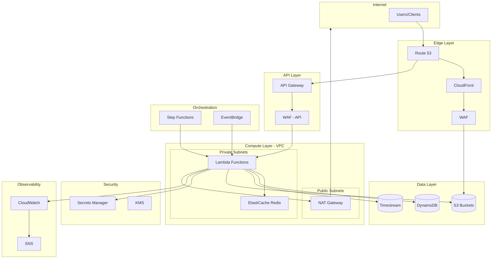

# Design Document: Infrastructure Deployment

## Overview

This design document describes the Terraform-based infrastructure for deploying the AI-Assisted Crypto Trading System to AWS. The infrastructure supports two environments (test and production) using a modular, reusable architecture that follows AWS Well-Architected Framework principles.

The design emphasizes:
- **Modularity**: Reusable Terraform modules for each AWS service
- **Security**: Defense-in-depth with encryption, least-privilege IAM, and network isolation
- **Scalability**: Serverless-first architecture with auto-scaling capabilities
- **Observability**: Comprehensive monitoring, logging, and alerting
- **Cost Efficiency**: Environment-appropriate sizing with cost controls

## Architecture

### High-Level Architecture Diagram



### Terraform Project Structure

```
infrastructure/
├── modules/
│   ├── vpc/
│   │   ├── main.tf
│   │   ├── variables.tf
│   │   ├── outputs.tf
│   │   └── vpc-endpoints.tf
│   ├── dynamodb/
│   │   ├── main.tf
│   │   ├── variables.tf
│   │   ├── outputs.tf
│   │   └── tables.tf
│   ├── timestream/
│   │   ├── main.tf
│   │   ├── variables.tf
│   │   └── outputs.tf
│   ├── s3/
│   │   ├── main.tf
│   │   ├── variables.tf
│   │   └── outputs.tf
│   ├── lambda/
│   │   ├── main.tf
│   │   ├── variables.tf
│   │   ├── outputs.tf
│   │   ├── functions.tf
│   │   └── layers.tf
│   ├── api-gateway/
│   │   ├── main.tf
│   │   ├── variables.tf
│   │   ├── outputs.tf
│   │   └── routes.tf
│   ├── elasticache/
│   │   ├── main.tf
│   │   ├── variables.tf
│   │   └── outputs.tf
│   ├── secrets/
│   │   ├── main.tf
│   │   ├── variables.tf
│   │   └── outputs.tf
│   ├── cloudfront/
│   │   ├── main.tf
│   │   ├── variables.tf
│   │   └── outputs.tf
│   ├── step-functions/
│   │   ├── main.tf
│   │   ├── variables.tf
│   │   ├── outputs.tf
│   │   └── state-machines/
│   ├── eventbridge/
│   │   ├── main.tf
│   │   ├── variables.tf
│   │   └── outputs.tf
│   ├── sns/
│   │   ├── main.tf
│   │   ├── variables.tf
│   │   └── outputs.tf
│   ├── cloudwatch/
│   │   ├── main.tf
│   │   ├── variables.tf
│   │   ├── outputs.tf
│   │   ├── dashboards.tf
│   │   └── alarms.tf
│   ├── waf/
│   │   ├── main.tf
│   │   ├── variables.tf
│   │   └── outputs.tf
│   ├── iam/
│   │   ├── main.tf
│   │   ├── variables.tf
│   │   ├── outputs.tf
│   │   └── policies/
│   ├── kms/
│   │   ├── main.tf
│   │   ├── variables.tf
│   │   └── outputs.tf
│   ├── route53/
│   │   ├── main.tf
│   │   ├── variables.tf
│   │   └── outputs.tf
│   ├── acm/
│   │   ├── main.tf
│   │   ├── variables.tf
│   │   └── outputs.tf
│   ├── backup/
│   │   ├── main.tf
│   │   ├── variables.tf
│   │   └── outputs.tf
│   └── budgets/
│       ├── main.tf
│       ├── variables.tf
│       └── outputs.tf
├── environments/
│   ├── test/
│   │   ├── main.tf
│   │   ├── backend.tf
│   │   ├── variables.tf
│   │   ├── terraform.tfvars
│   │   └── outputs.tf
│   └── production/
│       ├── main.tf
│       ├── backend.tf
│       ├── variables.tf
│       ├── terraform.tfvars
│       └── outputs.tf
├── global/
│   ├── state-bucket/
│   │   ├── main.tf
│   │   └── outputs.tf
│   └── acm-cloudfront/
│       ├── main.tf
│       └── outputs.tf
└── scripts/
    ├── init-backend.sh
    ├── deploy.sh
    └── destroy.sh
```

## Components and Interfaces

### VPC Module

The VPC module creates the network foundation with proper isolation.

```hcl
# modules/vpc/variables.tf
variable "environment" {
  type        = string
  description = "Environment name (test/production)"
}

variable "vpc_cidr" {
  type        = string
  description = "CIDR block for VPC"
}

variable "availability_zones" {
  type        = list(string)
  description = "List of availability zones"
}

variable "enable_nat_gateway" {
  type        = bool
  description = "Enable NAT Gateway"
  default     = true
}

variable "single_nat_gateway" {
  type        = bool
  description = "Use single NAT Gateway (for test environment)"
  default     = false
}
```

```hcl
# modules/vpc/main.tf (structure)
resource "aws_vpc" "main" {
  cidr_block           = var.vpc_cidr
  enable_dns_hostnames = true
  enable_dns_support   = true
  
  tags = {
    Name        = "${var.environment}-crypto-trading-vpc"
    Environment = var.environment
  }
}

# Public subnets for NAT Gateways
resource "aws_subnet" "public" {
  count             = length(var.availability_zones)
  vpc_id            = aws_vpc.main.id
  cidr_block        = cidrsubnet(var.vpc_cidr, 4, count.index)
  availability_zone = var.availability_zones[count.index]
  
  tags = {
    Name        = "${var.environment}-public-${var.availability_zones[count.index]}"
    Environment = var.environment
    Type        = "public"
  }
}

# Private subnets for Lambda functions
resource "aws_subnet" "private" {
  count             = length(var.availability_zones)
  vpc_id            = aws_vpc.main.id
  cidr_block        = cidrsubnet(var.vpc_cidr, 4, count.index + length(var.availability_zones))
  availability_zone = var.availability_zones[count.index]
  
  tags = {
    Name        = "${var.environment}-private-${var.availability_zones[count.index]}"
    Environment = var.environment
    Type        = "private"
  }
}
```

### DynamoDB Module

The DynamoDB module creates all 32 tables with proper configuration.

```hcl
# modules/dynamodb/variables.tf
variable "environment" {
  type        = string
  description = "Environment name"
}

variable "billing_mode" {
  type        = string
  description = "DynamoDB billing mode (PAY_PER_REQUEST or PROVISIONED)"
  default     = "PAY_PER_REQUEST"
}

variable "enable_autoscaling" {
  type        = bool
  description = "Enable auto-scaling for provisioned capacity"
  default     = false
}

variable "tables" {
  type = map(object({
    partition_key      = string
    partition_key_type = string
    sort_key           = optional(string)
    sort_key_type      = optional(string)
    ttl_attribute      = optional(string)
    gsi = optional(list(object({
      name               = string
      partition_key      = string
      partition_key_type = string
      sort_key           = optional(string)
      sort_key_type      = optional(string)
    })))
  }))
  description = "Map of table configurations"
}
```

### Lambda Module

The Lambda module deploys all handler functions with proper configuration.

```hcl
# modules/lambda/variables.tf
variable "environment" {
  type        = string
  description = "Environment name"
}

variable "vpc_id" {
  type        = string
  description = "VPC ID for Lambda functions"
}

variable "subnet_ids" {
  type        = list(string)
  description = "Private subnet IDs for Lambda functions"
}

variable "security_group_ids" {
  type        = list(string)
  description = "Security group IDs for Lambda functions"
}

variable "functions" {
  type = map(object({
    handler              = string
    memory_size          = number
    timeout              = number
    reserved_concurrency = optional(number)
    provisioned_concurrency = optional(number)
    environment_variables = optional(map(string))
  }))
  description = "Map of Lambda function configurations"
}

variable "layers" {
  type = list(object({
    name               = string
    compatible_runtimes = list(string)
    s3_bucket          = string
    s3_key             = string
  }))
  description = "Lambda layers configuration"
}
```

### API Gateway Module

```hcl
# modules/api-gateway/variables.tf
variable "environment" {
  type        = string
  description = "Environment name"
}

variable "domain_name" {
  type        = string
  description = "Custom domain name for API"
}

variable "certificate_arn" {
  type        = string
  description = "ACM certificate ARN"
}

variable "throttling_rate_limit" {
  type        = number
  description = "Requests per second limit"
  default     = 1000
}

variable "throttling_burst_limit" {
  type        = number
  description = "Burst limit"
  default     = 2000
}

variable "enable_caching" {
  type        = bool
  description = "Enable API caching"
  default     = false
}

variable "lambda_functions" {
  type        = map(string)
  description = "Map of route to Lambda function ARN"
}
```

## Data Models

### Environment Configuration

```hcl
# environments/test/terraform.tfvars
environment = "test"
aws_region  = "eu-central-1"

# Networking
vpc_cidr           = "10.0.0.0/16"
availability_zones = ["eu-central-1a", "eu-central-1b"]
single_nat_gateway = true

# Domain
domain_name     = "test.cryptotrading.example.com"
api_domain_name = "api.test.cryptotrading.example.com"

# DynamoDB
dynamodb_billing_mode = "PAY_PER_REQUEST"
enable_autoscaling    = false

# Lambda
lambda_memory_default = 256
lambda_timeout_default = 30

# Redis
redis_node_type       = "cache.t3.micro"
redis_num_cache_nodes = 1
redis_multi_az        = false

# Timestream
timestream_memory_retention_hours   = 24
timestream_magnetic_retention_days  = 30

# S3 Lifecycle
audit_log_retention_days = 90

# CloudWatch
log_retention_days = 30

# Throttling
api_throttling_rate_limit  = 1000
api_throttling_burst_limit = 2000

# Budgets
monthly_budget_amount = 500
```

```hcl
# environments/production/terraform.tfvars
environment = "production"
aws_region  = "eu-central-1"

# Networking
vpc_cidr           = "10.1.0.0/16"
availability_zones = ["eu-central-1a", "eu-central-1b", "eu-central-1c"]
single_nat_gateway = false

# Domain
domain_name     = "cryptotrading.example.com"
api_domain_name = "api.cryptotrading.example.com"

# DynamoDB
dynamodb_billing_mode = "PROVISIONED"
enable_autoscaling    = true

# Lambda
lambda_memory_default = 512
lambda_timeout_default = 30
enable_provisioned_concurrency = true

# Redis
redis_node_type       = "cache.r6g.large"
redis_num_cache_nodes = 2
redis_multi_az        = true

# Timestream
timestream_memory_retention_hours   = 168  # 7 days
timestream_magnetic_retention_days  = 365

# S3 Lifecycle
audit_log_retention_days = 2555  # 7 years

# CloudWatch
log_retention_days = 90

# Throttling
api_throttling_rate_limit  = 10000
api_throttling_burst_limit = 20000

# Budgets
monthly_budget_amount = 5000
```

### DynamoDB Table Definitions

```hcl
# modules/dynamodb/tables.tf
locals {
  tables = {
    strategy-templates = {
      partition_key      = "templateId"
      partition_key_type = "S"
      sort_key           = "version"
      sort_key_type      = "N"
      gsi = [{
        name               = "name-index"
        partition_key      = "name"
        partition_key_type = "S"
      }]
    }
    
    strategies = {
      partition_key      = "tenantId"
      partition_key_type = "S"
      sort_key           = "strategyId"
      sort_key_type      = "S"
    }
    
    strategy-versions = {
      partition_key      = "strategyId"
      partition_key_type = "S"
      sort_key           = "version"
      sort_key_type      = "N"
    }
    
    deployments = {
      partition_key      = "tenantId"
      partition_key_type = "S"
      sort_key           = "deploymentId"
      sort_key_type      = "S"
      gsi = [{
        name               = "strategyId-index"
        partition_key      = "strategyId"
        partition_key_type = "S"
      }]
    }
    
    # ... (remaining 28 tables follow same pattern)
    
    risk-events = {
      partition_key      = "tenantId"
      partition_key_type = "S"
      sort_key           = "timestampEventId"
      sort_key_type      = "S"
      ttl_attribute      = "expiresAt"
      gsi = [
        {
          name               = "eventType-timestamp-index"
          partition_key      = "eventType"
          partition_key_type = "S"
          sort_key           = "timestamp"
          sort_key_type      = "S"
        },
        {
          name               = "severity-timestamp-index"
          partition_key      = "severity"
          partition_key_type = "S"
          sort_key           = "timestamp"
          sort_key_type      = "S"
        }
      ]
    }
    
    trade-lifecycle = {
      partition_key      = "tenantId"
      partition_key_type = "S"
      sort_key           = "eventId"
      sort_key_type      = "S"
      gsi = [
        {
          name               = "correlationId-timestamp-index"
          partition_key      = "correlationId"
          partition_key_type = "S"
          sort_key           = "timestamp"
          sort_key_type      = "S"
        },
        {
          name               = "strategyId-timestamp-index"
          partition_key      = "strategyId"
          partition_key_type = "S"
          sort_key           = "timestamp"
          sort_key_type      = "S"
        }
      ]
    }
  }
}
```

### Lambda Function Definitions

```hcl
# modules/lambda/functions.tf
locals {
  functions = {
    # Strategy Management
    strategies = {
      handler     = "handlers/strategies.handler"
      memory_size = 512
      timeout     = 30
    }
    templates = {
      handler     = "handlers/templates.handler"
      memory_size = 256
      timeout     = 30
    }
    versions = {
      handler     = "handlers/versions.handler"
      memory_size = 256
      timeout     = 30
    }
    deployments = {
      handler     = "handlers/deployments.handler"
      memory_size = 512
      timeout     = 30
    }
    
    # Market Data
    streams = {
      handler     = "handlers/streams.handler"
      memory_size = 512
      timeout     = 60
    }
    data-sources = {
      handler     = "handlers/data-sources.handler"
      memory_size = 256
      timeout     = 30
    }
    backfills = {
      handler     = "handlers/backfills.handler"
      memory_size = 1024
      timeout     = 300
    }
    quality = {
      handler     = "handlers/quality.handler"
      memory_size = 512
      timeout     = 60
    }
    
    # AI Intelligence
    analysis = {
      handler     = "handlers/analysis.handler"
      memory_size = 1024
      timeout     = 60
    }
    model-configs = {
      handler     = "handlers/model-configs.handler"
      memory_size = 256
      timeout     = 30
    }
    providers = {
      handler     = "handlers/providers.handler"
      memory_size = 256
      timeout     = 30
    }
    allocations = {
      handler     = "handlers/allocations.handler"
      memory_size = 512
      timeout     = 30
    }
    ensemble = {
      handler     = "handlers/ensemble.handler"
      memory_size = 1024
      timeout     = 60
    }
    performance = {
      handler     = "handlers/performance.handler"
      memory_size = 512
      timeout     = 30
    }
    
    # Risk Controls
    position-limits = {
      handler              = "handlers/position-limits.handler"
      memory_size          = 512
      timeout              = 30
      reserved_concurrency = 10
    }
    drawdown = {
      handler              = "handlers/drawdown.handler"
      memory_size          = 512
      timeout              = 30
      reserved_concurrency = 10
    }
    circuit-breakers = {
      handler              = "handlers/circuit-breakers.handler"
      memory_size          = 512
      timeout              = 30
      reserved_concurrency = 20
    }
    kill-switch = {
      handler              = "handlers/kill-switch.handler"
      memory_size          = 256
      timeout              = 10
      reserved_concurrency = 50
    }
    risk-profiles = {
      handler     = "handlers/risk-profiles.handler"
      memory_size = 256
      timeout     = 30
    }
    risk-events = {
      handler     = "handlers/risk-events.handler"
      memory_size = 512
      timeout     = 30
    }
    
    # Exchange Integration
    exchange-config = {
      handler     = "handlers/exchange-config.handler"
      memory_size = 256
      timeout     = 30
    }
    exchange-connections = {
      handler     = "handlers/exchange-connections.handler"
      memory_size = 512
      timeout     = 60
    }
    exchange-orders = {
      handler              = "handlers/exchange-orders.handler"
      memory_size          = 512
      timeout              = 30
      reserved_concurrency = 100
    }
    exchange-positions = {
      handler     = "handlers/exchange-positions.handler"
      memory_size = 512
      timeout     = 30
    }
    
    # Audit & Reporting
    audit = {
      handler     = "handlers/audit.handler"
      memory_size = 512
      timeout     = 30
    }
    audit-packages = {
      handler     = "handlers/audit-packages.handler"
      memory_size = 1024
      timeout     = 300
    }
    audit-stream = {
      handler     = "handlers/audit-stream.handler"
      memory_size = 512
      timeout     = 60
    }
    ai-traces = {
      handler     = "handlers/ai-traces.handler"
      memory_size = 512
      timeout     = 30
    }
    data-lineage = {
      handler     = "handlers/data-lineage.handler"
      memory_size = 512
      timeout     = 30
    }
    compliance-reports = {
      handler     = "handlers/compliance-reports.handler"
      memory_size = 1024
      timeout     = 300
    }
    trade-lifecycle = {
      handler     = "handlers/trade-lifecycle.handler"
      memory_size = 512
      timeout     = 30
    }
    retention = {
      handler     = "handlers/retention.handler"
      memory_size = 512
      timeout     = 300
    }
    snapshots = {
      handler     = "handlers/snapshots.handler"
      memory_size = 1024
      timeout     = 300
    }
    news-context = {
      handler     = "handlers/news-context.handler"
      memory_size = 512
      timeout     = 60
    }
  }
}
```

## Correctness Properties

*A property is a characteristic or behavior that should hold true across all valid executions of a system—essentially, a formal statement about what the system should do. Properties serve as the bridge between human-readable specifications and machine-verifiable correctness guarantees.*

### Property 1: DynamoDB Table Schema Compliance

*For any* table defined in the backend `TableNames` constant, the Terraform configuration SHALL create a corresponding DynamoDB table with matching partition key, sort key, and GSI definitions as specified in `KeySchemas` and `GSINames`.

**Validates: Requirements 3.1, 3.2, 3.3**

### Property 2: DynamoDB Table Security Configuration

*For any* DynamoDB table created by the Terraform configuration, the table SHALL have point-in-time recovery enabled, server-side encryption enabled, and a name prefixed with the environment identifier.

**Validates: Requirements 3.4, 3.5, 3.9**

### Property 3: S3 Bucket Security Configuration

*For any* S3 bucket created by the Terraform configuration (excluding frontend-assets), the bucket SHALL have versioning enabled, server-side encryption enabled, and public access blocked.

**Validates: Requirements 5.2, 5.3, 5.4, 5.8**

### Property 4: Lambda Function Configuration Compliance

*For any* Lambda function created by the Terraform configuration, the function SHALL be deployed in VPC private subnets, have X-Ray tracing enabled, have an IAM execution role attached, have environment variables for DynamoDB table names, and have memory and timeout within specified ranges (256-1024MB, 10-300s).

**Validates: Requirements 6.2, 6.3, 6.4, 6.5, 6.6, 6.7**

### Property 5: Lambda Handler Coverage

*For any* handler file in the backend `handlers/` directory (excluding test files), the Terraform configuration SHALL create a corresponding Lambda function with appropriate integration to API Gateway.

**Validates: Requirements 6.1, 7.2**

### Property 6: API Gateway Request Validation

*For any* API Gateway endpoint created by the Terraform configuration, request validation SHALL be configured to validate request parameters and body against defined schemas.

**Validates: Requirements 7.4**

### Property 7: Secrets Manager Security Configuration

*For any* secret created in Secrets Manager, the secret SHALL have a resource policy restricting access to specific Lambda execution roles, use a KMS customer-managed key for encryption, and have a name prefixed with the environment identifier.

**Validates: Requirements 9.5, 9.6, 9.7**

### Property 8: SNS Topic Security Configuration

*For any* SNS topic created by the Terraform configuration, the topic SHALL have server-side encryption enabled and an access policy restricting publishing to authorized AWS services only.

**Validates: Requirements 13.3, 13.4**

### Property 9: IAM Policy Granularity

*For any* DynamoDB table, S3 bucket, or Secrets Manager secret, there SHALL exist a corresponding IAM policy that grants access only to that specific resource (not wildcards).

**Validates: Requirements 16.4, 16.5, 16.6, 16.8**

### Property 10: KMS Key Configuration

*For any* KMS customer-managed key created by the Terraform configuration, the key SHALL have automatic rotation enabled, a key policy with least-privilege access, and a corresponding alias for easy reference.

**Validates: Requirements 17.2, 17.3, 17.4**

### Property 11: CloudWatch Alarm Actions

*For any* CloudWatch alarm created by the Terraform configuration, the alarm SHALL have at least one action configured that references an SNS topic for notifications.

**Validates: Requirements 14.8**

### Property 12: CloudWatch Log Retention Compliance

*For any* CloudWatch log group created by the Terraform configuration, the retention period SHALL match the environment-specific configuration (30 days for test, 90 days for production).

**Validates: Requirements 14.6**

### Property 13: Environment Configuration Differentiation

*For any* configurable parameter that differs between environments (VPC CIDR, instance sizes, retention periods, scaling parameters, domain names, alarm thresholds), the test and production terraform.tfvars files SHALL contain different values.

**Validates: Requirements 2.6, 20.1, 20.2, 20.3, 20.4, 20.5**

### Property 14: Resource Tagging Compliance

*For any* AWS resource created by the Terraform configuration that supports tagging, the resource SHALL have tags for Environment, Project, Owner, and CostCenter.

**Validates: Requirements 23.1**

## Error Handling

### Terraform State Management

- Remote state stored in S3 with versioning enabled
- DynamoDB table for state locking prevents concurrent modifications
- State file encryption using SSE-S3
- Separate state files per environment to prevent cross-environment issues

### Deployment Failures

- Terraform plan required before apply
- Automatic rollback on apply failure (Terraform default behavior)
- Manual approval required for production deployments
- CloudWatch alarms for deployment pipeline failures

### Resource Creation Failures

- Retry logic built into Terraform provider
- Dependency ordering ensures resources created in correct sequence
- Outputs validated after creation
- Health checks for critical resources (API Gateway, Lambda)

### Network Failures

- Multi-AZ deployment for production
- NAT Gateway redundancy in production
- VPC endpoint fallback to NAT Gateway
- Health checks on Route 53 records

## Testing Strategy

### Unit Tests (Terraform Validate)

- Syntax validation for all Terraform files
- Variable type checking
- Module interface validation
- Provider version compatibility

### Property-Based Tests

Property-based tests will be implemented using `terraform-compliance` or custom Python scripts with `hypothesis` to verify the correctness properties defined above.

**Test Configuration:**
- Minimum 100 iterations per property test
- Tests run against `terraform plan` output (JSON format)
- Each test tagged with property reference

**Example Test Structure:**
```python
# test_dynamodb_properties.py
from hypothesis import given, strategies as st
import json

@given(table_name=st.sampled_from(BACKEND_TABLE_NAMES))
def test_dynamodb_table_schema_compliance(table_name, terraform_plan):
    """
    Feature: infrastructure-deployment
    Property 1: DynamoDB Table Schema Compliance
    Validates: Requirements 3.1, 3.2, 3.3
    """
    # Find table in plan
    table_resource = find_dynamodb_table(terraform_plan, table_name)
    assert table_resource is not None, f"Table {table_name} not found in plan"
    
    # Verify key schema matches backend definition
    expected_schema = BACKEND_KEY_SCHEMAS[table_name]
    assert table_resource['hash_key'] == expected_schema['partition_key']
    if 'sort_key' in expected_schema:
        assert table_resource['range_key'] == expected_schema['sort_key']
```

### Integration Tests

- Deploy to test environment
- Verify all resources created successfully
- Test API Gateway endpoints respond
- Verify Lambda functions execute
- Test cross-service connectivity

### Compliance Tests

- AWS Config rules for security compliance
- IAM Access Analyzer for policy validation
- Security Hub findings review
- Cost allocation tag verification

### Test Execution Order

1. `terraform fmt -check` - Code formatting
2. `terraform validate` - Syntax validation
3. `terraform plan` - Generate plan
4. Property-based tests against plan JSON
5. `terraform apply` (test environment)
6. Integration tests
7. Compliance tests
8. Manual approval for production
9. `terraform apply` (production)
10. Smoke tests
