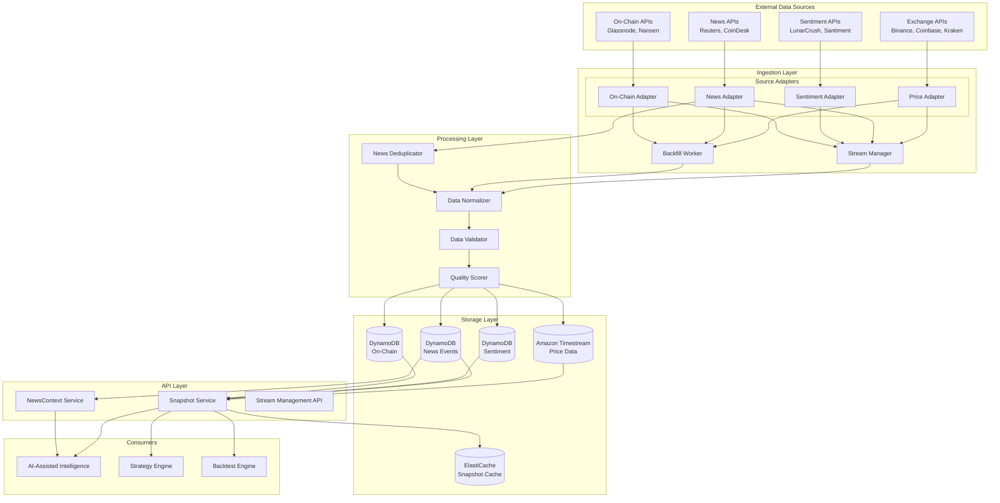

# Design Document: Market Data Ingestion

## Overview

The Market Data Ingestion feature provides a unified data pipeline for ingesting, normalizing, and storing market data from multiple sources. It uses the Adapter pattern (consistent with AI-Assisted Intelligence) to support various data providers and produces a unified `MarketDataSnapshot` format that feeds into AI analysis.

Key design principles:
- **Provider Agnostic**: Common interfaces abstract provider-specific implementations
- **Real-Time First**: Optimized for low-latency streaming with fallback to polling
- **Quality Aware**: Every data point has quality metadata for downstream filtering
- **AI-Ready**: Output formats designed for direct consumption by AI prompts

## Architecture



## Components and Interfaces

### Data Source Abstraction

```typescript
type DataSourceType = 'PRICE' | 'NEWS' | 'SENTIMENT' | 'ON_CHAIN';
type DataSourceStatus = 'ACTIVE' | 'INACTIVE' | 'RATE_LIMITED' | 'ERROR';

interface DataSource {
  sourceId: string;
  type: DataSourceType;
  name: string;
  apiEndpoint: string;
  authMethod: 'API_KEY' | 'OAUTH' | 'HMAC';
  supportedSymbols: string[];
  rateLimits: RateLimitConfig;
  status: DataSourceStatus;
  priority: number;  // For fallback ordering
  costPerRequest?: number;
  createdAt: string;
  updatedAt: string;
}

interface RateLimitConfig {
  requestsPerSecond: number;
  requestsPerMinute: number;
  requestsPerDay: number;
}

// Source Adapter Interface - all data sources implement this
interface SourceAdapter {
  readonly sourceType: DataSourceType;
  
  // Connection management
  connect(): Promise<void>;
  disconnect(): Promise<void>;
  isConnected(): boolean;
  
  // Data retrieval
  subscribe(symbols: string[], callback: DataCallback): Promise<SubscriptionHandle>;
  unsubscribe(handle: SubscriptionHandle): Promise<void>;
  fetchHistorical(symbol: string, startTime: string, endTime: string): Promise<RawDataPoint[]>;
  
  // Health
  healthCheck(): Promise<HealthCheckResult>;
}

type DataCallback = (data: RawDataPoint) => void;

interface SubscriptionHandle {
  id: string;
  symbols: string[];
  sourceId: string;
}

interface RawDataPoint {
  sourceId: string;
  type: DataSourceType;
  symbol: string;
  timestamp: string;
  data: unknown;  // Provider-specific format
}
```

### Price Data Types

```typescript
interface PricePoint {
  symbol: string;
  timestamp: string;
  open: number;
  high: number;
  low: number;
  close: number;
  volume: number;
  quoteVolume?: number;
  trades?: number;
  sourceId: string;
  qualityScore: number;
}

interface PriceFeed {
  feedId: string;
  symbol: string;
  exchange: string;
  interval: '1m' | '5m' | '15m' | '1h' | '4h' | '1d';
  status: 'ACTIVE' | 'PAUSED' | 'ERROR';
  lastUpdate: string;
  latencyMs: number;
}

interface PriceAdapter extends SourceAdapter {
  subscribeToPrices(symbols: string[], interval: string, callback: (price: PricePoint) => void): Promise<SubscriptionHandle>;
  getOHLCV(symbol: string, interval: string, startTime: string, endTime: string): Promise<PricePoint[]>;
  getLatestPrice(symbol: string): Promise<PricePoint>;
}
```

### News Data Types

```typescript
type NewsCategory = 'REGULATORY' | 'TECHNICAL' | 'MARKET' | 'PARTNERSHIP' | 'GENERAL';

interface NewsEvent {
  eventId: string;
  title: string;
  content: string;
  summary?: string;
  source: string;
  sourceUrl: string;
  publishedAt: string;
  ingestedAt: string;
  symbols: string[];
  category: NewsCategory;
  relevanceScore: number;  // 0.0 to 1.0
  sentiment?: number;      // -1.0 to 1.0
  contentHash: string;     // For deduplication
  qualityScore: number;
}

interface NewsAdapter extends SourceAdapter {
  subscribeToNews(symbols: string[], callback: (news: NewsEvent) => void): Promise<SubscriptionHandle>;
  getNewsHistory(symbol: string, startTime: string, endTime: string): Promise<NewsEvent[]>;
  searchNews(query: string, limit: number): Promise<NewsEvent[]>;
}

interface NewsDeduplicationResult {
  isUnique: boolean;
  similarEventId?: string;
  similarityScore?: number;
}
```

### Sentiment Data Types

```typescript
interface SentimentData {
  sentimentId: string;
  symbol: string;
  timestamp: string;
  overallScore: number;      // -1.0 to 1.0
  mentionVolume: number;
  changeRate24h: number;     // Percentage change
  sources: SentimentSource[];
  aggregatedFrom: string[];  // Source IDs
  qualityScore: number;
}

interface SentimentSource {
  platform: 'TWITTER' | 'REDDIT' | 'TELEGRAM' | 'DISCORD' | 'NEWS';
  score: number;
  volume: number;
  weight: number;
}

interface SentimentAdapter extends SourceAdapter {
  getSentiment(symbol: string): Promise<SentimentData>;
  getSentimentHistory(symbol: string, startTime: string, endTime: string): Promise<SentimentData[]>;
}
```

### On-Chain Metrics Types

```typescript
type OnChainMetricType = 
  | 'ACTIVE_ADDRESSES'
  | 'TRANSACTION_VOLUME'
  | 'EXCHANGE_INFLOW'
  | 'EXCHANGE_OUTFLOW'
  | 'WHALE_TRANSACTIONS'
  | 'NVT_RATIO'
  | 'MVRV_RATIO';

interface OnChainMetric {
  metricId: string;
  symbol: string;
  network: string;
  metricType: OnChainMetricType;
  value: number;
  timestamp: string;
  change24h?: number;
  change7d?: number;
  movingAverage7d?: number;
  sourceId: string;
  qualityScore: number;
}

interface OnChainAdapter extends SourceAdapter {
  getMetric(symbol: string, metricType: OnChainMetricType): Promise<OnChainMetric>;
  getMetricHistory(symbol: string, metricType: OnChainMetricType, startTime: string, endTime: string): Promise<OnChainMetric[]>;
  getSupportedMetrics(symbol: string): Promise<OnChainMetricType[]>;
}
```

### MarketDataSnapshot (Integration Point with AI-Assisted Intelligence)

```typescript
interface MarketDataSnapshot {
  snapshotId: string;
  symbol: string;
  timestamp: string;
  timeframe: string;
  
  // Price data
  prices: PricePoint[];
  latestPrice: PricePoint;
  
  // News context
  newsContext: NewsContext;
  
  // Sentiment
  sentiment: SentimentData | null;
  
  // On-chain
  onChainMetrics: OnChainMetric[];
  
  // Quality metadata
  qualityScore: number;
  dataCompleteness: DataCompleteness;
  assembledAt: string;
  cachedUntil?: string;
}

interface DataCompleteness {
  hasPrices: boolean;
  hasNews: boolean;
  hasSentiment: boolean;
  hasOnChain: boolean;
  missingTypes: DataSourceType[];
}

interface SnapshotService {
  assembleSnapshot(symbol: string, timeframe: string, options?: SnapshotOptions): Promise<MarketDataSnapshot>;
  getCachedSnapshot(symbol: string, timeframe: string): Promise<MarketDataSnapshot | null>;
  invalidateCache(symbol: string): Promise<void>;
}

interface SnapshotOptions {
  includePrices: boolean;
  includeNews: boolean;
  includeSentiment: boolean;
  includeOnChain: boolean;
  newsTimeWindowHours: number;
  maxNewsEvents: number;
}
```

### NewsContext (For AI Prompts)

```typescript
interface NewsContext {
  symbol: string;
  timeWindow: string;
  events: NewsContextEvent[];
  summary: string;
  dominantSentiment: 'POSITIVE' | 'NEGATIVE' | 'NEUTRAL' | 'MIXED';
  eventCount: number;
  generatedAt: string;
}

interface NewsContextEvent {
  eventId: string;
  title: string;
  summary: string;
  category: NewsCategory;
  relevanceScore: number;
  publishedAt: string;
  source: string;
}

interface ContextService {
  generateNewsContext(symbol: string, timeWindowHours: number, maxEvents: number): Promise<NewsContext>;
  trackContextUsage(contextId: string, analysisId: string): Promise<void>;
}
```

### Stream Management

```typescript
interface DataStream {
  streamId: string;
  tenantId: string;
  sourceId: string;
  symbols: string[];
  type: DataSourceType;
  status: 'STARTING' | 'ACTIVE' | 'PAUSED' | 'ERROR' | 'STOPPED';
  metrics: StreamMetrics;
  createdAt: string;
  lastActivity: string;
}

interface StreamMetrics {
  messagesReceived: number;
  messagesPerSecond: number;
  averageLatencyMs: number;
  errorCount: number;
  lastError?: string;
  uptime: number;
}

interface StreamService {
  startStream(tenantId: string, sourceId: string, symbols: string[]): Promise<DataStream>;
  stopStream(tenantId: string, streamId: string): Promise<void>;
  pauseStream(tenantId: string, streamId: string): Promise<void>;
  resumeStream(tenantId: string, streamId: string): Promise<void>;
  getStreamStatus(tenantId: string, streamId: string): Promise<DataStream>;
  listStreams(tenantId: string): Promise<DataStream[]>;
}
```

### Backfill Service

```typescript
interface BackfillRequest {
  requestId: string;
  tenantId: string;
  sourceId: string;
  symbol: string;
  dataType: DataSourceType;
  startTime: string;
  endTime: string;
  status: 'QUEUED' | 'PROCESSING' | 'COMPLETED' | 'FAILED';
  progress: BackfillProgress;
  createdAt: string;
  completedAt?: string;
}

interface BackfillProgress {
  totalRecords: number;
  processedRecords: number;
  percentComplete: number;
  estimatedCompletionTime?: string;
  gaps: DataGap[];
}

interface DataGap {
  startTime: string;
  endTime: string;
  reason: string;
}

interface BackfillService {
  requestBackfill(tenantId: string, request: BackfillRequestInput): Promise<BackfillRequest>;
  getBackfillStatus(tenantId: string, requestId: string): Promise<BackfillRequest>;
  cancelBackfill(tenantId: string, requestId: string): Promise<void>;
  listBackfills(tenantId: string): Promise<BackfillRequest[]>;
}
```

### Data Quality Service

```typescript
interface DataQualityScore {
  scoreId: string;
  sourceId: string;
  symbol: string;
  dataType: DataSourceType;
  timestamp: string;
  overallScore: number;  // 0.0 to 1.0
  components: QualityComponents;
  anomalies: DataAnomaly[];
}

interface QualityComponents {
  completeness: number;   // % of expected data points present
  freshness: number;      // Based on data age
  consistency: number;    // Based on value ranges and patterns
  accuracy: number;       // Based on cross-source validation
}

interface DataAnomaly {
  anomalyId: string;
  type: 'PRICE_SPIKE' | 'DATA_GAP' | 'STALE_DATA' | 'OUTLIER' | 'INCONSISTENCY';
  severity: 'LOW' | 'MEDIUM' | 'HIGH';
  description: string;
  detectedAt: string;
  dataPoint?: unknown;
}

interface QualityService {
  calculateQualityScore(sourceId: string, symbol: string, dataType: DataSourceType): Promise<DataQualityScore>;
  detectAnomalies(data: RawDataPoint[]): Promise<DataAnomaly[]>;
  getQualityHistory(sourceId: string, period: string): Promise<DataQualityScore[]>;
  setQualityThreshold(dataType: DataSourceType, threshold: number): Promise<void>;
}
```

## Data Models

### DynamoDB Table Schemas

**DataSources Table**
- Partition Key: `sourceId`
- Attributes: type, name, apiEndpoint, authMethod, supportedSymbols, rateLimits, status, priority, timestamps

**NewsEvents Table**
- Partition Key: `symbol`
- Sort Key: `publishedAt#eventId`
- GSI: `contentHash-index` for deduplication
- GSI: `source-publishedAt-index` for source-based queries
- Attributes: title, content, summary, source, category, relevanceScore, sentiment, qualityScore

**SentimentData Table**
- Partition Key: `symbol`
- Sort Key: `timestamp`
- Attributes: overallScore, mentionVolume, changeRate24h, sources, aggregatedFrom, qualityScore

**OnChainMetrics Table**
- Partition Key: `symbol#metricType`
- Sort Key: `timestamp`
- Attributes: network, value, change24h, change7d, movingAverage7d, sourceId, qualityScore

**Streams Table**
- Partition Key: `tenantId`
- Sort Key: `streamId`
- Attributes: sourceId, symbols, type, status, metrics, timestamps

**BackfillRequests Table**
- Partition Key: `tenantId`
- Sort Key: `requestId`
- Attributes: sourceId, symbol, dataType, startTime, endTime, status, progress, timestamps

### Amazon Timestream Schema

**PriceData Table**
- Dimensions: symbol, exchange, interval, sourceId
- Measures: open, high, low, close, volume, quoteVolume, trades, qualityScore
- Time: timestamp

### S3 Storage

**Raw Data Archive**
- Path: `raw/{sourceId}/{dataType}/{year}/{month}/{day}/{hour}.jsonl`
- Lifecycle: Transition to Glacier after 30 days

**Backfill Data**
- Path: `backfill/{requestId}/{symbol}/{chunk}.jsonl`
- Lifecycle: Delete after processing


## Correctness Properties

*A property is a characteristic or behavior that should hold true across all valid executions of a system—essentially, a formal statement about what the system should do. Properties serve as the bridge between human-readable specifications and machine-verifiable correctness guarantees.*

### Property 1: Data Source Registration Completeness

*For any* registered DataSource, it SHALL have a valid sourceId, type (PRICE, NEWS, SENTIMENT, or ON_CHAIN), apiEndpoint, authMethod, supportedSymbols array, and rateLimits configuration, AND a corresponding SourceAdapter SHALL exist that implements the SourceAdapter interface.

**Validates: Requirements 1.1, 1.2, 1.3**

### Property 2: Data Source Failover

*For any* DataSource marked as INACTIVE or ERROR, all data requests SHALL be routed to the next available fallback source (by priority), AND no requests SHALL be sent to the unavailable source.

**Validates: Requirements 1.4**

### Property 3: Price Data Normalization and Validation

*For any* PricePoint after normalization, it SHALL contain symbol, timestamp, open, high, low, close, and volume fields, AND if any value is outside expected ranges (e.g., negative prices, volume > 10x average), an anomaly flag SHALL be set.

**Validates: Requirements 2.2, 2.3**

### Property 4: Price Feed Reconnection

*For any* Price_Feed that disconnects, the system SHALL attempt reconnection with exponential backoff (delays increasing by factor of 2), AND after max retries, SHALL switch to the configured fallback source.

**Validates: Requirements 2.6**

### Property 5: News Event Processing

*For any* NewsEvent after processing, it SHALL contain title, content, source, publishedAt, symbols array, category (from valid enum), AND relevanceScore between 0.0 and 1.0.

**Validates: Requirements 3.2, 3.3, 3.6**

### Property 6: News Event Persistence Round-Trip

*For any* valid NewsEvent object, serializing to JSON, persisting to storage, retrieving, and deserializing SHALL produce an equivalent NewsEvent with all fields preserved.

**Validates: Requirements 3.4**

### Property 7: News Deduplication

*For any* two NewsEvents with contentHash similarity above the configured threshold, only the first received event SHALL be stored, AND subsequent duplicates SHALL be rejected with a reference to the original eventId.

**Validates: Requirements 3.5**

### Property 8: Sentiment Normalization

*For any* SentimentData after normalization, the overallScore SHALL be between -1.0 and 1.0, AND it SHALL contain symbol, timestamp, mentionVolume, and changeRate24h fields.

**Validates: Requirements 4.2, 4.3, 4.4**

### Property 9: Sentiment Weighted Aggregation

*For any* SentimentData aggregated from multiple sources, the overallScore SHALL equal the weighted average of individual source scores using the configured weights, AND the sum of weights SHALL equal 1.0.

**Validates: Requirements 4.5**

### Property 10: On-Chain Metric Normalization

*For any* OnChainMetric after normalization, it SHALL contain metricType (from valid enum), value, symbol, network, and timestamp fields.

**Validates: Requirements 5.2, 5.3, 5.4**

### Property 11: Derived Metric Calculation

*For any* OnChainMetric with historical data, the change24h SHALL equal ((current - value24hAgo) / value24hAgo) * 100, AND movingAverage7d SHALL equal the mean of the last 7 daily values.

**Validates: Requirements 5.5**

### Property 12: Snapshot Assembly Completeness

*For any* MarketDataSnapshot, it SHALL contain the symbol, timestamp, timeframe, qualityScore, and dataCompleteness fields, AND dataCompleteness SHALL accurately reflect which data types (prices, news, sentiment, onChain) are present or missing.

**Validates: Requirements 6.1, 6.2, 6.3**

### Property 13: Snapshot Caching

*For any* MarketDataSnapshot that is cached, subsequent requests for the same symbol and timeframe within the cache TTL SHALL return the identical snapshot (same snapshotId), AND cache invalidation SHALL cause fresh assembly on next request.

**Validates: Requirements 6.4**

### Property 14: NewsContext Generation

*For any* NewsContext, it SHALL contain at most 10 NewsEvents, all events SHALL be within the specified time window, AND events SHALL be ordered by relevanceScore descending then publishedAt descending.

**Validates: Requirements 7.1, 7.2, 7.3**

### Property 15: NewsContext Tracking

*For any* NewsContext used in an AI analysis, a tracking record SHALL be created linking the context's eventIds to the analysisId for auditability.

**Validates: Requirements 7.5**

### Property 16: Stream Lifecycle Management

*For any* DataStream, starting SHALL set status to ACTIVE, stopping SHALL set status to STOPPED, AND while ACTIVE the stream SHALL track messagesReceived, messagesPerSecond, averageLatencyMs, and errorCount metrics.

**Validates: Requirements 8.1, 8.2, 8.5**

### Property 17: Stream Tenant Limits

*For any* Tenant, the number of concurrent ACTIVE streams SHALL not exceed the tenant's configured maxStreams limit, AND attempts to start additional streams SHALL be rejected with a limit exceeded error.

**Validates: Requirements 8.3**

### Property 18: Backfill Processing

*For any* BackfillRequest, it SHALL be queued with status QUEUED, progress SHALL be updated during processing with percentComplete and estimatedCompletionTime, AND upon completion, any data gaps SHALL be reported in the progress.gaps array.

**Validates: Requirements 9.1, 9.4, 9.5**

### Property 19: Backfill Rate Limiting

*For any* BackfillRequest processing, the request rate to the DataSource SHALL not exceed the source's configured rateLimits, AND requests SHALL be throttled with appropriate delays when approaching limits.

**Validates: Requirements 9.3**

### Property 20: Quality Score Calculation

*For any* DataQualityScore, it SHALL contain components for completeness, freshness, consistency, and accuracy, AND the overallScore SHALL be a weighted combination of these components, AND detected anomalies SHALL be included in the anomalies array.

**Validates: Requirements 10.1, 10.3, 10.4**

### Property 21: Quality Threshold Alerting

*For any* DataQualityScore where overallScore falls below the configured threshold, an alert SHALL be triggered, AND the alert SHALL include the sourceId, symbol, dataType, and score details.

**Validates: Requirements 10.2**

## Error Handling

### Data Source Errors

- **Source Unavailable**: Mark source INACTIVE, switch to fallback, log error with source details
- **Rate Limited**: Return HTTP 429, queue requests, respect retry-after from provider
- **Authentication Failed**: Mark source ERROR, alert administrator, disable automatic retries

### Ingestion Errors

- **Invalid Data Format**: Log raw data, skip record, increment error counter
- **Anomaly Detected**: Flag data point, include in quality metrics, optionally alert
- **Duplicate News**: Reject with reference to original, do not store

### Stream Errors

- **Connection Lost**: Attempt reconnection with exponential backoff (1s, 2s, 4s, 8s, max 60s)
- **Stream Limit Exceeded**: Return HTTP 429 with current/max stream counts
- **Data Lag Detected**: Alert if data freshness exceeds threshold, log metrics

### Backfill Errors

- **Rate Limit Hit**: Pause backfill, wait for reset, resume automatically
- **Partial Failure**: Continue with available data, report gaps in progress
- **Source Timeout**: Retry with backoff, mark gap if retries exhausted

### Quality Errors

- **Quality Below Threshold**: Trigger alert, continue processing, flag affected snapshots
- **Anomaly Burst**: If anomaly rate exceeds threshold, pause ingestion, alert for investigation

## Testing Strategy

### Unit Tests

Unit tests verify specific examples and edge cases:

- Source adapter implementations for each provider type
- Price normalization with various exchange formats
- News categorization with sample articles
- Sentiment score normalization from different scales
- Derived metric calculations (change percentages, moving averages)
- Deduplication with similar and identical content
- Quality score component calculations
- Anomaly detection with known anomalous data

### Property-Based Tests

Property-based tests verify universal properties across randomly generated inputs. Each property test will:

- Run minimum 100 iterations with random inputs
- Use fast-check library for TypeScript property-based testing
- Tag each test with the corresponding design property number

**Test Configuration:**
- Framework: Jest with fast-check
- Minimum iterations: 100 per property
- Generators: Custom generators for DataSource, PricePoint, NewsEvent, SentimentData, OnChainMetric, MarketDataSnapshot, and DataStream objects

**Property Test Coverage:**
- Property 1: Generate data sources, verify registration completeness
- Property 3: Generate price data, verify normalization and validation
- Property 5: Generate news events, verify processing completeness
- Property 6: Generate news events, verify persistence round-trip
- Property 7: Generate similar news pairs, verify deduplication
- Property 8: Generate sentiment data, verify normalization bounds
- Property 9: Generate multi-source sentiment, verify weighted aggregation
- Property 10: Generate on-chain metrics, verify normalization
- Property 11: Generate metric history, verify derived calculations
- Property 12: Generate partial data, verify snapshot completeness
- Property 13: Generate snapshot requests, verify caching behavior
- Property 14: Generate news sets, verify context generation rules
- Property 16: Generate stream operations, verify lifecycle
- Property 17: Generate tenant stream requests, verify limits
- Property 18: Generate backfill requests, verify processing
- Property 20: Generate data quality scenarios, verify scoring
- Property 21: Generate low-quality data, verify alerting

### Integration Tests

Integration tests verify end-to-end flows:

- Full ingestion flow: connect source → receive data → normalize → validate → store
- Snapshot assembly: ingest all data types → assemble snapshot → verify completeness
- Backfill flow: request backfill → process → verify data → report gaps
- Failover flow: primary source fails → switch to fallback → verify continuity
- Quality monitoring: ingest data → calculate quality → trigger alerts
