# Design Document: Production Deployment

## Overview

This design document describes the deployment process for the AI-Assisted Crypto Trading System. The deployment is orchestrated through a series of shell scripts and configuration files that automate infrastructure provisioning, backend deployment, frontend deployment, and system validation. The process supports both test and production environments with appropriate safeguards.

The deployment follows a phased approach:
1. **Infrastructure Phase**: Apply Terraform to provision AWS resources
2. **Backend Phase**: Build, package, and deploy Lambda functions
3. **Secrets Phase**: Populate credentials in Secrets Manager
4. **Frontend Phase**: Build and deploy Next.js application
5. **Validation Phase**: Health checks, smoke tests, and monitoring verification
6. **Documentation Phase**: Generate deployment artifacts and runbooks

## Architecture

### Deployment Flow Diagram

```mermaid
flowchart TD
    subgraph "Phase 1: Infrastructure"
        TF_INIT[Terraform Init] --> TF_PLAN[Terraform Plan]
        TF_PLAN --> TF_APPLY[Terraform Apply]
        TF_APPLY --> TF_OUTPUT[Capture Outputs]
        TF_OUTPUT --> MANIFEST[Create Manifest]
    end

    subgraph "Phase 2: Backend"
        BE_DEPS[Install Dependencies] --> BE_BUILD[TypeScript Build]
        BE_BUILD --> BE_TEST[Run Tests]
        BE_TEST --> BE_PACKAGE[Create ZIP Packages]
        BE_PACKAGE --> BE_UPLOAD[Upload to S3]
        BE_UPLOAD --> LAMBDA_UPDATE[Update Lambda Functions]
        LAMBDA_UPDATE --> LAMBDA_ENV[Configure Env Vars]
        LAMBDA_ENV --> LAMBDA_PUBLISH[Publish Versions]
    end

    subgraph "Phase 3: Secrets"
        SEC_INPUT[Input Credentials] --> SEC_VALIDATE[Validate Format]
        SEC_VALIDATE --> SEC_STORE[Store in Secrets Manager]
        SEC_STORE --> SEC_REFRESH[Refresh Lambda]
    end

    subgraph "Phase 4: Frontend"
        FE_DEPS[Install Dependencies] --> FE_CONFIG[Create Config]
        FE_CONFIG --> FE_BUILD[Next.js Build]
        FE_BUILD --> FE_TEST[Run Tests]
        FE_TEST --> FE_EXPORT[Export Static]
        FE_EXPORT --> FE_UPLOAD[Upload to S3]
        FE_UPLOAD --> CF_INVALIDATE[Invalidate CloudFront]
    end

    subgraph "Phase 5: Validation"
        DNS_CHECK[DNS Validation] --> SSL_CHECK[SSL Validation]
        SSL_CHECK --> API_HEALTH[API Health Checks]
        API_HEALTH --> FE_CHECK[Frontend Checks]
        FE_CHECK --> SMOKE[Smoke Tests]
        SMOKE --> MON_CHECK[Monitoring Checks]
    end

    subgraph "Phase 6: Documentation"
        DOC_SUMMARY[Deployment Summary] --> DOC_RUNBOOK[Runbook]
        DOC_RUNBOOK --> DOC_COMMIT[Commit to Repo]
    end

    MANIFEST --> BE_DEPS
    LAMBDA_PUBLISH --> SEC_INPUT
    SEC_REFRESH --> FE_DEPS
    CF_INVALIDATE --> DNS_CHECK
    MON_CHECK --> DOC_SUMMARY
```



### Directory Structure

```
deployment/
├── scripts/
│   ├── deploy.sh                    # Main deployment orchestrator
│   ├── deploy-infrastructure.sh     # Terraform deployment
│   ├── deploy-backend.sh            # Lambda deployment
│   ├── deploy-frontend.sh           # Frontend deployment
│   ├── populate-secrets.sh          # Secrets population
│   ├── validate-deployment.sh       # Health checks and smoke tests
│   ├── generate-docs.sh             # Documentation generation
│   ├── rollback-backend.sh          # Lambda rollback
│   └── rollback-frontend.sh         # Frontend rollback
├── config/
│   ├── test.env                     # Test environment config
│   ├── production.env               # Production environment config
│   └── secrets-template.json        # Template for secrets input
├── manifests/
│   ├── test-manifest.json           # Test deployment manifest
│   └── production-manifest.json     # Production deployment manifest
├── docs/
│   ├── deployment-summary.md        # Generated deployment summary
│   ├── runbook.md                   # Operational runbook
│   └── checklist.md                 # Production readiness checklist
└── tests/
    ├── health-checks.sh             # API health check tests
    ├── smoke-tests.sh               # End-to-end smoke tests
    └── monitoring-checks.sh         # Monitoring validation
```

## Components and Interfaces

### Main Deployment Script

```bash
#!/bin/bash
# deployment/scripts/deploy.sh

set -e

ENVIRONMENT=${1:-test}
SKIP_TESTS=${2:-false}

echo "=== Deploying to ${ENVIRONMENT} environment ==="

# Phase 1: Infrastructure
./deploy-infrastructure.sh $ENVIRONMENT

# Phase 2: Backend
./deploy-backend.sh $ENVIRONMENT $SKIP_TESTS

# Phase 3: Secrets (interactive)
./populate-secrets.sh $ENVIRONMENT

# Phase 4: Frontend
./deploy-frontend.sh $ENVIRONMENT $SKIP_TESTS

# Phase 5: Validation
./validate-deployment.sh $ENVIRONMENT

# Phase 6: Documentation
./generate-docs.sh $ENVIRONMENT

echo "=== Deployment to ${ENVIRONMENT} complete ==="
```

### Infrastructure Deployment Script

```bash
#!/bin/bash
# deployment/scripts/deploy-infrastructure.sh

ENVIRONMENT=$1
INFRA_DIR="infrastructure/environments/${ENVIRONMENT}"

cd $INFRA_DIR

# Initialize Terraform
terraform init -reconfigure

# Plan changes
terraform plan -out=tfplan

# Apply changes
terraform apply tfplan

# Capture outputs to manifest
terraform output -json > ../../../deployment/manifests/${ENVIRONMENT}-manifest.json

echo "Infrastructure deployment complete. Manifest saved."
```

### Backend Deployment Script

```bash
#!/bin/bash
# deployment/scripts/deploy-backend.sh

ENVIRONMENT=$1
SKIP_TESTS=$2
MANIFEST_FILE="deployment/manifests/${ENVIRONMENT}-manifest.json"

cd backend

# Install dependencies
npm ci

# Build TypeScript
npm run build

# Run tests (unless skipped)
if [ "$SKIP_TESTS" != "true" ]; then
    npm test
    if [ $? -ne 0 ]; then
        echo "Tests failed. Aborting deployment."
        exit 1
    fi
fi

# Read manifest values
BUCKET_NAME=$(jq -r '.lambda_deployment_bucket_id.value' ../$MANIFEST_FILE)
REGION=$(jq -r '.aws_region.value' ../$MANIFEST_FILE)

# Package and upload each function
for handler in src/handlers/*.ts; do
    if [[ "$handler" != *".test.ts" ]]; then
        FUNC_NAME=$(basename $handler .ts)
        
        # Create deployment package
        zip -r "${FUNC_NAME}.zip" dist/ node_modules/ -x "*.test.*"
        
        # Upload to S3
        aws s3 cp "${FUNC_NAME}.zip" "s3://${BUCKET_NAME}/lambda/${FUNC_NAME}.zip"
        
        # Update Lambda function
        aws lambda update-function-code \
            --function-name "${ENVIRONMENT}-crypto-trading-${FUNC_NAME}" \
            --s3-bucket "${BUCKET_NAME}" \
            --s3-key "lambda/${FUNC_NAME}.zip" \
            --region "${REGION}"
        
        # Publish version
        aws lambda publish-version \
            --function-name "${ENVIRONMENT}-crypto-trading-${FUNC_NAME}" \
            --region "${REGION}"
        
        rm "${FUNC_NAME}.zip"
    fi
done

echo "Backend deployment complete."
```

### Frontend Configuration Generator

```typescript
// deployment/scripts/generate-frontend-config.ts

interface FrontendConfig {
  apiUrl: string;
  wsUrl?: string;
  environment: string;
  features: {
    enableAnalytics: boolean;
    enableErrorTracking: boolean;
    enableRealTimeUpdates: boolean;
  };
}

function generateConfig(manifest: any, environment: string): FrontendConfig {
  const apiEndpoint = manifest.api_gateway_endpoint.value;
  
  return {
    apiUrl: apiEndpoint,
    wsUrl: apiEndpoint.replace('https://', 'wss://').replace('/api', '/ws'),
    environment,
    features: {
      enableAnalytics: environment === 'production',
      enableErrorTracking: environment === 'production',
      enableRealTimeUpdates: true,
    },
  };
}
```

### Frontend Deployment Script

```bash
#!/bin/bash
# deployment/scripts/deploy-frontend.sh

ENVIRONMENT=$1
SKIP_TESTS=$2
MANIFEST_FILE="deployment/manifests/${ENVIRONMENT}-manifest.json"

cd frontend

# Read manifest values
API_URL=$(jq -r '.api_gateway_endpoint.value' ../$MANIFEST_FILE)
BUCKET_NAME=$(jq -r '.frontend_assets_bucket_id.value' ../$MANIFEST_FILE)
DISTRIBUTION_ID=$(jq -r '.cloudfront_distribution_id.value' ../$MANIFEST_FILE)

# Create environment file
cat > .env.local << EOF
NEXT_PUBLIC_API_URL=${API_URL}
NEXT_PUBLIC_ENVIRONMENT=${ENVIRONMENT}
EOF

# Install dependencies
npm ci

# Run tests (unless skipped)
if [ "$SKIP_TESTS" != "true" ]; then
    npm test
    if [ $? -ne 0 ]; then
        echo "Tests failed. Aborting deployment."
        exit 1
    fi
fi

# Build Next.js
npm run build

# Export static files
npx next export -o out

# Upload to S3 with correct headers
aws s3 sync out/ "s3://${BUCKET_NAME}/" \
    --delete \
    --cache-control "max-age=31536000,public" \
    --exclude "*.html"

aws s3 sync out/ "s3://${BUCKET_NAME}/" \
    --exclude "*" \
    --include "*.html" \
    --cache-control "no-cache,no-store,must-revalidate"

# Invalidate CloudFront cache
aws cloudfront create-invalidation \
    --distribution-id "${DISTRIBUTION_ID}" \
    --paths "/*"

echo "Frontend deployment complete."
```

### Secrets Population Script

```bash
#!/bin/bash
# deployment/scripts/populate-secrets.sh

ENVIRONMENT=$1
MANIFEST_FILE="deployment/manifests/${ENVIRONMENT}-manifest.json"

echo "=== Secrets Population for ${ENVIRONMENT} ==="
echo "WARNING: You will be prompted to enter sensitive credentials."
echo "These values will NOT be logged or displayed."
echo ""

# Exchange credentials
EXCHANGES=("binance" "coinbase" "kraken" "okx" "bsdex" "bison" "finoa" "bybit")

for exchange in "${EXCHANGES[@]}"; do
    SECRET_ARN=$(jq -r ".exchange_secret_arns.value.${exchange}" $MANIFEST_FILE)
    
    if [ "$SECRET_ARN" != "null" ]; then
        echo "Enter credentials for ${exchange} (or press Enter to skip):"
        read -s -p "API Key: " API_KEY
        echo ""
        
        if [ -n "$API_KEY" ]; then
            read -s -p "API Secret: " API_SECRET
            echo ""
            
            aws secretsmanager put-secret-value \
                --secret-id "${SECRET_ARN}" \
                --secret-string "{\"apiKey\":\"${API_KEY}\",\"apiSecret\":\"${API_SECRET}\"}"
            
            echo "✓ ${exchange} credentials stored"
        else
            echo "⊘ ${exchange} skipped"
        fi
    fi
done

# AI Provider credentials
AI_PROVIDERS=("gemini" "openai" "deepseek")

for provider in "${AI_PROVIDERS[@]}"; do
    SECRET_ARN=$(jq -r ".ai_provider_secret_arns.value.${provider}" $MANIFEST_FILE)
    
    if [ "$SECRET_ARN" != "null" ]; then
        echo "Enter API key for ${provider} (or press Enter to skip):"
        read -s -p "API Key: " API_KEY
        echo ""
        
        if [ -n "$API_KEY" ]; then
            aws secretsmanager put-secret-value \
                --secret-id "${SECRET_ARN}" \
                --secret-string "{\"apiKey\":\"${API_KEY}\"}"
            
            echo "✓ ${provider} API key stored"
        else
            echo "⊘ ${provider} skipped"
        fi
    fi
done

echo ""
echo "Secrets population complete."
```

### Health Check Script

```bash
#!/bin/bash
# deployment/tests/health-checks.sh

ENVIRONMENT=$1
MANIFEST_FILE="deployment/manifests/${ENVIRONMENT}-manifest.json"

API_URL=$(jq -r '.api_gateway_endpoint.value' $MANIFEST_FILE)

echo "=== API Health Checks ==="

# Test endpoints by category
ENDPOINTS=(
    "GET /health"
    "GET /api/templates"
    "GET /api/strategies"
    "GET /api/risk-profiles"
    "GET /api/data-sources"
    "GET /api/providers"
)

FAILED=0

for endpoint in "${ENDPOINTS[@]}"; do
    METHOD=$(echo $endpoint | cut -d' ' -f1)
    PATH=$(echo $endpoint | cut -d' ' -f2)
    
    START=$(date +%s%N)
    RESPONSE=$(curl -s -o /dev/null -w "%{http_code}" -X $METHOD "${API_URL}${PATH}")
    END=$(date +%s%N)
    LATENCY=$(( ($END - $START) / 1000000 ))
    
    if [ "$RESPONSE" == "200" ] || [ "$RESPONSE" == "401" ]; then
        echo "✓ ${endpoint} - ${RESPONSE} (${LATENCY}ms)"
    else
        echo "✗ ${endpoint} - ${RESPONSE} (${LATENCY}ms)"
        FAILED=$((FAILED + 1))
    fi
done

if [ $FAILED -gt 0 ]; then
    echo ""
    echo "FAILED: ${FAILED} health checks failed"
    exit 1
fi

echo ""
echo "All health checks passed."
```

### Smoke Test Script

```bash
#!/bin/bash
# deployment/tests/smoke-tests.sh

ENVIRONMENT=$1
MANIFEST_FILE="deployment/manifests/${ENVIRONMENT}-manifest.json"

API_URL=$(jq -r '.api_gateway_endpoint.value' $MANIFEST_FILE)
API_KEY=$(jq -r '.api_key.value' $MANIFEST_FILE)

echo "=== Smoke Tests ==="

# Test 1: Create strategy template
echo "Test 1: Create strategy template..."
TEMPLATE_RESPONSE=$(curl -s -X POST "${API_URL}/api/templates" \
    -H "Content-Type: application/json" \
    -H "x-api-key: ${API_KEY}" \
    -d '{
        "name": "smoke-test-template",
        "description": "Smoke test template",
        "parameters": {}
    }')

TEMPLATE_ID=$(echo $TEMPLATE_RESPONSE | jq -r '.templateId')
if [ "$TEMPLATE_ID" != "null" ]; then
    echo "✓ Template created: ${TEMPLATE_ID}"
else
    echo "✗ Template creation failed"
    exit 1
fi

# Test 2: Create strategy from template
echo "Test 2: Create strategy..."
STRATEGY_RESPONSE=$(curl -s -X POST "${API_URL}/api/strategies" \
    -H "Content-Type: application/json" \
    -H "x-api-key: ${API_KEY}" \
    -d "{
        \"templateId\": \"${TEMPLATE_ID}\",
        \"name\": \"smoke-test-strategy\",
        \"parameters\": {}
    }")

STRATEGY_ID=$(echo $STRATEGY_RESPONSE | jq -r '.strategyId')
if [ "$STRATEGY_ID" != "null" ]; then
    echo "✓ Strategy created: ${STRATEGY_ID}"
else
    echo "✗ Strategy creation failed"
    exit 1
fi

# Test 3: Create risk profile
echo "Test 3: Create risk profile..."
PROFILE_RESPONSE=$(curl -s -X POST "${API_URL}/api/risk-profiles" \
    -H "Content-Type: application/json" \
    -H "x-api-key: ${API_KEY}" \
    -d '{
        "name": "smoke-test-profile",
        "maxDrawdown": 0.1,
        "maxPositionSize": 1000
    }')

PROFILE_ID=$(echo $PROFILE_RESPONSE | jq -r '.profileId')
if [ "$PROFILE_ID" != "null" ]; then
    echo "✓ Risk profile created: ${PROFILE_ID}"
else
    echo "✗ Risk profile creation failed"
    exit 1
fi

# Cleanup
echo "Cleaning up test data..."
curl -s -X DELETE "${API_URL}/api/strategies/${STRATEGY_ID}" -H "x-api-key: ${API_KEY}"
curl -s -X DELETE "${API_URL}/api/templates/${TEMPLATE_ID}" -H "x-api-key: ${API_KEY}"
curl -s -X DELETE "${API_URL}/api/risk-profiles/${PROFILE_ID}" -H "x-api-key: ${API_KEY}"

echo "✓ Cleanup complete"
echo ""
echo "All smoke tests passed."
```

## Data Models

### Deployment Manifest Schema

```typescript
interface DeploymentManifest {
  environment: string;
  aws_region: string;
  account_id: string;
  
  // VPC
  vpc_id: string;
  private_subnet_ids: string[];
  public_subnet_ids: string[];
  
  // API
  api_gateway_endpoint: string;
  api_gateway_stage_invoke_url: string;
  
  // Frontend
  frontend_assets_bucket_id: string;
  cloudfront_distribution_id: string;
  cloudfront_domain_name: string;
  
  // Lambda
  lambda_deployment_bucket_id: string;
  lambda_function_names: Record<string, string>;
  lambda_function_arns: Record<string, string>;
  
  // Data
  dynamodb_table_names: Record<string, string>;
  redis_endpoint: string;
  timestream_database_name: string;
  
  // Secrets
  exchange_secret_arns: Record<string, string>;
  ai_provider_secret_arns: Record<string, string>;
  
  // Monitoring
  step_functions_state_machine_arns: Record<string, string>;
  eventbridge_event_bus_arn: string;
}
```

### Environment Configuration

```bash
# deployment/config/test.env
ENVIRONMENT=test
AWS_REGION=eu-central-1
DOMAIN=test.acinaces.com
API_DOMAIN=api.test.acinaces.com
SKIP_PRODUCTION_CHECKS=true
```

```bash
# deployment/config/production.env
ENVIRONMENT=production
AWS_REGION=eu-central-1
DOMAIN=acinaces.com
API_DOMAIN=api.acinaces.com
SKIP_PRODUCTION_CHECKS=false
REQUIRE_MANUAL_APPROVAL=true
```

### Production Readiness Checklist

```markdown
# Production Readiness Checklist

## Pre-Deployment
- [ ] All secrets populated with production credentials
- [ ] DNS records configured and propagated
- [ ] SSL certificates valid (>30 days remaining)
- [ ] Backup plans active and tested
- [ ] Monitoring alerts configured with correct recipients
- [ ] Rate limiting configured appropriately
- [ ] WAF rules active and tested
- [ ] Load testing completed

## Deployment
- [ ] Infrastructure deployed successfully
- [ ] Backend Lambda functions deployed
- [ ] Frontend deployed to CloudFront
- [ ] CloudFront cache invalidated

## Post-Deployment
- [ ] All health checks passing
- [ ] Smoke tests passing
- [ ] Monitoring dashboards accessible
- [ ] Alarms in OK state
- [ ] X-Ray traces visible
- [ ] Logs flowing to CloudWatch

## Sign-off
- [ ] DevOps Engineer: _______________
- [ ] QA Engineer: _______________
- [ ] Release Manager: _______________
- [ ] Date: _______________
```

## Correctness Properties

*A property is a characteristic or behavior that should hold true across all valid executions of a system—essentially, a formal statement about what the system should do. Properties serve as the bridge between human-readable specifications and machine-verifiable correctness guarantees.*

### Property 1: Lambda Deployment Coverage

*For any* Lambda handler file in `backend/src/handlers/` (excluding test files), there SHALL exist a corresponding deployment package uploaded to S3 and a Lambda function updated with that package.

**Validates: Requirements 2.4, 3.1**

### Property 2: Lambda Environment Variable Configuration

*For any* Lambda function deployed, the environment variables SHALL include all DynamoDB table names from the Terraform outputs, the Redis endpoint, and the Secrets Manager ARNs for credentials the function requires.

**Validates: Requirements 3.2**

### Property 3: S3 Upload Configuration

*For any* file uploaded to the frontend S3 bucket, the content-type header SHALL match the file extension (e.g., `.js` → `application/javascript`, `.html` → `text/html`), and cache-control SHALL be set to long-cache for hashed assets and no-cache for HTML files.

**Validates: Requirements 6.7, 6.8**

### Property 4: API Health Check Coverage

*For any* Lambda function category (strategies, templates, risk-controls, market-data, ai-intelligence, exchange, audit), the health check SHALL verify at least one endpoint in that category responds successfully.

**Validates: Requirements 8.2**

### Property 5: Monitoring Configuration Compliance

*For any* CloudWatch alarm created by the infrastructure, the alarm SHALL be in OK state after deployment, and *for any* SNS topic, there SHALL exist at least one subscription configured.

**Validates: Requirements 11.2, 11.3**

## Error Handling

### Infrastructure Deployment Failures

- Terraform plan is always run before apply
- Failed apply leaves state consistent (Terraform handles rollback)
- Error messages captured and displayed
- Manual intervention required for state corruption

### Backend Deployment Failures

- Test failures abort deployment immediately
- Individual Lambda update failures are logged but don't stop other updates
- Failed functions listed in deployment report
- Rollback script available to revert to previous version

### Frontend Deployment Failures

- Test failures abort deployment immediately
- S3 sync failures are retried up to 3 times
- CloudFront invalidation failures are logged but don't fail deployment
- Previous version available via S3 versioning

### Secrets Population Failures

- Invalid credential format rejected before storage
- Failed secret updates logged
- Partial population allowed (some exchanges may not be configured)
- Validation step verifies secrets are accessible

### Health Check Failures

- Individual endpoint failures don't stop other checks
- All failures collected and reported together
- Detailed error information provided for debugging
- Deployment marked as failed if critical endpoints fail

## Testing Strategy

### Unit Tests

Unit tests verify individual deployment script functions:
- Manifest parsing and validation
- Configuration file generation
- S3 upload header calculation
- Health check response parsing

### Property-Based Tests

Property-based tests verify deployment correctness properties using shell scripts and AWS CLI queries:

```bash
# Test Lambda deployment coverage
test_lambda_coverage() {
    HANDLERS=$(ls backend/src/handlers/*.ts | grep -v test | wc -l)
    DEPLOYED=$(aws lambda list-functions --query "Functions[?starts_with(FunctionName, '${ENV}-crypto-trading')].FunctionName" | jq length)
    
    if [ "$HANDLERS" -eq "$DEPLOYED" ]; then
        echo "PASS: All ${HANDLERS} handlers deployed"
    else
        echo "FAIL: Expected ${HANDLERS} functions, found ${DEPLOYED}"
        exit 1
    fi
}
```

### Integration Tests

Integration tests verify end-to-end deployment:
- Full deployment to test environment
- Health checks pass
- Smoke tests pass
- Rollback works correctly

### Deployment Verification Tests

Post-deployment verification:
- DNS resolution works
- SSL certificates valid
- API endpoints respond
- Frontend loads correctly
- Monitoring active

### Test Execution Order

1. Unit tests (pre-deployment)
2. Infrastructure deployment
3. Property tests for infrastructure
4. Backend deployment
5. Property tests for Lambda
6. Frontend deployment
7. Property tests for S3
8. Health checks
9. Smoke tests
10. Monitoring verification
