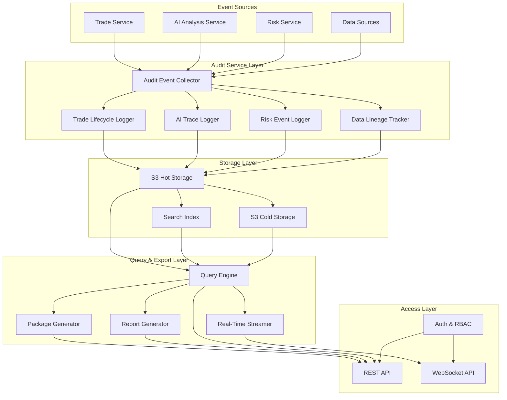

# Design Document: Reporting & Audit

## Overview

This document describes the design for the Reporting & Audit feature of the AI-Assisted Crypto Trading System. The feature provides comprehensive audit trails, trade lifecycle logging, AI traceability, compliance reporting, and downloadable audit packages.

The design follows the principle of "Auditability by Default" - every input, output, and action is logged, versioned, and reproducible. The system ensures complete transparency and regulatory defensibility.

### Design Decisions

1. **Immutable Log Storage**: All audit records are stored as immutable logs in S3 with tenant-partitioned paths. This ensures data integrity and enables efficient time-based queries.

2. **Correlation ID Pattern**: Trade events, AI traces, and risk events are linked using correlation IDs, enabling full reconstruction of decision chains.

3. **Event-Driven Architecture**: Audit events are captured at the point of occurrence and streamed to subscribers in real-time via WebSocket/SSE.

4. **Cryptographic Integrity**: Audit packages include SHA-256 hashes for tamper detection and verification.

5. **Tiered Storage**: Hot storage (S3 Standard) for recent data, cold storage (S3 Glacier) for archived data beyond retention thresholds.

## Architecture



## Components and Interfaces

### 1. Trade Lifecycle Logger

Captures all events in a trade's lifecycle from signal generation to settlement.

```typescript
/**
 * Trade event types in the lifecycle
 */
type TradeEventType =
  | 'SIGNAL_GENERATED'
  | 'ORDER_CREATED'
  | 'ORDER_SUBMITTED'
  | 'ORDER_ACKNOWLEDGED'
  | 'PARTIAL_FILL'
  | 'COMPLETE_FILL'
  | 'ORDER_CANCELLED'
  | 'ORDER_REJECTED'
  | 'ORDER_EXPIRED';

/**
 * A single event in the trade lifecycle
 * Requirements: 1.1, 1.2, 1.3, 1.5
 */
interface TradeEvent {
  eventId: string;
  tenantId: string;
  tradeCorrelationId: string;  // Links all events for a single trade
  eventType: TradeEventType;
  timestamp: string;
  orderDetails: OrderSnapshot;
  strategyId: string;
  triggerConditions: TriggerCondition[];
  latencyFromPrevious?: number;  // Milliseconds since previous event
  metadata: Record<string, unknown>;
}

/**
 * Complete order state at a lifecycle stage
 * Requirements: 1.5
 */
interface OrderSnapshot {
  orderId: string;
  symbol: string;
  side: 'BUY' | 'SELL';
  orderType: 'MARKET' | 'LIMIT' | 'STOP' | 'STOP_LIMIT';
  quantity: number;
  filledQuantity: number;
  price?: number;
  stopPrice?: number;
  status: string;
  exchangeOrderId?: string;
  parameters: Record<string, unknown>;
}

/**
 * Condition that triggered the event
 */
interface TriggerCondition {
  type: string;
  description: string;
  value: unknown;
  threshold?: unknown;
}

/**
 * Trade Lifecycle Logger Service Interface
 * Requirements: 1.1, 1.2, 1.3, 1.4, 1.6
 */
interface TradeLifecycleLogger {
  /**
   * Log a trade event as an immutable record
   * Requirements: 1.1, 1.4
   */
  logTradeEvent(event: TradeEventInput): Promise<TradeEvent>;

  /**
   * Get all events for a trade by correlation ID
   * Requirements: 1.3
   */
  getTradeLifecycle(tenantId: string, tradeCorrelationId: string): Promise<TradeEvent[]>;

  /**
   * Get latency metrics between lifecycle stages
   * Requirements: 1.6
   */
  getLatencyMetrics(tenantId: string, tradeCorrelationId: string): Promise<LatencyMetrics>;
}
```

### 2. AI Trace Logger

Records complete AI interaction traces for reproducibility and compliance.

```typescript
/**
 * AI analysis types that generate traces
 */
type AIAnalysisType =
  | 'REGIME_CLASSIFICATION'
  | 'STRATEGY_EXPLANATION'
  | 'PARAMETER_SUGGESTION'
  | 'RISK_ASSESSMENT'
  | 'MARKET_ANALYSIS';

/**
 * Complete AI interaction trace
 * Requirements: 2.1, 2.2, 2.5, 2.6
 */
interface AITrace {
  traceId: string;
  tenantId: string;
  correlationId?: string;  // Links to resulting trade decisions
  analysisType: AIAnalysisType;
  
  // Input capture (Requirements: 2.2, 2.6)
  promptTemplateId: string;
  promptVersion: number;
  renderedPrompt: string;
  inputSnapshot: AIInputSnapshot;
  
  // Output capture (Requirements: 2.2)
  rawOutput: string;
  validatedOutput: unknown;
  validationPassed: boolean;
  
  // Model information (Requirements: 2.5)
  modelId: string;
  modelVersion: string;
  ensembleWeights?: Record<string, number>;
  
  // Metrics
  processingTimeMs: number;
  tokenUsage: TokenUsage;
  costUsd: number;
  
  timestamp: string;
}

/**
 * Snapshot of all inputs needed to reproduce the AI analysis
 * Requirements: 2.6
 */
interface AIInputSnapshot {
  marketDataHash: string;
  marketDataSnapshot: MarketDataReference;
  newsContextIds?: string[];
  sentimentDataIds?: string[];
  onChainDataIds?: string[];
  strategyContext?: Record<string, unknown>;
}

/**
 * Reference to market data used in analysis
 */
interface MarketDataReference {
  symbols: string[];
  timeRange: { start: string; end: string };
  snapshotId: string;
}

/**
 * Decision influence record
 * Requirements: 2.4
 */
interface DecisionInfluence {
  traceId: string;
  decisionType: string;
  outputValuesUsed: Record<string, unknown>;
  influenceDescription: string;
  resultingAction: string;
}

/**
 * AI Trace Logger Service Interface
 * Requirements: 2.1, 2.2, 2.3, 2.4, 2.5, 2.6
 */
interface AITraceLogger {
  /**
   * Create and store an AI trace
   * Requirements: 2.1, 2.2
   */
  logAITrace(input: AITraceInput): Promise<AITrace>;

  /**
   * Link an AI trace to a trade decision
   * Requirements: 2.3
   */
  linkToDecision(traceId: string, correlationId: string): Promise<void>;

  /**
   * Record how AI output influenced a decision
   * Requirements: 2.4
   */
  recordDecisionInfluence(influence: DecisionInfluence): Promise<void>;

  /**
   * Get all inputs needed to reproduce an analysis
   * Requirements: 2.6
   */
  getReproductionInputs(traceId: string): Promise<AIInputSnapshot>;
}
```

### 3. Risk Event Audit Trail

Extends the existing RiskEventService with enhanced audit capabilities.

```typescript
/**
 * Extended risk event with audit fields
 * Requirements: 3.1, 3.2, 3.3, 3.4, 3.5
 */
interface AuditedRiskEvent extends RiskEvent {
  // Link to triggering context (Requirements: 3.3)
  triggeringTradeId?: string;
  triggeringMarketConditions?: MarketConditionSnapshot;
  
  // Rejection details (Requirements: 3.4)
  rejectionDetails?: RejectionDetails;
  
  // Parameter change tracking (Requirements: 3.5)
  parameterChange?: ParameterChangeRecord;
}

/**
 * Details when a risk control prevents a trade
 * Requirements: 3.4
 */
interface RejectionDetails {
  orderId: string;
  failedChecks: FailedCheck[];
  orderSnapshot: OrderSnapshot;
}

interface FailedCheck {
  checkType: string;
  currentValue: unknown;
  limitValue: unknown;
  description: string;
}

/**
 * Record of risk parameter changes
 * Requirements: 3.5
 */
interface ParameterChangeRecord {
  parameterName: string;
  previousValue: unknown;
  newValue: unknown;
  changedBy: string;
  changeReason?: string;
}

/**
 * Market conditions at time of risk event
 */
interface MarketConditionSnapshot {
  timestamp: string;
  prices: Record<string, number>;
  volatility: Record<string, number>;
  volume24h: Record<string, number>;
}
```

### 4. Data Lineage Tracker

Tracks data from source through transformations to final use.

```typescript
/**
 * Data lineage node types
 */
type LineageNodeType =
  | 'SOURCE'           // Original data ingestion
  | 'TRANSFORMATION'   // Data transformation step
  | 'AGGREGATION'      // Data aggregation
  | 'DECISION_INPUT';  // Used in a decision

/**
 * A node in the data lineage graph
 * Requirements: 4.1, 4.2, 4.4
 */
interface LineageNode {
  nodeId: string;
  tenantId: string;
  nodeType: LineageNodeType;
  dataType: string;  // e.g., 'PRICE', 'NEWS', 'SENTIMENT'
  timestamp: string;
  
  // Source information (Requirements: 4.2)
  sourceId?: string;
  sourceName?: string;
  ingestionTimestamp?: string;
  
  // Transformation details (Requirements: 4.4)
  transformationType?: string;
  transformationParams?: Record<string, unknown>;
  
  // Quality tracking (Requirements: 4.2)
  qualityScore?: number;
  
  // Graph connections
  parentNodeIds: string[];
  childNodeIds: string[];
  
  metadata: Record<string, unknown>;
}

/**
 * Data lineage edge representing data flow
 */
interface LineageEdge {
  edgeId: string;
  sourceNodeId: string;
  targetNodeId: string;
  relationship: 'DERIVED_FROM' | 'AGGREGATED_INTO' | 'USED_BY';
  timestamp: string;
}

/**
 * Data Lineage Tracker Service Interface
 * Requirements: 4.1, 4.2, 4.3, 4.4, 4.5
 */
interface DataLineageTracker {
  /**
   * Record data ingestion from source
   * Requirements: 4.1, 4.2
   */
  recordIngestion(input: IngestionRecord): Promise<LineageNode>;

  /**
   * Record data transformation
   * Requirements: 4.4
   */
  recordTransformation(input: TransformationRecord): Promise<LineageNode>;

  /**
   * Record data usage in a decision
   * Requirements: 4.3
   */
  recordUsage(input: UsageRecord): Promise<LineageNode>;

  /**
   * Get forward lineage (what used this data)
   * Requirements: 4.5
   */
  getForwardLineage(nodeId: string): Promise<LineageNode[]>;

  /**
   * Get backward lineage (where did this data come from)
   * Requirements: 4.5
   */
  getBackwardLineage(nodeId: string): Promise<LineageNode[]>;
}
```

### 5. Audit Package Generator

Creates downloadable audit packages with integrity verification.

```typescript
/**
 * Scope options for audit package generation
 * Requirements: 5.3
 */
interface AuditPackageScope {
  timeRange: { startDate: string; endDate: string };
  strategyIds?: string[];
  assetIds?: string[];
  includeAll?: boolean;  // Entire portfolio
}

/**
 * Export format options
 * Requirements: 5.5
 */
type ExportFormat = 'JSON' | 'CSV' | 'PDF';

/**
 * Generated audit package
 * Requirements: 5.1, 5.2, 5.4, 5.6
 */
interface AuditPackage {
  packageId: string;
  tenantId: string;
  generatedAt: string;
  scope: AuditPackageScope;
  format: ExportFormat;
  
  // Contents (Requirements: 5.2)
  contents: {
    tradeLifecycleLogs: number;
    aiTraces: number;
    riskEvents: number;
    dataLineageRecords: number;
  };
  
  // Integrity (Requirements: 5.4)
  integrityHash: string;  // SHA-256 of package contents
  hashAlgorithm: 'SHA-256';
  
  // Download (Requirements: 5.6)
  downloadUrl: string;
  downloadExpiresAt: string;
  sizeBytes: number;
  compressed: boolean;
}

/**
 * Audit Package Generator Service Interface
 * Requirements: 5.1, 5.2, 5.3, 5.4, 5.5, 5.6
 */
interface AuditPackageGenerator {
  /**
   * Generate an audit package
   * Requirements: 5.1, 5.2, 5.3
   */
  generatePackage(
    tenantId: string,
    scope: AuditPackageScope,
    format: ExportFormat
  ): Promise<AuditPackage>;

  /**
   * Verify package integrity
   * Requirements: 5.4
   */
  verifyIntegrity(packageId: string): Promise<boolean>;

  /**
   * Get download URL for a package
   * Requirements: 5.6
   */
  getDownloadUrl(packageId: string): Promise<string>;
}
```

### 6. Compliance Report Generator

Generates formatted compliance reports from audit data.

```typescript
/**
 * Report template definition
 * Requirements: 6.1
 */
interface ReportTemplate {
  templateId: string;
  name: string;
  description: string;
  sections: ReportSection[];
  format: 'PDF' | 'HTML' | 'XLSX';
  version: number;
}

interface ReportSection {
  sectionId: string;
  title: string;
  type: 'SUMMARY' | 'TABLE' | 'CHART' | 'TEXT';
  dataQuery: string;  // Query to fetch section data
  formatting: Record<string, unknown>;
}

/**
 * Report schedule configuration
 * Requirements: 6.3
 */
interface ReportSchedule {
  scheduleId: string;
  tenantId: string;
  templateId: string;
  frequency: 'DAILY' | 'WEEKLY' | 'MONTHLY';
  deliveryChannels: DeliveryChannel[];
  filters: ReportFilters;
  enabled: boolean;
  nextRunAt: string;
}

interface DeliveryChannel {
  type: 'EMAIL' | 'S3' | 'WEBHOOK';
  destination: string;
}

/**
 * Generated compliance report
 * Requirements: 6.2, 6.4, 6.5
 */
interface ComplianceReport {
  reportId: string;
  tenantId: string;
  templateId: string;
  generatedAt: string;
  dateRange: { startDate: string; endDate: string };
  
  // Summary statistics (Requirements: 6.4)
  summary: ReportSummary;
  
  // Report content
  sections: GeneratedSection[];
  
  // Storage reference (Requirements: 6.5)
  storageUrl: string;
  format: string;
}

/**
 * Report summary statistics
 * Requirements: 6.4
 */
interface ReportSummary {
  tradeCounts: { total: number; byAsset: Record<string, number> };
  volumes: { total: number; byAsset: Record<string, number> };
  pnl: { realized: number; unrealized: number; total: number };
  riskEvents: { total: number; bySeverity: Record<string, number> };
  aiUsage: { totalAnalyses: number; byModel: Record<string, number> };
}

/**
 * Report filters for customization
 * Requirements: 6.6
 */
interface ReportFilters {
  dateRange?: { startDate: string; endDate: string };
  assetIds?: string[];
  strategyIds?: string[];
  metrics?: string[];
}

/**
 * Compliance Report Generator Service Interface
 * Requirements: 6.1, 6.2, 6.3, 6.4, 6.5, 6.6
 */
interface ComplianceReportGenerator {
  /**
   * Create or update a report template
   * Requirements: 6.1
   */
  saveTemplate(template: ReportTemplate): Promise<ReportTemplate>;

  /**
   * Generate a report from template
   * Requirements: 6.2
   */
  generateReport(
    tenantId: string,
    templateId: string,
    filters: ReportFilters
  ): Promise<ComplianceReport>;

  /**
   * Schedule recurring report generation
   * Requirements: 6.3
   */
  scheduleReport(schedule: ReportSchedule): Promise<ReportSchedule>;

  /**
   * Get report history
   * Requirements: 6.5
   */
  getReportHistory(tenantId: string, templateId?: string): Promise<ComplianceReport[]>;
}
```

### 7. Audit Query Engine

Provides search and aggregation capabilities for audit data.

```typescript
/**
 * Audit query filters
 * Requirements: 7.1
 */
interface AuditQueryFilters {
  timeRange: { startDate: string; endDate: string };
  eventTypes?: string[];
  strategyIds?: string[];
  assetIds?: string[];
  severities?: string[];
  searchText?: string;  // Full-text search (Requirements: 7.5)
}

/**
 * Aggregation options
 * Requirements: 7.3
 */
interface AggregationOptions {
  groupBy: 'DAY' | 'HOUR' | 'EVENT_TYPE' | 'STRATEGY' | 'ASSET';
  metrics: ('COUNT' | 'SUM' | 'AVG' | 'MIN' | 'MAX')[];
  field?: string;
}

/**
 * Paginated query result
 * Requirements: 7.4
 */
interface PaginatedResult<T> {
  items: T[];
  totalCount: number;
  pageSize: number;
  pageToken?: string;
  hasMore: boolean;
}

/**
 * Audit Query Engine Service Interface
 * Requirements: 7.1, 7.2, 7.3, 7.4, 7.5, 7.6
 */
interface AuditQueryEngine {
  /**
   * Query audit records with filters
   * Requirements: 7.1, 7.2
   */
  query(
    tenantId: string,
    filters: AuditQueryFilters,
    pageSize?: number,
    pageToken?: string
  ): Promise<PaginatedResult<AuditRecord>>;

  /**
   * Aggregate audit data for trends
   * Requirements: 7.3
   */
  aggregate(
    tenantId: string,
    filters: AuditQueryFilters,
    options: AggregationOptions
  ): Promise<AggregationResult>;

  /**
   * Full-text search in audit records
   * Requirements: 7.5
   */
  search(
    tenantId: string,
    searchText: string,
    filters?: AuditQueryFilters
  ): Promise<PaginatedResult<AuditRecord>>;
}
```

### 8. Retention Manager

Manages data retention policies and archival.

```typescript
/**
 * Retention policy configuration
 * Requirements: 8.1, 8.3
 */
interface RetentionPolicy {
  policyId: string;
  tenantId: string;
  recordType: string;  // e.g., 'TRADE_EVENT', 'AI_TRACE', 'RISK_EVENT'
  retentionDays: number;
  archiveAfterDays: number;
  minimumRetentionDays: number;  // Regulatory minimum (Requirements: 8.3)
  enabled: boolean;
}

/**
 * Storage usage metrics
 * Requirements: 8.5
 */
interface StorageUsage {
  tenantId: string;
  hotStorageBytes: number;
  coldStorageBytes: number;
  totalBytes: number;
  estimatedMonthlyCostUsd: number;
  recordCounts: Record<string, number>;
  asOfTimestamp: string;
}

/**
 * Retention Manager Service Interface
 * Requirements: 8.1, 8.2, 8.3, 8.4, 8.5, 8.6
 */
interface RetentionManager {
  /**
   * Configure retention policy
   * Requirements: 8.1
   */
  setPolicy(policy: RetentionPolicy): Promise<RetentionPolicy>;

  /**
   * Archive records past retention period
   * Requirements: 8.2
   */
  archiveExpiredRecords(tenantId: string): Promise<ArchiveResult>;

  /**
   * Retrieve archived records
   * Requirements: 8.4
   */
  retrieveArchivedRecords(
    tenantId: string,
    recordType: string,
    timeRange: { startDate: string; endDate: string }
  ): Promise<RetrievalJob>;

  /**
   * Get storage usage metrics
   * Requirements: 8.5
   */
  getStorageUsage(tenantId: string): Promise<StorageUsage>;

  /**
   * Validate deletion request against retention policy
   * Requirements: 8.6
   */
  validateDeletion(
    tenantId: string,
    recordType: string,
    recordIds: string[]
  ): Promise<DeletionValidation>;
}
```

### 9. Access Control Manager

Manages tenant isolation and role-based access.

```typescript
/**
 * User roles for audit access
 * Requirements: 9.3
 */
type AuditRole = 'VIEWER' | 'ANALYST' | 'ADMIN';

/**
 * Role permissions
 */
const ROLE_PERMISSIONS: Record<AuditRole, string[]> = {
  VIEWER: ['READ'],
  ANALYST: ['READ', 'QUERY', 'EXPORT'],
  ADMIN: ['READ', 'QUERY', 'EXPORT', 'CONFIGURE', 'DELETE']
};

/**
 * Access log entry
 * Requirements: 9.4
 */
interface AccessLogEntry {
  logId: string;
  tenantId: string;
  userId: string;
  action: string;
  resourceType: string;
  resourceId?: string;
  timestamp: string;
  ipAddress?: string;
  userAgent?: string;
  success: boolean;
  failureReason?: string;
}

/**
 * Data masking configuration
 * Requirements: 9.5
 */
interface MaskingConfig {
  fieldPath: string;
  maskType: 'FULL' | 'PARTIAL' | 'HASH';
  applicableRoles: AuditRole[];
}

/**
 * Access Control Manager Service Interface
 * Requirements: 9.1, 9.2, 9.3, 9.4, 9.5, 9.6
 */
interface AccessControlManager {
  /**
   * Verify tenant access to resource
   * Requirements: 9.1, 9.2
   */
  verifyAccess(
    tenantId: string,
    userId: string,
    resourceType: string,
    action: string
  ): Promise<boolean>;

  /**
   * Get user's role for audit access
   * Requirements: 9.3
   */
  getUserRole(tenantId: string, userId: string): Promise<AuditRole>;

  /**
   * Log access event
   * Requirements: 9.4
   */
  logAccess(entry: AccessLogEntry): Promise<void>;

  /**
   * Apply data masking based on role
   * Requirements: 9.5
   */
  applyMasking<T>(data: T, userRole: AuditRole): T;
}
```

### 10. Real-Time Audit Streamer

Provides real-time streaming of audit events.

```typescript
/**
 * Subscription filter for audit streams
 * Requirements: 10.2
 */
interface StreamSubscription {
  subscriptionId: string;
  tenantId: string;
  userId: string;
  filters: {
    eventTypes?: string[];
    severities?: string[];
    strategyIds?: string[];
  };
  createdAt: string;
}

/**
 * Streamed audit event
 */
interface StreamedAuditEvent {
  eventId: string;
  eventType: string;
  severity: string;
  timestamp: string;
  summary: string;
  data: Record<string, unknown>;
}

/**
 * Notification channel configuration
 * Requirements: 10.4
 */
interface NotificationConfig {
  tenantId: string;
  channels: NotificationChannel[];
  severityThreshold: 'CRITICAL' | 'EMERGENCY';
}

interface NotificationChannel {
  type: 'EMAIL' | 'SMS' | 'SLACK' | 'WEBHOOK';
  destination: string;
  enabled: boolean;
}

/**
 * Real-Time Audit Streamer Service Interface
 * Requirements: 10.1, 10.2, 10.3, 10.4, 10.5, 10.6
 */
interface RealTimeAuditStreamer {
  /**
   * Subscribe to audit event stream
   * Requirements: 10.1, 10.2
   */
  subscribe(
    tenantId: string,
    userId: string,
    filters?: StreamSubscription['filters']
  ): Promise<StreamSubscription>;

  /**
   * Unsubscribe from stream
   */
  unsubscribe(subscriptionId: string): Promise<void>;

  /**
   * Publish audit event to subscribers
   * Requirements: 10.3
   */
  publishEvent(event: StreamedAuditEvent): Promise<void>;

  /**
   * Configure push notifications
   * Requirements: 10.4
   */
  configureNotifications(config: NotificationConfig): Promise<void>;

  /**
   * Get buffered events for reconnection
   * Requirements: 10.6
   */
  getBufferedEvents(
    subscriptionId: string,
    since: string
  ): Promise<StreamedAuditEvent[]>;
}
```

## Data Models

### Storage Schema

Audit records are stored in S3 with tenant-partitioned paths:

```
audit/{tenantId}/{recordType}/{year}/{month}/{day}/{recordId}.json
```

Record types:
- `trade-events` - Trade lifecycle events
- `ai-traces` - AI interaction traces
- `risk-events` - Risk event audit trail
- `lineage-nodes` - Data lineage records
- `access-logs` - Access audit logs

### Index Schema

A search index (OpenSearch/Elasticsearch) provides fast queries:

```typescript
interface AuditIndexDocument {
  id: string;
  tenantId: string;
  recordType: string;
  timestamp: string;
  eventType?: string;
  severity?: string;
  strategyId?: string;
  assetId?: string;
  correlationId?: string;
  searchableText: string;  // Concatenated searchable fields
  metadata: Record<string, unknown>;
}
```


## Correctness Properties

*A property is a characteristic or behavior that should hold true across all valid executions of a system—essentially, a formal statement about what the system should do. Properties serve as the bridge between human-readable specifications and machine-verifiable correctness guarantees.*

### Property 1: Trade Event Field Completeness

*For any* trade event logged by the Audit_Service, the stored record SHALL contain all required fields: event type, timestamp, order details (including all parameters and metadata), strategy ID, and triggering conditions.

**Validates: Requirements 1.2, 1.5**

### Property 2: Trade Correlation Integrity

*For any* set of trade events sharing the same trade correlation ID, querying by that correlation ID SHALL return all events in the set, and no events from other trades.

**Validates: Requirements 1.3**

### Property 3: Immutable Log Preservation

*For any* audit record stored in the system, attempting to modify the record after creation SHALL have no effect on the original stored data—retrieving the record SHALL return the original values.

**Validates: Requirements 1.4**

### Property 4: Latency Calculation Accuracy

*For any* sequence of trade events with the same correlation ID, the latency recorded for each event (except the first) SHALL equal the difference between its timestamp and the previous event's timestamp.

**Validates: Requirements 1.6**

### Property 5: AI Trace Field Completeness

*For any* AI trace logged by the Audit_Service, the stored record SHALL contain: prompt template ID, prompt version, rendered prompt, raw AI output, validated output, processing time, model ID, model version, and ensemble weights (if applicable).

**Validates: Requirements 2.2, 2.5**

### Property 6: AI Trace Correlation Linking

*For any* AI trace linked to a trade decision via correlation ID, querying the trace by correlation ID SHALL return the trace, and the trace SHALL reference the correct decision.

**Validates: Requirements 2.3**

### Property 7: AI Input Reproducibility

*For any* AI trace, the stored input snapshot SHALL contain sufficient information (market data hash, snapshot references, context IDs) to reproduce the exact AI interaction.

**Validates: Requirements 2.6**

### Property 8: Risk Event Field Completeness

*For any* risk event logged by the Audit_Service, the stored record SHALL contain: event type, severity, trigger condition, action taken, affected scope, and (for rejections) full details of all failed checks.

**Validates: Requirements 3.2, 3.4**

### Property 9: Risk Event Context Linking

*For any* risk event with a triggering trade or market condition, the stored record SHALL contain valid references to the triggering context that can be resolved.

**Validates: Requirements 3.3**

### Property 10: Parameter Change Audit Trail

*For any* risk parameter change, the audit record SHALL contain: parameter name, previous value, new value, user who made the change, and timestamp.

**Validates: Requirements 3.5**

### Property 11: Data Lineage Completeness

*For any* data used in a trading decision, the lineage record SHALL contain: data source, ingestion timestamp, all transformations applied (with type and parameters), and quality score.

**Validates: Requirements 4.2, 4.4**

### Property 12: Bidirectional Lineage Traversal

*For any* lineage node, forward lineage queries SHALL return all nodes that used this data, and backward lineage queries SHALL return all nodes this data was derived from—the union of forward and backward traversals SHALL form a connected graph.

**Validates: Requirements 4.5**

### Property 13: Audit Package Completeness and Scope

*For any* audit package generated with a specified scope (time range, strategies, assets), the package SHALL contain all matching trade lifecycle logs, AI traces, risk events, and data lineage records—and no records outside the scope.

**Validates: Requirements 5.1, 5.2, 5.3**

### Property 14: Package Integrity Hash Verification

*For any* audit package, recomputing the SHA-256 hash of the package contents SHALL produce the same hash stored in the package metadata.

**Validates: Requirements 5.4**

### Property 15: Export Format Validity

*For any* audit package exported in JSON, CSV, or PDF format, the output SHALL be valid according to the format specification and parseable by standard tools.

**Validates: Requirements 5.5**

### Property 16: Report Template Round-Trip

*For any* report template saved to the system, retrieving the template SHALL return an equivalent template with all sections, formatting, and queries preserved.

**Validates: Requirements 6.1**

### Property 17: Report Data Accuracy

*For any* compliance report generated from a template, the summary statistics (trade counts, volumes, P&L, risk events, AI usage) SHALL accurately reflect the underlying audit data for the specified filters.

**Validates: Requirements 6.4, 6.6**

### Property 18: Report Generation Logging

*For any* compliance report generated, the system SHALL create an audit log entry for the generation event and store the report for future retrieval.

**Validates: Requirements 6.5**

### Property 19: Query Filter Correctness

*For any* audit query with filters (time range, event type, strategy, asset, severity), all returned records SHALL match all specified filters, and no matching records SHALL be omitted.

**Validates: Requirements 7.1**

### Property 20: Aggregation Accuracy

*For any* aggregation query (grouping by day, hour, event type, strategy, or asset), the aggregated counts and metrics SHALL equal the sum of individual records in each group.

**Validates: Requirements 7.3**

### Property 21: Pagination Completeness

*For any* query result set, iterating through all pages SHALL return exactly the same records as a non-paginated query (if supported), with no duplicates and no omissions.

**Validates: Requirements 7.4**

### Property 22: Full-Text Search Recall

*For any* audit record containing a specific text string in its description or metadata, a full-text search for that string SHALL return the record in the results.

**Validates: Requirements 7.5**

### Property 23: Query Meta-Auditing

*For any* audit query executed, the system SHALL create an access log entry containing the query parameters, user, and timestamp.

**Validates: Requirements 7.6**

### Property 24: Retention Policy Enforcement

*For any* retention policy configured for a record type, records older than the retention period SHALL be archived, and the minimum retention period SHALL never be violated.

**Validates: Requirements 8.1, 8.3**

### Property 25: Archive Retrieval Completeness

*For any* archived records retrieved, the retrieved data SHALL be identical to the original data before archival.

**Validates: Requirements 8.4**

### Property 26: Deletion Protection

*For any* deletion request for audit records within their retention period, the system SHALL reject the deletion and the records SHALL remain accessible.

**Validates: Requirements 8.6**

### Property 27: Tenant Isolation

*For any* audit record belonging to tenant A, queries from tenant B SHALL never return that record, regardless of query parameters.

**Validates: Requirements 9.1**

### Property 28: Role-Based Access Control

*For any* user with a specific role (VIEWER, ANALYST, ADMIN), the user SHALL only be able to perform actions permitted by that role, and all other actions SHALL be denied.

**Validates: Requirements 9.2, 9.3**

### Property 29: Access Logging Completeness

*For any* access to sensitive audit data, the system SHALL create an access log entry containing: user ID, timestamp, resource accessed, and action performed.

**Validates: Requirements 9.4**

### Property 30: Data Masking by Role

*For any* audit record containing sensitive fields accessed by a lower-privilege role, the sensitive fields SHALL be masked according to the masking configuration.

**Validates: Requirements 9.5**

### Property 31: Stream Filter Correctness

*For any* stream subscription with filters (event types, severities), all events delivered to the subscriber SHALL match the specified filters.

**Validates: Requirements 10.2**

### Property 32: Critical Event Notification

*For any* audit event with severity CRITICAL or EMERGENCY, the system SHALL send notifications to all configured channels for the tenant.

**Validates: Requirements 10.4**

### Property 33: Concurrent Subscriber Delivery

*For any* audit event published, all active subscribers for the tenant (matching the event's filters) SHALL receive the event.

**Validates: Requirements 10.5**

### Property 34: Event Buffer Replay

*For any* subscriber that disconnects and reconnects within the buffer window, all events that occurred during disconnection SHALL be replayed in order.

**Validates: Requirements 10.6**

## Error Handling

### Error Categories

1. **Validation Errors** (4xx)
   - Invalid filter parameters
   - Missing required fields
   - Invalid date ranges
   - Unauthorized access attempts

2. **Storage Errors** (5xx)
   - S3 write failures
   - Index update failures
   - Archive retrieval failures

3. **Rate Limiting Errors** (429)
   - Query rate exceeded
   - Export rate exceeded
   - Stream subscription limit exceeded

### Error Response Format

```typescript
interface AuditErrorResponse {
  error: {
    code: string;
    message: string;
    details?: Record<string, unknown>;
    requestId: string;
    timestamp: string;
  };
}
```

### Error Codes

| Code | Description |
|------|-------------|
| `AUDIT_001` | Invalid time range |
| `AUDIT_002` | Record not found |
| `AUDIT_003` | Tenant access denied |
| `AUDIT_004` | Insufficient permissions |
| `AUDIT_005` | Retention policy violation |
| `AUDIT_006` | Package generation failed |
| `AUDIT_007` | Report template invalid |
| `AUDIT_008` | Query timeout |
| `AUDIT_009` | Archive retrieval pending |
| `AUDIT_010` | Stream subscription limit |

## Testing Strategy

### Dual Testing Approach

The testing strategy employs both unit tests and property-based tests:

- **Unit tests**: Verify specific examples, edge cases, and error conditions
- **Property tests**: Verify universal properties across all valid inputs using fast-check

### Property-Based Testing Configuration

- **Library**: fast-check (already used in the project)
- **Minimum iterations**: 100 per property test
- **Tag format**: `Feature: reporting-audit, Property {number}: {property_text}`

### Test Categories

#### 1. Trade Lifecycle Logger Tests

**Unit Tests:**
- Log each trade event type and verify storage
- Verify correlation ID linking for multi-event trades
- Test latency calculation between events
- Test immutability by attempting modification

**Property Tests:**
- Property 1: Trade Event Field Completeness
- Property 2: Trade Correlation Integrity
- Property 3: Immutable Log Preservation
- Property 4: Latency Calculation Accuracy

#### 2. AI Trace Logger Tests

**Unit Tests:**
- Log AI traces for each analysis type
- Verify decision influence recording
- Test input snapshot completeness

**Property Tests:**
- Property 5: AI Trace Field Completeness
- Property 6: AI Trace Correlation Linking
- Property 7: AI Input Reproducibility

#### 3. Risk Event Audit Tests

**Unit Tests:**
- Log each risk event type
- Test rejection detail capture
- Verify parameter change tracking

**Property Tests:**
- Property 8: Risk Event Field Completeness
- Property 9: Risk Event Context Linking
- Property 10: Parameter Change Audit Trail

#### 4. Data Lineage Tests

**Unit Tests:**
- Create lineage chains from source to decision
- Test transformation logging
- Verify forward and backward traversal

**Property Tests:**
- Property 11: Data Lineage Completeness
- Property 12: Bidirectional Lineage Traversal

#### 5. Audit Package Tests

**Unit Tests:**
- Generate packages for different scopes
- Test each export format
- Verify hash generation and verification

**Property Tests:**
- Property 13: Audit Package Completeness and Scope
- Property 14: Package Integrity Hash Verification
- Property 15: Export Format Validity

#### 6. Compliance Report Tests

**Unit Tests:**
- Create and retrieve report templates
- Generate reports with various filters
- Test summary statistic calculation

**Property Tests:**
- Property 16: Report Template Round-Trip
- Property 17: Report Data Accuracy
- Property 18: Report Generation Logging

#### 7. Query Engine Tests

**Unit Tests:**
- Query with each filter type
- Test pagination with various page sizes
- Test full-text search with special characters

**Property Tests:**
- Property 19: Query Filter Correctness
- Property 20: Aggregation Accuracy
- Property 21: Pagination Completeness
- Property 22: Full-Text Search Recall
- Property 23: Query Meta-Auditing

#### 8. Retention Manager Tests

**Unit Tests:**
- Configure retention policies
- Test archival process
- Verify deletion protection

**Property Tests:**
- Property 24: Retention Policy Enforcement
- Property 25: Archive Retrieval Completeness
- Property 26: Deletion Protection

#### 9. Access Control Tests

**Unit Tests:**
- Test each role's permissions
- Verify tenant isolation
- Test data masking for each role

**Property Tests:**
- Property 27: Tenant Isolation
- Property 28: Role-Based Access Control
- Property 29: Access Logging Completeness
- Property 30: Data Masking by Role

#### 10. Real-Time Streaming Tests

**Unit Tests:**
- Subscribe and receive events
- Test filter application
- Test notification delivery

**Property Tests:**
- Property 31: Stream Filter Correctness
- Property 32: Critical Event Notification
- Property 33: Concurrent Subscriber Delivery
- Property 34: Event Buffer Replay

### Test Generators

New generators needed for property-based testing:

```typescript
// Trade event generators
export const tradeEventTypeArb = (): fc.Arbitrary<TradeEventType> =>
  fc.constantFrom(
    'SIGNAL_GENERATED', 'ORDER_CREATED', 'ORDER_SUBMITTED',
    'ORDER_ACKNOWLEDGED', 'PARTIAL_FILL', 'COMPLETE_FILL',
    'ORDER_CANCELLED', 'ORDER_REJECTED', 'ORDER_EXPIRED'
  );

export const tradeEventArb = (): fc.Arbitrary<TradeEvent> =>
  fc.record({
    eventId: fc.uuid(),
    tenantId: fc.uuid(),
    tradeCorrelationId: fc.uuid(),
    eventType: tradeEventTypeArb(),
    timestamp: isoDateStringArb(),
    orderDetails: orderSnapshotArb(),
    strategyId: fc.uuid(),
    triggerConditions: fc.array(triggerConditionArb(), { minLength: 0, maxLength: 5 }),
    latencyFromPrevious: fc.option(fc.integer({ min: 0, max: 10000 }), { nil: undefined }),
    metadata: fc.dictionary(fc.string(), fc.jsonValue())
  });

// AI trace generators
export const aiTraceArb = (): fc.Arbitrary<AITrace> =>
  fc.record({
    traceId: fc.uuid(),
    tenantId: fc.uuid(),
    correlationId: fc.option(fc.uuid(), { nil: undefined }),
    analysisType: fc.constantFrom(
      'REGIME_CLASSIFICATION', 'STRATEGY_EXPLANATION',
      'PARAMETER_SUGGESTION', 'RISK_ASSESSMENT', 'MARKET_ANALYSIS'
    ),
    promptTemplateId: fc.uuid(),
    promptVersion: fc.integer({ min: 1, max: 100 }),
    renderedPrompt: fc.string({ minLength: 10, maxLength: 1000 }),
    inputSnapshot: aiInputSnapshotArb(),
    rawOutput: fc.string({ minLength: 10, maxLength: 5000 }),
    validatedOutput: fc.jsonValue(),
    validationPassed: fc.boolean(),
    modelId: fc.uuid(),
    modelVersion: fc.string({ minLength: 1, maxLength: 20 }),
    ensembleWeights: fc.option(
      fc.dictionary(fc.string(), fc.double({ min: 0, max: 1, noNaN: true })),
      { nil: undefined }
    ),
    processingTimeMs: fc.integer({ min: 0, max: 60000 }),
    tokenUsage: tokenUsageArb(),
    costUsd: fc.double({ min: 0, max: 10, noNaN: true }),
    timestamp: isoDateStringArb()
  });

// Audit package scope generators
export const auditPackageScopeArb = (): fc.Arbitrary<AuditPackageScope> =>
  fc.record({
    timeRange: validDateRangeArb(),
    strategyIds: fc.option(fc.array(fc.uuid(), { minLength: 1, maxLength: 5 }), { nil: undefined }),
    assetIds: fc.option(fc.array(cryptoSymbolArb(), { minLength: 1, maxLength: 10 }), { nil: undefined }),
    includeAll: fc.option(fc.boolean(), { nil: undefined })
  });
```
