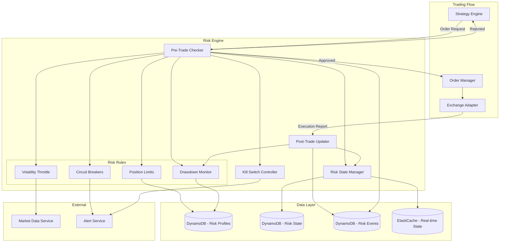

# Design Document: Risk & Controls

## Overview

The Risk & Controls feature implements a comprehensive risk management system that acts as a gatekeeper for all trading operations. The Risk Engine evaluates every trade against configured risk rules, enforces position limits, monitors drawdown, applies volatility-based throttling, and provides emergency kill switches.

Key design principles:
- **Fail-Safe**: Default to rejecting trades when risk state is uncertain
- **Low Latency**: Pre-trade checks complete in <50ms
- **Independent**: Kill switch operates independently of other services
- **Auditable**: Every risk decision is logged with full context

## Architecture



## Components and Interfaces

### Risk Engine Core

```typescript
interface RiskEngine {
  // Pre-trade validation
  validateOrder(order: OrderRequest): Promise<RiskCheckResult>;
  
  // Post-trade updates
  processExecution(execution: ExecutionReport): Promise<void>;
  
  // Kill switch
  activateKillSwitch(tenantId: string, reason: string): Promise<void>;
  deactivateKillSwitch(tenantId: string, authToken: string): Promise<void>;
  
  // State queries
  getRiskState(tenantId: string, strategyId?: string): Promise<RiskState>;
  getActiveRestrictions(tenantId: string): Promise<Restriction[]>;
}

interface RiskCheckResult {
  approved: boolean;
  orderId: string;
  checks: RiskCheckDetail[];
  rejectionReason?: string;
  processingTimeMs: number;
  timestamp: string;
}

interface RiskCheckDetail {
  checkType: RiskCheckType;
  passed: boolean;
  message: string;
  currentValue?: number;
  limitValue?: number;
}

type RiskCheckType = 
  | 'POSITION_LIMIT'
  | 'PORTFOLIO_LIMIT'
  | 'DRAWDOWN'
  | 'VOLATILITY'
  | 'CIRCUIT_BREAKER'
  | 'KILL_SWITCH'
  | 'EXCHANGE_LIMIT'
  | 'CAPITAL_AVAILABLE'
  | 'LEVERAGE';
```

### Position Limit Management

```typescript
type LimitType = 'ABSOLUTE' | 'PERCENTAGE';
type LimitScope = 'ASSET' | 'STRATEGY' | 'PORTFOLIO';

interface PositionLimit {
  limitId: string;
  tenantId: string;
  scope: LimitScope;
  assetId?: string;      // For ASSET scope
  strategyId?: string;   // For STRATEGY scope
  limitType: LimitType;
  maxValue: number;      // Absolute value or percentage (0-100)
  currentValue: number;
  utilizationPercent: number;
  createdAt: string;
  updatedAt: string;
}

interface PositionLimitService {
  setLimit(tenantId: string, limit: PositionLimitInput): Promise<PositionLimit>;
  getLimit(tenantId: string, limitId: string): Promise<PositionLimit>;
  listLimits(tenantId: string, scope?: LimitScope): Promise<PositionLimit[]>;
  checkLimit(tenantId: string, order: OrderRequest): Promise<LimitCheckResult>;
  updateCurrentValue(tenantId: string, limitId: string, value: number): Promise<void>;
}

interface LimitCheckResult {
  withinLimit: boolean;
  currentValue: number;
  maxValue: number;
  remainingCapacity: number;
  wouldExceedBy?: number;
}
```

### Drawdown Management

```typescript
interface DrawdownState {
  stateId: string;
  tenantId: string;
  strategyId?: string;
  scope: 'STRATEGY' | 'PORTFOLIO';
  peakValue: number;
  currentValue: number;
  drawdownPercent: number;
  drawdownAbsolute: number;
  warningThreshold: number;
  maxThreshold: number;
  status: DrawdownStatus;
  lastResetAt: string;
  updatedAt: string;
}

type DrawdownStatus = 'NORMAL' | 'WARNING' | 'CRITICAL' | 'PAUSED';

interface DrawdownConfig {
  configId: string;
  tenantId: string;
  strategyId?: string;
  warningThresholdPercent: number;   // Default 5%
  maxThresholdPercent: number;       // Default 10%
  resetInterval: 'DAILY' | 'WEEKLY' | 'MONTHLY' | 'MANUAL';
  autoResumeEnabled: boolean;
  cooldownMinutes: number;
}

interface DrawdownService {
  getDrawdownState(tenantId: string, strategyId?: string): Promise<DrawdownState>;
  updateValue(tenantId: string, strategyId: string | null, newValue: number): Promise<DrawdownState>;
  resetDrawdown(tenantId: string, strategyId?: string): Promise<DrawdownState>;
  checkDrawdown(tenantId: string, strategyId?: string): Promise<DrawdownCheckResult>;
  pauseStrategy(tenantId: string, strategyId: string, reason: string): Promise<void>;
  resumeStrategy(tenantId: string, strategyId: string, authToken: string): Promise<void>;
}

interface DrawdownCheckResult {
  status: DrawdownStatus;
  currentDrawdownPercent: number;
  distanceToWarning: number;
  distanceToMax: number;
  tradingAllowed: boolean;
}
```

### Volatility Throttling

```typescript
interface VolatilityState {
  stateId: string;
  assetId: string;
  currentIndex: number;
  indexType: VolatilityIndexType;
  level: VolatilityLevel;
  throttlePercent: number;    // 0 = no throttle, 100 = full stop
  allowNewEntries: boolean;
  updatedAt: string;
}

type VolatilityIndexType = 'ATR' | 'STD_DEV' | 'REALIZED_VOL' | 'IMPLIED_VOL';
type VolatilityLevel = 'LOW' | 'NORMAL' | 'HIGH' | 'EXTREME';

interface VolatilityConfig {
  configId: string;
  tenantId: string;
  assetId?: string;           // null = portfolio-wide
  indexType: VolatilityIndexType;
  normalThreshold: number;
  highThreshold: number;
  extremeThreshold: number;
  highThrottlePercent: number;      // e.g., 50% reduction
  extremeThrottlePercent: number;   // e.g., 100% (no new entries)
  cooldownMinutes: number;
}

interface VolatilityService {
  getVolatilityState(assetId: string): Promise<VolatilityState>;
  updateVolatilityIndex(assetId: string, indexValue: number): Promise<VolatilityState>;
  checkThrottle(tenantId: string, assetId: string): Promise<ThrottleCheckResult>;
  applyThrottle(order: OrderRequest, throttlePercent: number): OrderRequest;
}

interface ThrottleCheckResult {
  level: VolatilityLevel;
  throttlePercent: number;
  allowNewEntries: boolean;
  adjustedMaxSize?: number;
  cooldownRemainingMs?: number;
}
```

### Kill Switch

```typescript
interface KillSwitchState {
  tenantId: string;
  active: boolean;
  activatedAt?: string;
  activatedBy?: string;
  activationReason?: string;
  triggerType: 'MANUAL' | 'AUTOMATIC';
  scope: 'TENANT' | 'STRATEGY' | 'ASSET';
  scopeId?: string;
  pendingOrdersCancelled: number;
}

interface KillSwitchConfig {
  configId: string;
  tenantId: string;
  autoTriggers: AutoKillTrigger[];
  requireAuthForDeactivation: boolean;
  notificationChannels: string[];
}

interface AutoKillTrigger {
  triggerId: string;
  condition: KillTriggerCondition;
  enabled: boolean;
}

type KillTriggerCondition = 
  | { type: 'RAPID_LOSS'; lossPercent: number; timeWindowMinutes: number }
  | { type: 'ERROR_RATE'; errorPercent: number; timeWindowMinutes: number }
  | { type: 'SYSTEM_ERROR'; errorTypes: string[] };

interface KillSwitchService {
  activate(tenantId: string, reason: string, scope?: KillSwitchScope): Promise<KillSwitchState>;
  deactivate(tenantId: string, authToken: string): Promise<KillSwitchState>;
  getState(tenantId: string): Promise<KillSwitchState>;
  checkAutoTriggers(tenantId: string, event: RiskEvent): Promise<boolean>;
  isActive(tenantId: string): Promise<boolean>;
}

interface KillSwitchScope {
  type: 'TENANT' | 'STRATEGY' | 'ASSET';
  id?: string;
}
```

### Circuit Breakers

```typescript
interface CircuitBreaker {
  breakerId: string;
  tenantId: string;
  name: string;
  condition: CircuitBreakerCondition;
  scope: 'STRATEGY' | 'ASSET' | 'PORTFOLIO';
  scopeId?: string;
  state: CircuitBreakerState;
  tripCount: number;
  lastTrippedAt?: string;
  cooldownMinutes: number;
  autoResetEnabled: boolean;
}

type CircuitBreakerState = 'CLOSED' | 'OPEN' | 'HALF_OPEN';

type CircuitBreakerCondition = 
  | { type: 'LOSS_RATE'; lossPercent: number; timeWindowMinutes: number }
  | { type: 'CONSECUTIVE_FAILURES'; count: number }
  | { type: 'PRICE_DEVIATION'; deviationPercent: number; timeWindowMinutes: number }
  | { type: 'ERROR_RATE'; errorPercent: number; sampleSize: number };

interface CircuitBreakerService {
  createBreaker(tenantId: string, config: CircuitBreakerInput): Promise<CircuitBreaker>;
  getBreaker(tenantId: string, breakerId: string): Promise<CircuitBreaker>;
  listBreakers(tenantId: string): Promise<CircuitBreaker[]>;
  checkBreakers(tenantId: string, context: TradingContext): Promise<CircuitBreakerCheckResult>;
  tripBreaker(tenantId: string, breakerId: string, reason: string): Promise<CircuitBreaker>;
  resetBreaker(tenantId: string, breakerId: string, authToken?: string): Promise<CircuitBreaker>;
  recordEvent(tenantId: string, event: TradingEvent): Promise<void>;
}

interface CircuitBreakerCheckResult {
  allClosed: boolean;
  openBreakers: CircuitBreaker[];
  halfOpenBreakers: CircuitBreaker[];
}

interface TradingContext {
  strategyId?: string;
  assetId?: string;
  recentLossPercent?: number;
  recentErrorRate?: number;
  priceDeviation?: number;
}
```

### Pre-Trade and Post-Trade Checks

```typescript
interface PreTradeChecker {
  validate(order: OrderRequest): Promise<RiskCheckResult>;
}

interface OrderRequest {
  orderId: string;
  tenantId: string;
  strategyId: string;
  assetId: string;
  side: 'BUY' | 'SELL';
  quantity: number;
  price?: number;
  orderType: 'MARKET' | 'LIMIT' | 'STOP';
  exchangeId: string;
  timestamp: string;
}

interface PostTradeUpdater {
  processExecution(execution: ExecutionReport): Promise<PostTradeResult>;
}

interface ExecutionReport {
  executionId: string;
  orderId: string;
  tenantId: string;
  strategyId: string;
  assetId: string;
  side: 'BUY' | 'SELL';
  executedQuantity: number;
  executedPrice: number;
  commission: number;
  exchangeId: string;
  timestamp: string;
}

interface PostTradeResult {
  positionUpdated: boolean;
  newPositionSize: number;
  realizedPnL: number;
  drawdownUpdated: boolean;
  newDrawdownPercent: number;
  riskEventsTriggered: RiskEvent[];
}
```

### Risk Profile

```typescript
interface RiskProfile {
  profileId: string;
  tenantId: string;
  name: string;
  version: number;
  positionLimits: PositionLimitConfig[];
  drawdownConfig: DrawdownConfig;
  volatilityConfig: VolatilityConfig;
  circuitBreakers: CircuitBreakerCondition[];
  exchangeSafeguards: ExchangeSafeguardConfig;
  createdAt: string;
  updatedAt: string;
}

interface PositionLimitConfig {
  scope: LimitScope;
  assetId?: string;
  limitType: LimitType;
  maxValue: number;
}

interface ExchangeSafeguardConfig {
  maxOrderSize: number;
  minOrderSize: number;
  maxPriceDeviationPercent: number;
  rateLimitBuffer: number;  // % of rate limit to reserve
  connectionTimeoutMs: number;
  maxRetries: number;
}

interface RiskProfileService {
  createProfile(tenantId: string, profile: RiskProfileInput): Promise<RiskProfile>;
  getProfile(tenantId: string, profileId: string): Promise<RiskProfile>;
  updateProfile(tenantId: string, profileId: string, updates: Partial<RiskProfileInput>): Promise<RiskProfile>;
  listProfiles(tenantId: string): Promise<RiskProfile[]>;
  assignToStrategy(tenantId: string, strategyId: string, profileId: string): Promise<void>;
  getProfileHistory(tenantId: string, profileId: string): Promise<RiskProfile[]>;
  validateProfile(profile: RiskProfileInput): ValidationResult;
}
```

### Exchange Safeguards

```typescript
interface ExchangeLimits {
  exchangeId: string;
  assetId: string;
  minOrderSize: number;
  maxOrderSize: number;
  minPrice: number;
  maxPrice: number;
  maxPriceDeviationPercent: number;
  tickSize: number;
  lotSize: number;
}

interface ExchangeHealth {
  exchangeId: string;
  status: 'HEALTHY' | 'DEGRADED' | 'UNHEALTHY';
  latencyMs: number;
  errorRate: number;
  rateLimitRemaining: number;
  rateLimitResetAt: string;
  lastCheckedAt: string;
}

interface ExchangeSafeguardService {
  validateOrder(order: OrderRequest, limits: ExchangeLimits): ValidationResult;
  checkExchangeHealth(exchangeId: string): Promise<ExchangeHealth>;
  trackRateLimit(exchangeId: string, requestCount: number): Promise<RateLimitStatus>;
  shouldThrottle(exchangeId: string): Promise<boolean>;
  categorizeError(error: ExchangeError): ErrorCategory;
}

interface RateLimitStatus {
  remaining: number;
  limit: number;
  resetAt: string;
  shouldWait: boolean;
  waitMs?: number;
}

type ErrorCategory = 'RETRYABLE' | 'RATE_LIMIT' | 'INVALID_ORDER' | 'EXCHANGE_ERROR' | 'FATAL';
```

### Risk Event Logging

```typescript
type RiskEventType = 
  | 'LIMIT_BREACH'
  | 'LIMIT_WARNING'
  | 'DRAWDOWN_WARNING'
  | 'DRAWDOWN_BREACH'
  | 'VOLATILITY_THROTTLE'
  | 'CIRCUIT_BREAKER_TRIP'
  | 'CIRCUIT_BREAKER_RESET'
  | 'KILL_SWITCH_ACTIVATED'
  | 'KILL_SWITCH_DEACTIVATED'
  | 'ORDER_REJECTED'
  | 'EXCHANGE_ERROR';

type RiskEventSeverity = 'INFO' | 'WARNING' | 'CRITICAL' | 'EMERGENCY';

interface RiskEvent {
  eventId: string;
  tenantId: string;
  eventType: RiskEventType;
  severity: RiskEventSeverity;
  strategyId?: string;
  assetId?: string;
  description: string;
  triggerCondition: string;
  actionTaken: string;
  metadata: Record<string, unknown>;
  timestamp: string;
}

interface RiskEventService {
  logEvent(event: RiskEventInput): Promise<RiskEvent>;
  getEvents(tenantId: string, filters: RiskEventFilters): Promise<RiskEvent[]>;
  getEventStats(tenantId: string, period: string): Promise<RiskEventStats>;
  configureAlerts(tenantId: string, config: AlertConfig): Promise<void>;
  sendAlert(event: RiskEvent): Promise<void>;
}

interface RiskEventFilters {
  eventTypes?: RiskEventType[];
  severities?: RiskEventSeverity[];
  strategyId?: string;
  assetId?: string;
  startTime?: string;
  endTime?: string;
  limit?: number;
}

interface AlertConfig {
  channels: AlertChannel[];
  severityThreshold: RiskEventSeverity;
  eventTypes: RiskEventType[];
}

interface AlertChannel {
  type: 'EMAIL' | 'SMS' | 'WEBHOOK' | 'SLACK';
  destination: string;
  enabled: boolean;
}
```

## Data Models

### DynamoDB Table Schemas

**RiskProfiles Table**
- Partition Key: `tenantId`
- Sort Key: `profileId#version`
- Attributes: name, positionLimits, drawdownConfig, volatilityConfig, circuitBreakers, exchangeSafeguards, timestamps

**RiskState Table**
- Partition Key: `tenantId`
- Sort Key: `stateType#scopeId`
- Attributes: currentValue, limits, status, updatedAt
- Used for: positions, drawdown state, volatility state

**CircuitBreakers Table**
- Partition Key: `tenantId`
- Sort Key: `breakerId`
- Attributes: name, condition, scope, state, tripCount, cooldownMinutes, timestamps

**KillSwitchState Table**
- Partition Key: `tenantId`
- Attributes: active, activatedAt, activatedBy, reason, triggerType, scope

**RiskEvents Table**
- Partition Key: `tenantId`
- Sort Key: `timestamp#eventId`
- GSI: `eventType-timestamp-index` for filtering by type
- TTL: `expiresAt` for retention management
- Attributes: eventType, severity, description, triggerCondition, actionTaken, metadata

### ElastiCache Schema

**Real-time Risk State**
- Key: `risk:state:{tenantId}:{strategyId}`
- Value: JSON with current positions, drawdown, restrictions
- TTL: 60 seconds (refreshed on every update)

**Kill Switch State**
- Key: `risk:killswitch:{tenantId}`
- Value: JSON with active status, reason
- TTL: None (persistent until explicitly cleared)


## Correctness Properties

*A property is a characteristic or behavior that should hold true across all valid executions of a system—essentially, a formal statement about what the system should do. Properties serve as the bridge between human-readable specifications and machine-verifiable correctness guarantees.*

### Property 1: Position Limit Enforcement

*For any* order that would cause a position to exceed its configured Position_Limit (at asset, strategy, or portfolio level), the Risk_Engine SHALL reject the order, AND the rejection SHALL include the limit type, current value, max value, and exceeded amount.

**Validates: Requirements 1.1, 1.2, 1.3**

### Property 2: Position Tracking Accuracy

*For any* sequence of executed trades, the calculated position size SHALL equal the sum of all buy quantities minus the sum of all sell quantities, AND position updates SHALL be reflected in subsequent limit checks.

**Validates: Requirements 1.4, 1.5**

### Property 3: Passive Limit Breach Handling

*For any* position that exceeds its limit due to market price movement (not a new trade), the position SHALL be flagged with status BREACH, AND if auto-reduction is enabled, a reduction order SHALL be queued.

**Validates: Requirements 1.6**

### Property 4: Drawdown Monitoring and Pause

*For any* portfolio or strategy, the drawdown percentage SHALL equal ((peakValue - currentValue) / peakValue) * 100, AND when drawdown exceeds warningThreshold an alert SHALL be sent, AND when drawdown exceeds maxThreshold trading SHALL be paused.

**Validates: Requirements 2.1, 2.2, 2.3, 2.4**

### Property 5: Drawdown Resume Requirement

*For any* strategy paused due to drawdown breach, the strategy SHALL remain paused until explicit manual resume is called with valid authentication, AND automatic resume SHALL NOT occur.

**Validates: Requirements 2.5**

### Property 6: Drawdown Reset

*For any* drawdown reset operation (manual or scheduled), the peakValue SHALL be set to currentValue, AND drawdownPercent SHALL become 0, AND status SHALL return to NORMAL.

**Validates: Requirements 2.6**

### Property 7: Volatility Throttling

*For any* asset with volatility index exceeding highThreshold, maximum position sizes SHALL be reduced by highThrottlePercent, AND when exceeding extremeThreshold, new entries SHALL be blocked while exits remain allowed.

**Validates: Requirements 3.1, 3.2, 3.3, 3.4**

### Property 8: Volatility Cooldown Restoration

*For any* asset where volatility returns below normalThreshold, normal trading parameters SHALL be restored only after the configured cooldownMinutes have elapsed, not immediately.

**Validates: Requirements 3.5**

### Property 9: Kill Switch Behavior

*For any* kill switch activation (manual or automatic), all pending orders SHALL be cancelled, all new orders SHALL be rejected, AND the activation SHALL be logged with timestamp, reason, and trigger type.

**Validates: Requirements 4.1, 4.2, 4.3**

### Property 10: Kill Switch Deactivation Authentication

*For any* kill switch deactivation attempt, the operation SHALL require valid authentication, AND deactivation without authentication SHALL be rejected.

**Validates: Requirements 4.5**

### Property 11: Circuit Breaker Rules

*For any* circuit breaker with condition type LOSS_RATE, CONSECUTIVE_FAILURES, or PRICE_DEVIATION, when the condition is met the breaker SHALL trip to OPEN state, AND trading for the affected scope SHALL be paused.

**Validates: Requirements 5.1, 5.2, 5.3**

### Property 12: Circuit Breaker Auto-Reset

*For any* circuit breaker in OPEN state with autoResetEnabled=true, after cooldownMinutes have elapsed the breaker SHALL transition to HALF_OPEN, AND if no new triggers occur it SHALL transition to CLOSED.

**Validates: Requirements 5.5**

### Property 13: Circuit Breaker Manual Override

*For any* circuit breaker manual reset, the operation SHALL require authentication if configured, AND the reset SHALL be logged with the authenticating user.

**Validates: Requirements 5.6**

### Property 14: Pre-Trade Check Completeness

*For any* order submitted for pre-trade validation, the Risk_Engine SHALL check position limits, available capital, leverage limits, kill switch status, and circuit breaker status, AND the order SHALL be approved only if ALL checks pass.

**Validates: Requirements 6.1, 6.2, 6.5**

### Property 15: Pre-Trade Rejection Details

*For any* order rejected by pre-trade checks, the rejection response SHALL include the specific check(s) that failed, the current value, the limit value, and a human-readable message.

**Validates: Requirements 6.3**

### Property 16: Post-Trade State Updates

*For any* executed trade, the post-trade processor SHALL update: position size, realized P&L, drawdown state, and exposure metrics, AND if any threshold is breached, appropriate protective actions SHALL be triggered.

**Validates: Requirements 7.1, 7.2, 7.3**

### Property 17: Position Reconciliation

*For any* position reconciliation that reveals a discrepancy between internal state and exchange data, the system SHALL use exchange data as the source of truth, AND an alert SHALL be generated.

**Validates: Requirements 7.5**

### Property 18: Risk Profile Application

*For any* strategy with an assigned Risk_Profile, all risk parameters from the profile SHALL be applied, AND strategy-specific overrides SHALL take precedence over profile defaults.

**Validates: Requirements 8.1, 8.2, 8.3**

### Property 19: Risk Profile Validation

*For any* Risk_Profile configuration, the system SHALL validate internal consistency (e.g., warning threshold < max threshold), AND inconsistent configurations SHALL be rejected with specific error messages.

**Validates: Requirements 8.5**

### Property 20: Risk Profile Versioning

*For any* Risk_Profile update, a new version SHALL be created with incremented version number, AND all previous versions SHALL remain retrievable.

**Validates: Requirements 8.6**

### Property 21: Exchange Limit Enforcement

*For any* order that violates exchange-specific limits (min/max size, price deviation), the order SHALL be rejected before submission to the exchange, AND the rejection SHALL include the specific limit violated.

**Validates: Requirements 9.1, 9.2**

### Property 22: Exchange Rate Limit Tracking

*For any* exchange with rate limits, the system SHALL track remaining requests, AND when approaching the limit (within buffer percentage), requests SHALL be throttled with appropriate delays.

**Validates: Requirements 9.3**

### Property 23: Exchange Error Categorization

*For any* exchange error, the system SHALL categorize it as RETRYABLE, RATE_LIMIT, INVALID_ORDER, EXCHANGE_ERROR, or FATAL, AND apply the appropriate handling (retry, wait, reject, or alert).

**Validates: Requirements 9.6**

### Property 24: Risk Event Logging

*For any* risk event, the log record SHALL contain eventType, severity, triggerCondition, actionTaken, and timestamp, AND the record SHALL be serializable to and from JSON without data loss.

**Validates: Requirements 10.1, 10.2**

### Property 25: Risk Event Tenant Isolation

*For any* tenant querying risk events, the results SHALL contain only events where the event's tenantId matches the requesting tenant's ID.

**Validates: Requirements 10.4**

## Error Handling

### Pre-Trade Errors

- **Limit Exceeded**: Return detailed rejection with limit type, current/max values
- **Kill Switch Active**: Return immediate rejection with kill switch reason
- **Circuit Breaker Open**: Return rejection with breaker name and reset time
- **Insufficient Capital**: Return rejection with required vs available capital

### Post-Trade Errors

- **State Update Failed**: Retry with exponential backoff, alert on persistent failure
- **Reconciliation Mismatch**: Use exchange data, log discrepancy, alert
- **Threshold Breach**: Trigger protective action, log event, send alert

### Kill Switch Errors

- **Activation Failed**: Retry immediately, escalate to backup system
- **Deactivation Auth Failed**: Log attempt, reject, alert security team
- **Order Cancellation Failed**: Retry, log failures, manual intervention required

### Circuit Breaker Errors

- **Trip Failed**: Default to OPEN state (fail-safe)
- **Reset Failed**: Remain in current state, log error, manual intervention
- **Condition Evaluation Error**: Default to triggered (fail-safe)

### Exchange Errors

- **Rate Limited**: Queue request, wait for reset, retry
- **Connection Lost**: Pause trading, attempt reconnection, alert
- **Invalid Order**: Reject with exchange error details, do not retry
- **Unknown Error**: Log full details, categorize as FATAL, alert

## Testing Strategy

### Unit Tests

Unit tests verify specific examples and edge cases:

- Position limit calculations with various order sizes
- Drawdown percentage calculations with price movements
- Volatility index calculations with different metrics
- Circuit breaker condition evaluation
- Kill switch state transitions
- Pre-trade check combinations (all pass, one fail, multiple fail)
- Exchange limit validation with boundary values
- Error categorization for various exchange errors

### Property-Based Tests

Property-based tests verify universal properties across randomly generated inputs. Each property test will:

- Run minimum 100 iterations with random inputs
- Use fast-check library for TypeScript property-based testing
- Tag each test with the corresponding design property number

**Test Configuration:**
- Framework: Jest with fast-check
- Minimum iterations: 100 per property
- Generators: Custom generators for OrderRequest, ExecutionReport, RiskProfile, PositionLimit, DrawdownState, VolatilityState, CircuitBreaker, and RiskEvent objects

**Property Test Coverage:**
- Property 1: Generate orders and limits, verify enforcement
- Property 2: Generate trade sequences, verify position accuracy
- Property 4: Generate value sequences, verify drawdown calculation
- Property 5: Generate paused strategies, verify resume requirement
- Property 6: Generate drawdown states, verify reset behavior
- Property 7: Generate volatility scenarios, verify throttling
- Property 8: Generate volatility recovery, verify cooldown
- Property 9: Generate kill switch activations, verify behavior
- Property 10: Generate deactivation attempts, verify auth requirement
- Property 11: Generate circuit breaker conditions, verify triggering
- Property 12: Generate open breakers, verify auto-reset
- Property 14: Generate orders, verify all checks run
- Property 15: Generate failing orders, verify rejection details
- Property 16: Generate executions, verify state updates
- Property 18: Generate profiles and strategies, verify application
- Property 19: Generate profile configs, verify validation
- Property 20: Generate profile updates, verify versioning
- Property 21: Generate orders with exchange limits, verify enforcement
- Property 22: Generate rate limit scenarios, verify throttling
- Property 23: Generate exchange errors, verify categorization
- Property 24: Generate risk events, verify logging completeness
- Property 25: Generate multi-tenant events, verify isolation

### Integration Tests

Integration tests verify end-to-end flows:

- Full pre-trade → execute → post-trade flow with risk updates
- Kill switch activation → order rejection → deactivation flow
- Circuit breaker trip → cooldown → auto-reset flow
- Drawdown breach → pause → manual resume flow
- Position reconciliation with simulated exchange data
