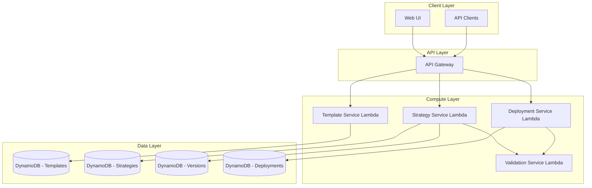

# Design Document: Strategy Management

## Overview

The Strategy Management feature provides a comprehensive system for creating, configuring, versioning, and deploying trading strategies within the AI-Assisted Crypto Trading System. This design follows a serverless architecture on AWS, using Lambda for compute, DynamoDB for persistence, and API Gateway for REST endpoints.

The system enforces strict parameter validation through hard bounds, maintains complete version history for auditability, and supports three deployment modes: backtest, paper trading, and live execution.

## Architecture



## Components and Interfaces

### Strategy Template Service

Manages predefined strategy templates that serve as blueprints for user strategies.

```typescript
interface StrategyTemplate {
  templateId: string;
  name: string;
  description: string;
  version: number;
  parameters: ParameterDefinition[];
  createdAt: string;
  updatedAt: string;
}

interface ParameterDefinition {
  name: string;
  dataType: 'number' | 'string' | 'boolean' | 'enum';
  defaultValue: ParameterValue;
  hardBounds?: HardBounds;
  required: boolean;
  description: string;
  enumValues?: string[];
}

interface HardBounds {
  min?: number;
  max?: number;
  pattern?: string;  // regex for string validation
}

interface TemplateService {
  listTemplates(tenantId: string): Promise<StrategyTemplate[]>;
  getTemplate(templateId: string): Promise<StrategyTemplate>;
  getTemplateVersion(templateId: string, version: number): Promise<StrategyTemplate>;
}
```

### Strategy Service

Core service for creating, configuring, and managing user strategies.

```typescript
interface Strategy {
  strategyId: string;
  tenantId: string;
  name: string;
  templateId: string;
  templateVersion: number;
  parameters: Record<string, ParameterValue>;
  currentVersion: number;
  state: StrategyState;
  createdAt: string;
  updatedAt: string;
}

type ParameterValue = number | string | boolean;
type StrategyState = 'DRAFT' | 'ACTIVE' | 'PAUSED' | 'STOPPED' | 'ERROR';

interface StrategyVersion {
  strategyId: string;
  version: number;
  parameters: Record<string, ParameterValue>;
  createdAt: string;
  createdBy: string;
  changeDescription?: string;
}

interface StrategyService {
  createStrategy(tenantId: string, templateId: string, name: string): Promise<Strategy>;
  getStrategy(tenantId: string, strategyId: string): Promise<Strategy>;
  updateParameters(tenantId: string, strategyId: string, parameters: Record<string, ParameterValue>): Promise<Strategy>;
  listStrategies(tenantId: string): Promise<Strategy[]>;
  getVersionHistory(tenantId: string, strategyId: string): Promise<StrategyVersion[]>;
  getVersion(tenantId: string, strategyId: string, version: number): Promise<StrategyVersion>;
  rollbackToVersion(tenantId: string, strategyId: string, version: number): Promise<Strategy>;
}
```

### Deployment Service

Manages strategy deployment across different execution modes.

```typescript
type DeploymentMode = 'BACKTEST' | 'PAPER' | 'LIVE';

interface DeploymentConfig {
  strategyId: string;
  mode: DeploymentMode;
  backtestConfig?: BacktestConfig;
}

interface BacktestConfig {
  startDate: string;
  endDate: string;
  initialCapital: number;
}

interface Deployment {
  deploymentId: string;
  strategyId: string;
  tenantId: string;
  mode: DeploymentMode;
  state: DeploymentState;
  strategyVersion: number;
  config: DeploymentConfig;
  createdAt: string;
  updatedAt: string;
}

type DeploymentState = 'PENDING' | 'RUNNING' | 'PAUSED' | 'STOPPED' | 'COMPLETED' | 'ERROR';

interface DeploymentService {
  deploy(tenantId: string, config: DeploymentConfig): Promise<Deployment>;
  getDeployment(tenantId: string, deploymentId: string): Promise<Deployment>;
  updateState(tenantId: string, deploymentId: string, state: DeploymentState): Promise<Deployment>;
  listDeployments(tenantId: string, strategyId?: string): Promise<Deployment[]>;
}
```

### Validation Service

Centralized validation logic for parameters and strategy configurations.

```typescript
interface ValidationResult {
  valid: boolean;
  errors: ValidationError[];
}

interface ValidationError {
  field: string;
  message: string;
  code: string;
}

interface ValidationService {
  validateParameter(value: ParameterValue, definition: ParameterDefinition): ValidationResult;
  validateStrategy(strategy: Strategy, template: StrategyTemplate): ValidationResult;
  validateDeployment(deployment: DeploymentConfig, strategy: Strategy): ValidationResult;
}
```

## Data Models

### DynamoDB Table Schemas

**Templates Table**
- Partition Key: `templateId`
- Sort Key: `version`
- GSI: `name-index` for searching by template name

**Strategies Table**
- Partition Key: `tenantId`
- Sort Key: `strategyId`
- Attributes: name, templateId, templateVersion, parameters (JSON), currentVersion, state, timestamps

**Versions Table**
- Partition Key: `strategyId`
- Sort Key: `version`
- Attributes: parameters (JSON), createdAt, createdBy, changeDescription

**Deployments Table**
- Partition Key: `tenantId`
- Sort Key: `deploymentId`
- GSI: `strategyId-index` for listing deployments by strategy
- Attributes: mode, state, strategyVersion, config (JSON), timestamps


## Correctness Properties

*A property is a characteristic or behavior that should hold true across all valid executions of a system—essentially, a formal statement about what the system should do. Properties serve as the bridge between human-readable specifications and machine-verifiable correctness guarantees.*

### Property 1: Template Structure Completeness

*For any* Strategy_Template, it SHALL contain a non-empty templateId, name, description, version number, and a parameters array where each parameter has name, dataType, defaultValue, required flag, and description.

**Validates: Requirements 1.3, 1.4**

### Property 2: Template Versioning Preserves History

*For any* Strategy_Template that is updated, both the original version and the new version SHALL be retrievable, and the new version number SHALL be greater than the original.

**Validates: Requirements 1.5**

### Property 3: Strategy Initialization from Template

*For any* Strategy created from a Strategy_Template, all parameter values in the new Strategy SHALL equal the default values defined in the template's parameter definitions.

**Validates: Requirements 2.1**

### Property 4: Parameter Bounds Validation

*For any* parameter modification where the value is outside the parameter's Hard_Bounds (below min or above max), the modification SHALL be rejected with a validation error, and the original value SHALL remain unchanged.

**Validates: Requirements 2.2, 2.3**

### Property 5: Strategy Persistence Round-Trip

*For any* valid Strategy object, serializing to JSON, persisting to storage, retrieving, and deserializing SHALL produce an equivalent Strategy object with all parameter values preserved.

**Validates: Requirements 2.4, 2.6, 5.2, 5.3**

### Property 6: Strategy-Template Reference Integrity

*For any* Strategy, it SHALL maintain a valid reference to an existing Strategy_Template and a specific template version that exists in the system.

**Validates: Requirements 2.5**

### Property 7: Version Number Incrementing

*For any* sequence of saves to a Strategy, each new Strategy_Version SHALL have a version number exactly one greater than the previous version.

**Validates: Requirements 3.1**

### Property 8: Version Immutability

*For any* Strategy_Version that has been created, subsequent operations SHALL NOT modify the parameters or metadata of that version; the version's data SHALL remain identical across all retrievals.

**Validates: Requirements 3.2**

### Property 9: Version History Ordering

*For any* Strategy with multiple versions, requesting the version history SHALL return all versions ordered by creation timestamp in ascending order, and requesting any specific version SHALL return the complete parameter snapshot for that version.

**Validates: Requirements 3.3, 3.4**

### Property 10: Rollback Creates New Version

*For any* rollback operation to a previous Strategy_Version, the system SHALL create a new Strategy_Version (with incremented version number) containing the same parameter values as the target rollback version.

**Validates: Requirements 3.5**

### Property 11: Deployment Mode Validation

*For any* deployment request, it SHALL require a valid Deployment_Mode; BACKTEST mode SHALL require startDate and endDate; LIVE mode SHALL require risk controls to be configured. Requests missing required fields SHALL be rejected.

**Validates: Requirements 4.1, 4.2, 4.4**

### Property 12: Tenant Isolation

*For any* tenant, requesting strategies SHALL return only strategies belonging to that tenant; attempting to access another tenant's strategy SHALL result in a not-found or access-denied response.

**Validates: Requirements 5.4**

### Property 13: Parameter Validation Completeness

*For any* Strategy save operation, all required parameters defined in the template SHALL be present, and all parameter values SHALL conform to their specified data types. Violations SHALL result in rejection.

**Validates: Requirements 6.1, 6.2**

### Property 14: Template Reference Validation on Deployment

*For any* Strategy deployment, the Strategy SHALL reference a valid, existing Strategy_Template version. Deployment with invalid template references SHALL be rejected.

**Validates: Requirements 6.3**

### Property 15: Validation Error Details

*For any* validation failure, the returned error response SHALL include specific error messages identifying which field(s) failed validation and why.

**Validates: Requirements 6.4**

### Property 16: Parameter Combination Consistency

*For any* Strategy with parameters that have logical relationships (e.g., stop-loss and entry price), the system SHALL validate that the combination is logically consistent and reject inconsistent combinations.

**Validates: Requirements 6.5**

## Error Handling

### Validation Errors

- Return HTTP 400 with detailed `ValidationError` array
- Each error includes field name, error code, and human-readable message
- Multiple validation errors are aggregated in a single response

### Not Found Errors

- Return HTTP 404 when requested resource doesn't exist
- Include resource type and identifier in error message

### Authorization Errors

- Return HTTP 403 when tenant attempts to access another tenant's resources
- Log access attempt for security auditing

### Database Errors

- Return HTTP 500 for unexpected database failures
- Implement retry logic with exponential backoff for transient failures
- Ensure no partial writes corrupt data (use DynamoDB transactions where needed)

### Conflict Errors

- Return HTTP 409 for concurrent modification conflicts
- Include current version number to enable client retry with correct version

## Testing Strategy

### Unit Tests

Unit tests verify specific examples and edge cases:

- Template CRUD operations with valid and invalid data
- Parameter validation with boundary values (at min, at max, below min, above max)
- Strategy creation with various template configurations
- Version number incrementing logic
- Rollback operation mechanics
- Deployment mode-specific validation rules
- Error message formatting

### Property-Based Tests

Property-based tests verify universal properties across randomly generated inputs. Each property test will:

- Run minimum 100 iterations with random inputs
- Use fast-check library for TypeScript property-based testing
- Tag each test with the corresponding design property number

**Test Configuration:**
- Framework: Jest with fast-check
- Minimum iterations: 100 per property
- Generators: Custom generators for Strategy, Template, Parameter, and Deployment objects

**Property Test Coverage:**
- Property 1: Generate random templates, verify structure completeness
- Property 2: Generate template updates, verify version preservation
- Property 3: Generate template/strategy pairs, verify default initialization
- Property 4: Generate parameter values and bounds, verify validation behavior
- Property 5: Generate strategies, verify serialization round-trip
- Property 6: Generate strategies, verify template reference validity
- Property 7: Generate save sequences, verify version incrementing
- Property 8: Generate versions, verify immutability across retrievals
- Property 9: Generate multi-version strategies, verify ordering
- Property 10: Generate rollback operations, verify new version creation
- Property 11: Generate deployment configs, verify mode-specific validation
- Property 12: Generate multi-tenant scenarios, verify isolation
- Property 13: Generate strategies with various parameters, verify validation
- Property 14: Generate deployments with template refs, verify validation
- Property 15: Generate invalid inputs, verify error detail presence
- Property 16: Generate parameter combinations, verify consistency checks

### Integration Tests

Integration tests verify end-to-end flows:

- Full strategy lifecycle: create → configure → version → deploy
- Multi-tenant isolation in actual DynamoDB
- Concurrent modification handling
- Error recovery scenarios
