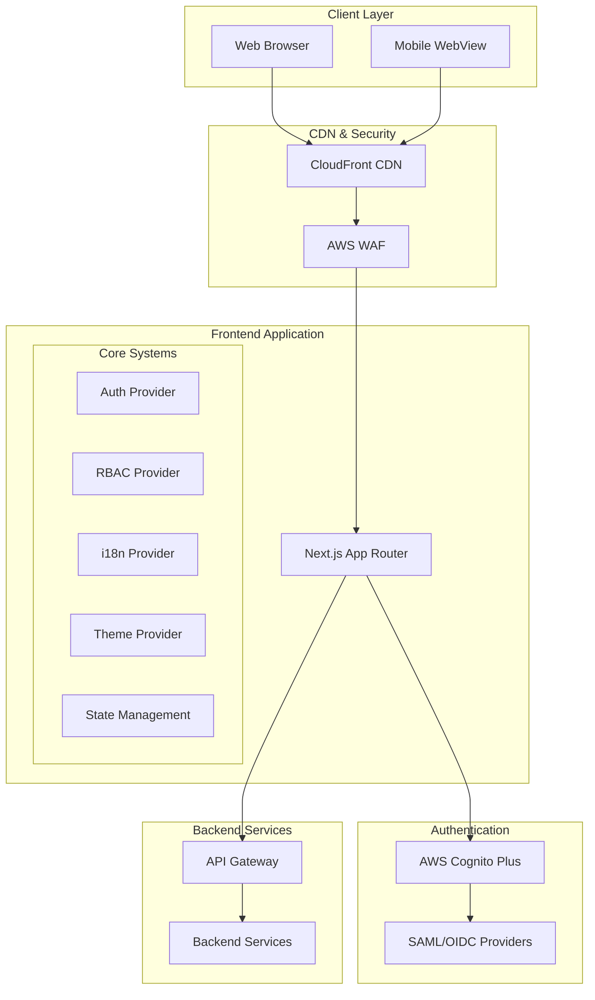

# Design Document: UI Implementation

## Overview

This design document describes the architecture and implementation approach for the AI-Assisted Crypto Trading System's web-based user interface. The UI is built with React/Next.js, integrates with AWS Cognito Plus for authentication (protected by WAF behind CloudFront), and implements comprehensive role-based access control (RBAC) across all system modules.

The system supports multi-tenancy with individual and organizational accounts, 11 languages with RTL support, responsive design for mobile/hybrid deployment, and full WCAG 2.1 AA accessibility compliance.

## Architecture



## Components and Interfaces

### 1. Authentication Module

```typescript
interface AuthConfig {
  cognitoUserPoolId: string;
  cognitoClientId: string;
  cognitoDomain: string;
  ssoProviders: SSOProvider[];
  mfaEnabled: boolean;
  sessionTimeoutMinutes: number;
}

interface SSOProvider {
  id: string;
  name: string;
  type: 'SAML' | 'OIDC';
  metadata: string;
  enabled: boolean;
}

interface AuthSession {
  userId: string;
  organizationId?: string;
  roles: Role[];
  permissions: Permission[];
  accessToken: string;
  refreshToken: string;
  expiresAt: Date;
  mfaVerified: boolean;
}

interface AuthProvider {
  login(credentials: Credentials): Promise<AuthSession>;
  loginWithSSO(providerId: string): Promise<AuthSession>;
  loginWithBiometric(): Promise<AuthSession>;
  logout(): Promise<void>;
  refreshSession(): Promise<AuthSession>;
  verifyMFA(code: string): Promise<AuthSession>;
  getSession(): AuthSession | null;
  onSessionExpiring(callback: () => void): void;
}
```

### 2. RBAC Module

```typescript
interface Role {
  id: string;
  name: string;
  description: string;
  permissions: Permission[];
  isSystem: boolean;
  organizationId?: string;
}

interface Permission {
  id: string;
  resource: ResourceType;
  action: ActionType;
  conditions?: PermissionCondition[];
}

type ResourceType = 
  | 'strategy' | 'order' | 'position' | 'market_data'
  | 'ai_model' | 'risk_control' | 'report' | 'audit_log'
  | 'user' | 'organization' | 'role' | 'exchange';

type ActionType = 'create' | 'read' | 'update' | 'delete' | 'execute' | 'export';

interface RBACProvider {
  hasPermission(resource: ResourceType, action: ActionType): boolean;
  hasAnyPermission(permissions: Array<{resource: ResourceType; action: ActionType}>): boolean;
  hasAllPermissions(permissions: Array<{resource: ResourceType; action: ActionType}>): boolean;
  getVisibleModules(): ModuleType[];
  filterByPermission<T>(items: T[], resource: ResourceType, action: ActionType): T[];
}
```

### 3. Internationalization Module

```typescript
type SupportedLocale = 
  | 'en-US' | 'de-DE' | 'fr-FR' | 'ar-SA' | 'fa-IR'
  | 'zh-CN' | 'hi-IN' | 'es-ES' | 'tr-TR' | 'pt-BR' | 'he-IL';

interface I18nProvider {
  locale: SupportedLocale;
  direction: 'ltr' | 'rtl';
  t(key: string, params?: Record<string, unknown>): string;
  formatNumber(value: number, options?: Intl.NumberFormatOptions): string;
  formatDate(date: Date, options?: Intl.DateTimeFormatOptions): string;
  formatCurrency(value: number, currency: string): string;
  setLocale(locale: SupportedLocale): Promise<void>;
}
```

### 4. State Management Module

```typescript
interface UserPreferences {
  theme: 'light' | 'dark' | 'system';
  locale: SupportedLocale;
  defaultDashboard: string;
  gridPreferences: Record<string, GridPreferences>;
  workspaceLayouts: WorkspaceLayout[];
  activeWorkspaceId: string;
}

interface GridPreferences {
  columnOrder: string[];
  columnWidths: Record<string, number>;
  pinnedColumns: { left: string[]; right: string[] };
  sortModel: SortModel[];
  filterModel: FilterModel;
  pageSize: number;
}

interface StateStore {
  preferences: UserPreferences;
  setPreference<K extends keyof UserPreferences>(key: K, value: UserPreferences[K]): void;
  syncPreferences(): Promise<void>;
  activeModule: ModuleType;
  setActiveModule(module: ModuleType): void;
  getGridState(gridId: string): GridPreferences;
  setGridState(gridId: string, state: Partial<GridPreferences>): void;
}
```


### 5. Data Grid Component

```typescript
interface DataGridProps<T> {
  id: string;
  data: T[];
  columns: ColumnDef<T>[];
  loading?: boolean;
  sortable?: boolean;
  filterable?: boolean;
  paginated?: boolean;
  virtualScroll?: boolean;
  selectable?: boolean;
  onSelectionChange?: (selected: T[]) => void;
  batchActions?: BatchAction<T>[];
  exportFormats?: ('csv' | 'excel' | 'pdf')[];
  persistPreferences?: boolean;
}

interface ColumnDef<T> {
  id: string;
  header: string;
  accessor: keyof T | ((row: T) => unknown);
  sortable?: boolean;
  filterable?: boolean;
  filterType?: 'text' | 'number' | 'date' | 'select';
  pinnable?: boolean;
  resizable?: boolean;
  width?: number;
  render?: (value: unknown, row: T) => React.ReactNode;
}

interface BatchAction<T> {
  id: string;
  label: string;
  permission?: { resource: ResourceType; action: ActionType };
  onExecute: (selected: T[]) => Promise<void>;
  confirmMessage?: string;
}
```

### 6. Command Palette Component

```typescript
interface SearchResult {
  id: string;
  type: 'strategy' | 'order' | 'asset' | 'report' | 'setting' | 'help' | 'action';
  title: string;
  description?: string;
  path?: string;
  action?: () => void;
  permission?: { resource: ResourceType; action: ActionType };
}

interface CommandPaletteProvider {
  open(): void;
  close(): void;
  search(query: string): Promise<SearchResult[]>;
  executeAction(actionId: string): Promise<void>;
  getRecentSearches(): SearchResult[];
  getFrequentActions(): SearchResult[];
}
```

### 7. Contextual Help System

```typescript
interface HelpContent {
  id: string;
  elementId: string;
  title: string;
  description: string;
  consequences?: string;
  learnMoreUrl?: string;
  translations: Record<SupportedLocale, HelpTranslation>;
}

interface ContextualHelpProvider {
  getHelp(elementId: string): HelpContent | null;
  showTooltip(elementId: string): void;
  showHelpPanel(elementId: string): void;
  trackHelpUsage(elementId: string, action: 'view' | 'expand' | 'link_click'): void;
}
```

### 8. Dashboard System

```typescript
type DashboardType = 'trader' | 'risk' | 'admin' | 'executive';

interface Dashboard {
  id: string;
  type: DashboardType;
  name: string;
  widgets: DashboardWidget[];
  layout: GridLayout;
  refreshInterval: number;
  isShared: boolean;
  sharedWith?: string[];
  ownerId: string;
}

interface DashboardWidget {
  id: string;
  type: WidgetType;
  title: string;
  config: WidgetConfig;
  position: { x: number; y: number; w: number; h: number };
  drillDownPath?: string;
}

type WidgetType = 
  | 'metric_card' | 'line_chart' | 'bar_chart' | 'pie_chart'
  | 'data_table' | 'alert_list' | 'activity_feed' | 'heatmap';
```

### 9. Error Handling System

```typescript
interface AppError {
  code: string;
  message: string;
  requestTrackingId: string;
  category: 'user' | 'system' | 'transient';
  details?: Record<string, unknown>;
  suggestedActions?: string[];
  retryable: boolean;
  timestamp: Date;
}

interface ErrorHandler {
  handleError(error: unknown): AppError;
  displayError(error: AppError): void;
  reportIssue(error: AppError, userComment?: string): Promise<void>;
  retry<T>(operation: () => Promise<T>, maxRetries?: number): Promise<T>;
}
```

### 10. Mobile/Hybrid Support

```typescript
interface NativeBridge {
  isBiometricAvailable(): Promise<boolean>;
  authenticateWithBiometric(): Promise<BiometricResult>;
  requestPushPermission(): Promise<boolean>;
  getPushToken(): Promise<string>;
  onPushNotification(callback: (notification: PushNotification) => void): void;
  isOnline(): boolean;
  onConnectivityChange(callback: (online: boolean) => void): void;
  getSafeAreaInsets(): SafeAreaInsets;
}

interface SafeAreaInsets {
  top: number;
  bottom: number;
  left: number;
  right: number;
}

interface OfflineStorage {
  get<T>(key: string): Promise<T | null>;
  set<T>(key: string, value: T): Promise<void>;
  remove(key: string): Promise<void>;
  sync(): Promise<SyncResult>;
}

interface PushNotification {
  id: string;
  type: 'risk_alert' | 'order_update' | 'system_alert';
  title: string;
  body: string;
  data?: Record<string, unknown>;
  timestamp: Date;
}
```

### 11. Audit Log Viewer

```typescript
interface AuditLogEntry {
  id: string;
  timestamp: Date;
  userId: string;
  userName: string;
  action: string;
  module: ModuleType;
  resource: string;
  resourceId: string;
  severity: 'info' | 'warning' | 'critical';
  beforeValue?: unknown;
  afterValue?: unknown;
  requestTrackingId: string;
}

interface AuditLogFilter {
  userId?: string;
  action?: string;
  module?: ModuleType;
  severity?: AuditLogEntry['severity'];
  startDate?: Date;
  endDate?: Date;
  searchText?: string;
}

interface AuditLogViewer {
  query(filter: AuditLogFilter, pagination: Pagination): Promise<PaginatedResult<AuditLogEntry>>;
  stream(filter: AuditLogFilter, onEntry: (entry: AuditLogEntry) => void): () => void;
  export(filter: AuditLogFilter, format: 'csv' | 'json'): Promise<Blob>;
}
```

## Data Models

### User and Organization Models

```typescript
interface User {
  id: string;
  email: string;
  name: string;
  organizationId?: string;
  roles: Role[];
  preferences: UserPreferences;
  mfaEnabled: boolean;
  lastLoginAt: Date;
  createdAt: Date;
  status: 'active' | 'suspended' | 'pending';
}

interface Organization {
  id: string;
  name: string;
  ownerId: string;
  members: OrganizationMember[];
  departments: Department[];
  settings: OrganizationSettings;
  createdAt: Date;
}

interface OrganizationMember {
  userId: string;
  roles: Role[];
  departmentId?: string;
  invitedAt: Date;
  joinedAt?: Date;
  status: 'pending' | 'active' | 'removed';
}
```

### API Response Models

```typescript
interface ApiResponse<T> {
  data: T;
  meta: ResponseMeta;
}

interface ResponseMeta {
  requestTrackingId: string;
  timestamp: Date;
  pagination?: PaginationMeta;
}

interface ApiError {
  code: string;
  message: string;
  requestTrackingId: string;
  details?: Record<string, unknown>;
}
```


## Correctness Properties

*A property is a characteristic or behavior that should hold true across all valid executions of a system—essentially, a formal statement about what the system should do. Properties serve as the bridge between human-readable specifications and machine-verifiable correctness guarantees.*

### Property 1: RBAC Enforcement Consistency

*For any* user with a defined set of permissions, and *for any* UI element, module, search result, or audit log entry, the visibility and accessibility of that item SHALL be determined solely by the user's permissions—items requiring permissions the user lacks SHALL be hidden, disabled, or filtered from results.

**Validates: Requirements 1.6, 2.1, 2.4, 7.5, 11.6**

### Property 2: Session Permission Retrieval

*For any* successful user login, the resulting session SHALL contain exactly the roles and permissions configured for that user, including any user-level overrides of organization-level permissions.

**Validates: Requirements 1.2, 2.5**

### Property 3: Permission Change Audit Trail

*For any* permission change operation (role assignment, permission modification), an audit log entry SHALL be created containing the administrator ID, timestamp, and both before and after permission values.

**Validates: Requirements 2.6**

### Property 4: Organization Upgrade Data Preservation

*For any* individual account with existing data (strategies, preferences, configurations), upgrading to an organization account SHALL preserve all data such that querying for that data after upgrade returns identical results.

**Validates: Requirements 3.2**

### Property 5: Member Removal Access Revocation

*For any* organization member who is removed, subsequent authentication attempts SHALL fail and API requests with their credentials SHALL be rejected, while audit log entries referencing that user SHALL remain queryable.

**Validates: Requirements 3.5**

### Property 6: Locale-Aware Rendering

*For any* UI text element, number, date, or currency value, and *for any* supported locale, the rendered output SHALL match the locale's conventions (translation for text, RTL direction for Arabic/Persian/Hebrew, locale-specific formatting for numbers/dates/currencies).

**Validates: Requirements 4.2, 4.3, 4.4, 4.5, 9.2**

### Property 7: Data Grid Operations Correctness

*For any* data grid with a dataset, applying sort operations SHALL produce correctly ordered results, applying filter operations SHALL return only matching rows, and batch actions SHALL execute on exactly the selected rows.

**Validates: Requirements 5.1, 5.2, 5.3, 5.4, 5.5**

### Property 8: User Preferences Round-Trip

*For any* user preference (theme, locale, grid configuration, workspace layout), saving the preference and then retrieving it (including across sessions and devices) SHALL return an equivalent value.

**Validates: Requirements 5.6, 6.2, 6.4, 6.5, 6.6**

### Property 9: Command Palette Search Completeness

*For any* search query in the command palette, the results SHALL include matching items from all searchable categories (strategies, orders, assets, reports, settings, help), support fuzzy matching, and be filtered by the user's permissions.

**Validates: Requirements 7.2, 7.4, 7.6**

### Property 10: Destructive Action Confirmation

*For any* action marked as destructive (delete, cancel, revoke), invoking the action SHALL display a confirmation dialog before execution, and canceling the dialog SHALL leave the system state unchanged.

**Validates: Requirements 8.3**

### Property 11: Keyboard Accessibility

*For any* interactive UI element, there SHALL exist a keyboard-accessible path to focus and activate that element, and the element SHALL have appropriate ARIA attributes for screen reader compatibility.

**Validates: Requirements 8.6**

### Property 12: Contextual Help Completeness

*For any* significant UI element with a help ID, the help system SHALL return content containing a description, usage instructions, and (where applicable) consequences of the action.

**Validates: Requirements 9.1, 9.3, 9.6**

### Property 13: Dashboard Data Consistency

*For any* dashboard widget displaying data, the data SHALL refresh at the configured interval, drill-down navigation SHALL lead to records that match the summary metric, and customizations SHALL persist across sessions.

**Validates: Requirements 10.2, 10.3, 10.4, 10.5, 10.6**

### Property 14: Audit Log Query Correctness

*For any* audit log query with filters, the returned entries SHALL match all specified filter criteria, contain complete context (before/after values where applicable), and be ordered by timestamp.

**Validates: Requirements 11.1, 11.2, 11.3, 11.4, 11.5**

### Property 15: Error Response Completeness

*For any* error returned by the system, the error object SHALL contain a request tracking ID, a category (user/system/transient), a human-readable message, and suggested resolution steps.

**Validates: Requirements 12.1, 12.2, 12.3, 12.4, 12.5**

### Property 16: Responsive Layout Adaptation

*For any* viewport width from mobile (320px) to desktop (1920px+), the UI layout SHALL adapt without horizontal scrolling, content overflow, or overlap with device safe areas.

**Validates: Requirements 14.1, 14.4**

### Property 17: Biometric Authentication Flow

*For any* mobile device with biometric capability, when biometric authentication is enabled and available, the authentication flow SHALL offer biometric as an option and successful biometric verification SHALL produce a valid session.

**Validates: Requirements 14.2**

### Property 18: Critical Alert Push Notification

*For any* critical system event (kill switch activation, risk limit breach), mobile users with push notifications enabled SHALL receive a notification within the configured delivery window.

**Validates: Requirements 14.3**

### Property 19: Offline Data Synchronization

*For any* data cached during offline mode, when connectivity is restored, the sync operation SHALL upload local changes, download remote changes, and report any conflicts to the user.

**Validates: Requirements 14.5, 14.6**

## Error Handling

### Error Categories

| Category | Description | User Action | System Action |
|----------|-------------|-------------|---------------|
| User Error | Invalid input, permission denied, validation failure | Show corrective guidance | Log for analytics |
| System Error | Server error, service unavailable | Show support contact with tracking ID | Alert operations, log full context |
| Transient Error | Network timeout, rate limit, temporary unavailability | Offer retry option | Auto-retry with backoff |

### Error Response Structure

```typescript
interface ErrorResponse {
  code: string;                    // Machine-readable error code
  message: string;                 // User-friendly message
  requestTrackingId: string;       // UUID for support/debugging
  category: 'user' | 'system' | 'transient';
  suggestedActions: string[];      // Steps user can take
  details?: Record<string, unknown>; // Additional context
  retryAfter?: number;             // Seconds until retry (for rate limits)
}
```

### Error Handling Strategies

1. **Validation Errors**: Display inline with form fields, highlight invalid inputs
2. **Authentication Errors**: Redirect to login, preserve navigation state
3. **Authorization Errors**: Show permission denied message, suggest contacting admin
4. **Network Errors**: Show offline indicator, queue operations for retry
5. **Server Errors**: Display tracking ID, offer issue reporting

## Testing Strategy

### Dual Testing Approach

This system requires both unit tests and property-based tests for comprehensive coverage:

- **Unit Tests**: Verify specific examples, edge cases, integration points, and error conditions
- **Property-Based Tests**: Verify universal properties hold across all valid inputs using randomized testing

### Property-Based Testing Configuration

- **Framework**: fast-check (TypeScript)
- **Minimum Iterations**: 100 per property test
- **Annotation Format**: `// Feature: ui-implementation, Property N: [property text]`

### Test Categories

#### Unit Tests
- Component rendering tests (React Testing Library)
- Hook behavior tests
- API integration tests
- Error boundary tests
- Accessibility tests (jest-axe)

#### Property-Based Tests
- RBAC permission filtering (Property 1)
- Locale formatting correctness (Property 6)
- Grid sort/filter operations (Property 7)
- Preference serialization round-trip (Property 8)
- Search result filtering (Property 9)
- Error response structure (Property 15)

#### Integration Tests
- Authentication flows (Cognito integration)
- Real-time data subscriptions
- Cross-device preference sync
- Offline/online transitions

### Test File Organization

```
frontend/
├── src/
│   ├── components/
│   │   └── DataGrid/
│   │       ├── DataGrid.tsx
│   │       ├── DataGrid.test.tsx      # Unit tests
│   │       └── DataGrid.property.test.tsx  # Property tests
│   ├── providers/
│   │   └── RBAC/
│   │       ├── RBACProvider.tsx
│   │       ├── RBACProvider.test.tsx
│   │       └── RBACProvider.property.test.tsx
│   └── hooks/
│       └── usePreferences/
│           ├── usePreferences.ts
│           ├── usePreferences.test.ts
│           └── usePreferences.property.test.ts
```
